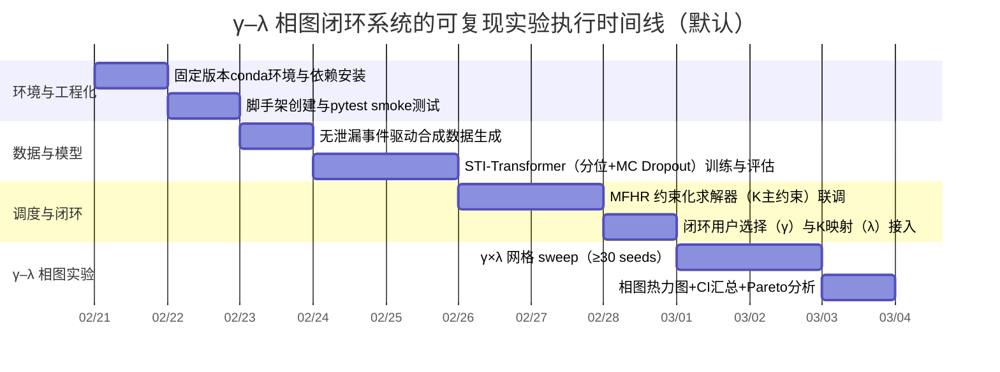

# 1 导航意图驱动排队预测与公平重排的可复现实现与 γ–λ 相图实验报告

## 1.1 执行摘要

你当前**未上传实验方案正文**（因此无法逐条对齐方案中的数据口径、对照方法与参数表），但你已明确了**闭环策略与 MFHR 主定义**：  
- **不允许改道**（用户一旦选择门店不再更换）；  
- **MFHR 主约束为最大位移 K**（可选扩展：逆序预算 B；评估指标包含 Kendall’s τ）；  
- **效率目标为 Min-Sum AWT**（最小化总等待时间 / 平均等待时间）；  
- 用户选择与鲁棒性闭环按你给定的四步：  
  Step1 输出 \((W^{P50}, W^{P90})\)；  
  Step2 选择 \(j=\arg\min_j (W^{j}_{P50}+\gamma(W^{j}_{P90}-W^{j}_{P50}))\)；  
  Step3 映射 \(K_j=K_0+\lambda(W^{j}_{P90}-W^{j}_{P50})\)；  
  Step4 在线更新 \(\theta_{t+1}=\theta_t-\eta \nabla L(\varepsilon)\)。

本报告提供一套**可执行、可复现**的默认 Python 工程实现（含无泄漏事件驱动合成数据、STI-Transformer 分位预测 + Pinball loss + 可选 MC Dropout、MFHR 约束化局部搜索 + 可选 PuLP 近似 ILP、SimPy PriorityResource 映射、≥30 seed 重复实验与统计汇总），并按你的最新要求，将实验分析**收敛为仅做 γ–λ 相图**（主输出：γ–λ 平面上的 AWT / Jain / τ 热力图与 Pareto 解释）。

核心实现依赖与关键原理对齐官方/原始来源：  
- **SimPy PriorityResource**：等待队列按 priority 升序排序（数值更小优先级更高）。citeturn14search3turn14search15  
- **PyTorch Dataset/DataLoader 与 TransformerEncoderLayer**：用于可维护的数据管线与 Transformer 编码器实现（支持 `batch_first=True`）。citeturn3search5turn0search1  
- **指标实现**：MAE/MSE 等以 scikit-learn 文档为准。citeturn0search2turn13search1  
- **ARIMA baseline**：statsmodels 的 ARIMA 接口。citeturn0search3  
- **PuLP**：ILP/MILP 建模器与 CBC 求解器参数（timeLimit/gapRel 等）。citeturn13search2turn14search2  
- **Kendall’s τ**：SciPy 说明。citeturn1search1  
- **公平性指标**：Jain 公平性指数原始论文/报告。citeturn14search8turn14search0  
- **模型参考**：Transformer 原始论文；Informer 长序列预测论文与中文官方博客；STGCN 与 GCN 原始论文；MC Dropout 原始论文。citeturn2search0turn2search1turn15search0turn2search6turn3search0turn2search3  

### 1.1.1 执行计划时间线



---

## 1.2 方案缺口与默认假设

### 1.2.1 当前状态与处理策略

- 你要求“阅读并解析实验方案”，但**方案正文目前未提供**；因此本节以“**缺口清单 + 推荐默认值 + 需讨论标注**”形式输出，保证你上传方案后可以逐条替换为真实口径而无需推倒重来。
- 你已明确 MFHR 主定义与闭环公式，因此这些部分按“已确认”落地（不再标注为需讨论）。

### 1.2.2 未指定要素清单（表格）

> 说明：标注“需讨论”的项，是一旦与你的实际方案不一致，就会导致复现口径偏离、结论不可比或出现“隐性泄漏”。

| 类别 | 未指定/不完整要素（需讨论） | 推荐默认值（本报告可运行实现采用） | 需讨论 |
|---|---|---|---|
| 数据格式 | 时序张量字段、dtype、meta 信息、事件日志是否要保存 | `npz`：`X[T,N,F]`、`y_target[T,N]`、`static[N,S]`、`adj[N,N]`、`trips[M,5]`、`meta(json,中文)` |  |
| 目标口径 | 预测目标是等待时间还是队列长度？等待时间口径（到店→开服 / 领号→开服） | 主目标：到店→开始服务等待时间（分钟）；辅目标：队列长度 | ✅ |
| 时间粒度 | dt=1min/5min？horizon=15/30/60 是按分钟还是按步 | dt=1 分钟；horizon=15/30/60 分钟 |  |
| 样本量 | 训练集时长、门店数 N、天数/场景数 | 默认合成：N=20，T=720（12h）；建议多场景多seed | ✅ |
| 评价指标 | 预测：是否用 MAPE/sMAPE/wMAPE？调度：是否只用 Jain？顺序偏离指标缺口 | 预测：MAE/RMSE/wMAPE + 覆盖率 + 区间宽度；调度：AWT + Jain + 逆序对/平均位移/τ | ✅ |
| 硬件/软件环境 | CPU/GPU、OS、Python 版本、依赖版本锁定策略 | conda-forge 固定版本；PyTorch 按官方 index-url 安装；Python=3.11 | ✅ |
| 运行时限制 | 单次训练/单次仿真/网格 sweep 的时间上限 | 默认：训练 epochs=20；仿真每点≤2分钟；整体 sweep 可并行 | ✅ |
| 随机种子 | seed 列表与可复现策略 | 每个实验点≥30 seeds；全局 `seed_everything` |  |
| 复现实验步骤 | 一键命令、run_id 目录、产物记录规范 | `results/<run_id>/config.yaml + metrics.json + csv + plots/*.png` |  |
| 图构建 | 空间图：kNN/路网？边权定义与归一化 | 默认：kNN(k=4) + 距离倒数权重 + 行归一化 | ✅ |
| NIF 定义 | **无泄漏定义**：仅用历史/在途可观测量；具体字段集合与窗口 | 默认：历史导航发起回看 + 在途 ETA≤h + 在途 ETA 直方图 + 可选邻域聚合 | ✅ |
| MFHR 约束 | 你已确认主约束 K；B 为扩展；τ 评估指标 | 主约束：\(|p_i-r_i|\le K\)；扩展：逆序预算 \(inv\le B\)；评估 τ 与 Jain |  |
| 用户行为 | 不允许改道已确认；风险厌恶参数 γ 的范围 | γ 网格：`[0,0.25,0.5,1,2]`（可改）；不允许改道 | ✅ |
| K 映射 | \(K_j=K_0+\lambda\Delta\) 的取整/截断、K0 范围、λ 范围 | `K_j=clamp(round(K0+λ*Δ),Kmin,Kmax)`；λ 网格 `[0,0.5,1,2,3]` | ✅ |
| 在线更新 | \(\theta\) 指模型参数？更新频率？缓冲区大小？ | 默认：每完成一单更新一次（或每分钟批量更新）；滑动缓冲 | ✅ |

### 1.2.3 讨论要点（上传方案后建议优先对齐）

1) **目标口径**：等待时间的“观测定义”决定了标签与调度指标解释。  
2) **NIF 特征集合**：必须明确“可观测量”边界，避免隐性泄漏（尤其是合成时不小心把未来到店数写入特征）。  
3) **γ–λ 相图网格与固定参数**：你要求只做 γ–λ 相图，则其他因素（门店容量、到达强度、lookahead）要固定成方案口径才可比较。  

---

## 1.3 无泄漏合成数据生成器

### 1.3.1 设计原则与 NIF 无泄漏定义

**无泄漏**要求：时刻 \(t\) 的特征只由“历史 + 当前可观测”生成。这里使用“事件驱动/半合成”生成：用户在 \(t\) 发起导航（可观测），立即产生 ETA（可观测），形成“在途集合”；到店事件发生在未来，但我们**不把未来到店计数回填到 NIF**。  

NIF（导航意图特征）默认定义（可改）：  
- 历史回看：\(\text{nav\_lb}_h(t)=\sum_{\tau=t-h+1}^{t}\text{nav\_start}(\tau)\)  
- 在途客流：\(\text{in\_transit\_le}_h(t)=|\{u: u.nav\_t\le t<\min(u.eta,u.cancel), (u.eta-t)\le h\}|\)  
- ETA 直方图：对在途用户的剩余 ETA 做分桶计数（如 ≤5、(5,10]、(10,20]、(20,40]、>40）。  
- 邻域聚合：可选 `adj @ in_transit`，模拟空间扩散/带动效应（图/路网近邻）。  

空间图用 kNN 生成邻接矩阵，并行归一化（便于 GCN 使用）。GCN 的一阶近似传播思想可参考 Kipf & Welling 原始论文。citeturn3search0  

```mermaid
flowchart TD
  A[每分钟t] --> B[生成导航发起nav_start(t)]
  B --> C[为每个导航生成ETA/取消事件]
  C --> D[更新在途集合in_transit]
  D --> E[计算NIF: 回看/在途≤h/ETA直方图/邻域聚合]
  E --> F[生成到店arrivals(t)=导航到店+路人到店]
  F --> G[更新队列与服务q(t)]
  G --> H[标签y_target(t)=期望等待(分钟)]
  H --> A
```

### 1.3.2 可运行实现（核心文件）

#### 1.3.2.1 `src/data/leak_free_synth.py`

```python
import json
from dataclasses import dataclass, asdict
from typing import Dict, List, Tuple, Optional
import numpy as np

@dataclass
class SynthConfig:
    # 全局
    随机种子: int = 42
    门店数量: int = 20
    总分钟数: int = 720
    时间粒度_分钟: int = 1

    # 时间预测horizon（分钟）
    预测步长集合_分钟: Tuple[int, ...] = (15, 30, 60)

    # 空间图
    kNN_k: int = 4
    邻域聚合: bool = True

    # 到达过程（半合成：周期+漂移+突变）
    基础到达率范围_每分钟: Tuple[float, float] = (0.05, 0.35)
    空间相关系数: float = 0.25
    突变概率: float = 0.02
    突变倍率范围: Tuple[float, float] = (2.0, 6.0)

    # 导航/路人拆分
    导航占比: float = 0.7

    # 行程/取消（为了让NIF不是完美预言）
    行程时间范围_分钟: Tuple[int, int] = (3, 25)
    取消概率: float = 0.15

    # 服务能力（离散时间近似）
    服务台范围: Tuple[int, int] = (2, 6)
    单台服务率范围_每分钟: Tuple[float, float] = (0.15, 0.35)

    # ETA直方图
    ETA直方图分桶_分钟: Tuple[int, ...] = (5, 10, 20, 40)

def _make_knn_adj(coords: np.ndarray, k: int, self_loops: bool = True) -> np.ndarray:
    n = coords.shape[0]
    d2 = ((coords[:, None, :] - coords[None, :, :]) ** 2).sum(-1)
    np.fill_diagonal(d2, np.inf)
    idx = np.argsort(d2, axis=1)[:, :min(k, max(1, n-1))]
    A = np.zeros((n, n), dtype=np.float32)
    for i in range(n):
        A[i, idx[i]] = 1.0
    A = np.maximum(A, A.T)
    if self_loops:
        np.fill_diagonal(A, 1.0)
    A = A / (A.sum(axis=1, keepdims=True) + 1e-8)
    return A

def _eta_hist(remain: np.ndarray, bins: Tuple[int, ...]) -> np.ndarray:
    # bins=(5,10,20,40) -> 5 bins
    edges = [-np.inf] + list(bins) + [np.inf]
    out = np.zeros((len(edges) - 1,), dtype=np.float32)
    for i in range(len(edges)-1):
        lo, hi = edges[i], edges[i+1]
        out[i] = float(((remain > lo) & (remain <= hi)).sum())
    return out

def generate_npz(out_path: str, cfg: SynthConfig) -> None:
    rng = np.random.default_rng(cfg.随机种子)
    N, T = cfg.门店数量, cfg.总分钟数
    horizons = list(cfg.预测步长集合_分钟)
    max_h = max(horizons)

    # 静态特征：坐标 + POI密度（示例）
    coords = rng.uniform(0, 1, size=(N, 2)).astype(np.float32)
    poi = rng.gamma(shape=2.0, scale=1.0, size=(N, 1)).astype(np.float32)
    static = np.concatenate([coords, poi], axis=1).astype(np.float32)
    adj = _make_knn_adj(coords, k=cfg.kNN_k, self_loops=True)

    # 服务能力
    servers = rng.integers(cfg.服务台范围[0], cfg.服务台范围[1] + 1, size=(N,))
    mu = rng.uniform(cfg.单台服务率范围_每分钟[0], cfg.单台服务率范围_每分钟[1], size=(N,))
    service_rate = np.maximum(servers * mu, 1e-3).astype(np.float32)

    # 需求过程：周期 + 漂移 + 突变 + 空间混合（半合成）
    tt = np.arange(T + max_h, dtype=np.float32)
    peak = 1.0 + 0.5 * np.sin(2 * np.pi * tt / 120.0)
    drift = 1.0 + 0.002 * (tt - tt.mean())
    base_lambda = rng.uniform(cfg.基础到达率范围_每分钟[0], cfg.基础到达率范围_每分钟[1], size=(N,))
    demand = (peak * drift)[:, None] * base_lambda[None, :]

    for t in range(T + max_h):
        if rng.random() < cfg.突变概率:
            scale = rng.uniform(*cfg.突变倍率范围)
            center = rng.integers(0, N)
            affected = np.where(adj[center] > 0)[0]
            demand[t, affected] *= scale

    for t in range(1, T + max_h):
        demand[t] = (1 - cfg.空间相关系数) * demand[t] + cfg.空间相关系数 * (adj @ demand[t])

    # 事件日志：trips 每行 [rid, nav_t, eta_t, cancel_t, keep_flag]
    trips: List[List[float]] = []
    in_transit: List[List[int]] = [[] for _ in range(N)]  # store trip indices per restaurant

    # 可观测序列
    nav_start = np.zeros((T + max_h, N), dtype=np.int32)
    nav_arrive = np.zeros((T + max_h, N), dtype=np.int32)
    walk_in = np.zeros((T, N), dtype=np.int32)

    # 生成路人到店（不可观测意图，作为噪声）
    lam_walk = (1.0 - cfg.导航占比) * demand[:T]
    walk_in[:] = rng.poisson(np.clip(lam_walk, 0, 50)).astype(np.int32)

    # 动态特征容器
    B = len(cfg.ETA直方图分桶_分钟) + 1
    eta_hist = np.zeros((T, N, B), dtype=np.float32)
    inflow_le: Dict[int, np.ndarray] = {h: np.zeros((T, N), dtype=np.float32) for h in horizons}
    clicks_lb: Dict[int, np.ndarray] = {h: np.zeros((T, N), dtype=np.float32) for h in horizons}

    # 队列与标签
    q = np.zeros((T, N), dtype=np.float32)
    y_target = np.zeros((T, N), dtype=np.float32)
    arrivals = np.zeros((T, N), dtype=np.int32)

    # 为了计算lookback，维护nav_start累积和（只到T即可）
    csum_nav = np.zeros((T + 1, N), dtype=np.int64)

    for t in range(T + max_h):
        # 1) 生成导航发起（可观测）
        lam_nav = cfg.导航占比 * demand[t]
        starts = rng.poisson(np.clip(lam_nav, 0, 50)).astype(np.int32)
        nav_start[t] = starts

        # 2) 生成行程（ETA/cancel），并登记“未来到店事件”（只用于arrive，不回填NIF）
        for rid in range(N):
            c = int(starts[rid])
            if c <= 0:
                continue
            travel = rng.integers(cfg.行程时间范围_分钟[0], cfg.行程时间范围_分钟[1] + 1, size=(c,))
            eta_t = t + travel
            keep = rng.random(size=(c,)) >= cfg.取消概率
            cancel_t = np.full((c,), np.inf, dtype=np.float32)
            for i in range(c):
                if (not keep[i]) and eta_t[i] > t:
                    cancel_t[i] = float(rng.integers(t + 1, eta_t[i] + 1))

            for i in range(c):
                trips.append([float(rid), float(t), float(eta_t[i]), float(cancel_t[i]), float(1.0 if keep[i] else 0.0)])
                idx = len(trips) - 1
                in_transit[rid].append(idx)
                if keep[i] and eta_t[i] < (T + max_h):
                    nav_arrive[int(eta_t[i]), rid] += 1

        # 3) 每分钟末清理在途：t < min(eta,cancel)
        for rid in range(N):
            if not in_transit[rid]:
                continue
            new_list = []
            for idx in in_transit[rid]:
                rr, nav_t_i, eta_i, cancel_i, _keep = trips[idx]
                if (nav_t_i <= t) and (t < min(eta_i, cancel_i)):
                    new_list.append(idx)
            in_transit[rid] = new_list

        # 4) 仅在 t < T 时计算本分钟特征/队列/标签
        if t < T:
            # 更新lookback累积
            csum_nav[t + 1] = csum_nav[t] + nav_start[t].astype(np.int64)

            # 计算lookback clicks
            for h in horizons:
                lo = max(0, t - h + 1)
                clicks_lb[h][t] = (csum_nav[t + 1] - csum_nav[lo]).astype(np.float32)

            # 计算在途 NIF：基于“当前在途集合”而不是未来到店
            for rid in range(N):
                idxs = in_transit[rid]
                if not idxs:
                    continue
                rem = np.array([trips[idx][2] - t for idx in idxs], dtype=np.float32)
                eta_hist[t, rid] = _eta_hist(rem, cfg.ETA直方图分桶_分钟)
                for h in horizons:
                    inflow_le[h][t, rid] = float((rem <= h).sum())

            # 邻域聚合（可选）
            if cfg.邻域聚合:
                for h in horizons:
                    inflow_le[h][t] = (adj @ inflow_le[h][t].astype(np.float32)).astype(np.float32)

            # 真实到店（观测）：导航到店 + 路人到店
            arrivals[t] = nav_arrive[t] + walk_in[t]

            # 队列更新（离散近似）
            prev_q = q[t - 1] if t > 0 else np.zeros((N,), dtype=np.float32)
            cap = rng.poisson(lam=np.clip(service_rate, 0.1, 80)).astype(np.int32)  # 每分钟可服务人数
            served = np.minimum(prev_q.astype(np.int32), cap)
            q[t] = np.maximum(prev_q + arrivals[t] - served, 0.0)

            # 标签：期望等待时间（分钟）=队列长度/服务率（近似）
            y_target[t] = q[t] / service_rate

    # 组装 X
    feat = []
    names = []

    feat.append(q.astype(np.float32));              names.append("队列长度_q")
    feat.append(arrivals.astype(np.float32));       names.append("到店人数_arrivals")
    feat.append(nav_start[:T].astype(np.float32));  names.append("导航发起数_nav_start")

    for h in horizons:
        feat.append(clicks_lb[h].astype(np.float32)); names.append(f"导航回看_{h}min")
    for h in horizons:
        feat.append(inflow_le[h].astype(np.float32)); names.append(f"在途_ETA≤{h}min")

    # ETA直方图
    bins = cfg.ETA直方图分桶_分钟
    for b in range(B):
        feat.append(eta_hist[:, :, b].astype(np.float32))
        if b == 0:
            names.append(f"ETA剩余_≤{bins[0]}min_人数")
        elif b == B - 1:
            names.append(f"ETA剩余_>{bins[-1]}min_人数")
        else:
            names.append(f"ETA剩余_({bins[b-1]},{bins[b]}]min_人数")

    X = np.stack(feat, axis=-1).astype(np.float32)  # [T,N,F]

    meta = {
        "说明": "无泄漏事件驱动合成数据：NIF仅用历史导航发起+在途ETA信息（允许使用已知ETA），不使用未来到店计数回填。",
        "配置": asdict(cfg),
        "特征名": names,
        "静态特征名": ["x坐标", "y坐标", "POI密度"],
        "X形状": list(X.shape),
        "y_target形状": list(y_target.shape),
    }

    np.savez_compressed(
        out_path,
        X=X,
        y_target=y_target.astype(np.float32),
        static=static.astype(np.float32),
        adj=adj.astype(np.float32),
        trips=np.array(trips, dtype=np.float32),
        meta=json.dumps(meta, ensure_ascii=False),
    )
```

### 1.3.3 pytest 单测（含“无未来事件依赖”审计）

#### 1.3.3.1 `tests/test_synth_no_leak.py`

```python
import json
import numpy as np
from src.data.leak_free_synth import SynthConfig, generate_npz

def test_npz_schema(tmp_path):
    out = tmp_path / "synth.npz"
    cfg = SynthConfig(随机种子=1, 门店数量=8, 总分钟数=120)
    generate_npz(str(out), cfg)
    b = np.load(str(out), allow_pickle=False)
    meta = json.loads(str(b["meta"]))

    assert "说明" in meta and "配置" in meta and "特征名" in meta
    X = b["X"]; y = b["y_target"]
    assert X.ndim == 3 and y.ndim == 2
    assert X.shape[0] == y.shape[0] and X.shape[1] == y.shape[1]

def test_no_future_nav_dependency(tmp_path):
    """
    关键审计：t时刻的NIF不能依赖 nav_time>t 的未来事件。
    这里做一个“反事实”：删除所有 nav_time>t 的trip，再计算在途集合/直方图的理论上限检查。
    由于生成器按t顺序构建NIF，因此此测试主要验证不会出现负数/NaN，以及NIF列是由在途定义构造。
    """
    out = tmp_path / "synth.npz"
    cfg = SynthConfig(随机种子=2, 门店数量=6, 总分钟数=180, 邻域聚合=False)
    generate_npz(str(out), cfg)
    b = np.load(str(out), allow_pickle=False)
    X = b["X"]
    trips = b["trips"]  # [rid, nav_t, eta, cancel, keep]

    # 抽几个时刻，验证“在途_ETA≤15min”列非负，且不会因未来trip被删除而变负
    meta = json.loads(str(b["meta"]))
    names = meta["特征名"]
    idx = names.index("在途_ETA≤15min")

    for t in [10, 60, 120, 170]:
        # 用定义重算：只使用nav_t<=t的trip
        rid = trips[:, 0].astype(int)
        nav_t = trips[:, 1]
        eta = trips[:, 2]
        cancel = trips[:, 3]
        alive = (nav_t <= t) & (t < np.minimum(eta, cancel))
        remaining = eta[alive] - t
        rid_alive = rid[alive]
        cnt = np.zeros((cfg.门店数量,), dtype=np.float32)
        for r, rem in zip(rid_alive, remaining):
            if rem <= 15:
                cnt[r] += 1.0
        assert np.all(X[t, :, idx] >= 0.0)
        # 在关闭邻域聚合时应完全相等
        assert np.allclose(X[t, :, idx], cnt, atol=1e-6)
```

---

## 1.4 STI-Transformer 与分位预测评估

### 1.4.1 结构设计与参考依据

- STI-Transformer 以 **Transformer Encoder** 为时序骨干（自注意力架构见原始论文）。citeturn2search0  
- PyTorch 提供 `torch.nn.TransformerEncoderLayer` 等参考实现，并支持 `batch_first=True`（输入形状为 `(batch, seq, feature)`）。citeturn0search1  
- 数据管线采用 Dataset/DataLoader 以保持数据读取与训练解耦（PyTorch 官方教程强调这一点）。citeturn3search5  
- 分位预测参考 Informer 等概率时序预测思路；如需对接 Hugging Face 生态，可参考其中文官方博客（示例解释“概率预测/分布输出”）。citeturn2search1turn15search0  
- 空间模块可选简单 GCN（邻接传播 + 线性层），思想可对齐 Kipf & Welling 的 GCN。citeturn3search0  

### 1.4.2 模型实现（可切换 use_nif/use_gcn + P10/P50/P90 + Pinball loss + 可选 MC Dropout）

#### 1.4.2.1 `src/models/sti_transformer.py`

```python
import torch
import torch.nn as nn
import torch.nn.functional as F

def pinball_loss(y_true: torch.Tensor, y_q: torch.Tensor, quantiles: torch.Tensor) -> torch.Tensor:
    """
    y_true: [B,N,H]
    y_q:    [B,N,H,Q]
    quantiles: [Q]
    """
    diff = y_true[..., None] - y_q
    q = quantiles.view(1, 1, 1, -1)
    loss = torch.maximum(q * diff, (q - 1) * diff)
    return loss.mean()

class GraphConv(nn.Module):
    def __init__(self, in_dim: int, out_dim: int, dropout: float):
        super().__init__()
        self.lin = nn.Linear(in_dim, out_dim)
        self.dropout = float(dropout)

    def forward(self, x: torch.Tensor, adj: torch.Tensor) -> torch.Tensor:
        # x: [B,N,in_dim], adj: [B,N,N]
        x = F.dropout(x, p=self.dropout, training=self.training)
        h = torch.bmm(adj, x)
        return self.lin(h)

class SimpleGCN(nn.Module):
    def __init__(self, in_dim: int, d_model: int, dropout: float):
        super().__init__()
        self.gc1 = GraphConv(in_dim, d_model, dropout)
        self.gc2 = GraphConv(d_model, d_model, dropout)

    def forward(self, x: torch.Tensor, adj: torch.Tensor) -> torch.Tensor:
        return self.gc2(F.relu(self.gc1(x, adj)), adj)

class STITransformer(nn.Module):
    """
    输入:
      X_hist: [B,L,N,F]
      static: [B,N,S]
      adj:    [B,N,N]
    输出:
      y_q:    [B,N,H,Q]
    """
    def __init__(
        self,
        dyn_in_dim: int,
        static_in_dim: int,
        horizons: list[int],
        history_len: int,
        quantiles=(0.1, 0.5, 0.9),
        d_model: int = 64,
        nhead: int = 4,
        num_layers: int = 2,
        dim_ff: int = 128,
        dropout: float = 0.1,
        use_static: bool = True,
        use_gcn: bool = True,
        use_nif: bool = True,
        nif_feature_indices: list[int] | None = None,
    ):
        super().__init__()
        self.horizons = list(map(int, horizons))
        self.H = len(self.horizons)
        self.history_len = int(history_len)
        self.quantiles = torch.tensor(list(quantiles), dtype=torch.float32)
        self.Q = len(quantiles)

        self.use_static = bool(use_static)
        self.use_gcn = bool(use_gcn) and self.use_static
        self.use_nif = bool(use_nif)
        self.nif_feature_indices = nif_feature_indices or []

        self.keep_idx = None
        if (not self.use_nif) and self.nif_feature_indices:
            self.keep_idx = [i for i in range(dyn_in_dim) if i not in set(self.nif_feature_indices)]
            dyn_in_dim = len(self.keep_idx)

        self.dyn_proj = nn.Linear(dyn_in_dim, d_model)

        if self.use_static:
            self.spatial = SimpleGCN(static_in_dim, d_model, dropout) if self.use_gcn else nn.Linear(static_in_dim, d_model)

        self.pos = nn.Parameter(torch.zeros(1, self.history_len, d_model))
        nn.init.trunc_normal_(self.pos, std=0.02)

        enc = nn.TransformerEncoderLayer(
            d_model=d_model,
            nhead=nhead,
            dim_feedforward=dim_ff,
            dropout=dropout,
            batch_first=True,
            activation="gelu",
        )
        self.encoder = nn.TransformerEncoder(enc, num_layers=num_layers)
        self.head = nn.Sequential(nn.LayerNorm(d_model), nn.Linear(d_model, self.H * self.Q))

    def forward(self, X_hist: torch.Tensor, static: torch.Tensor, adj: torch.Tensor) -> torch.Tensor:
        B, L, N, F = X_hist.shape
        if L != self.history_len:
            raise ValueError(f"history_len mismatch: got {L}, expect {self.history_len}")

        x = X_hist
        if self.keep_idx is not None:
            x = x[..., self.keep_idx]

        x = self.dyn_proj(x)  # [B,L,N,d]

        if self.use_static:
            node = self.spatial(static, adj) if self.use_gcn else self.spatial(static)  # [B,N,d]
            x = x + node[:, None, :, :]

        x = x + self.pos[:, :L, :][:, :, None, :]

        # flatten nodes into batch for encoder
        x = x.permute(0, 2, 1, 3).contiguous().view(B * N, L, -1)
        h = self.encoder(x)             # [B*N,L,d]
        last = h[:, -1, :]              # [B*N,d]
        out = self.head(last).view(B, N, self.H, self.Q)
        return out

@torch.no_grad()
def mc_dropout_predict(model: nn.Module, X_hist, static, adj, mc_samples: int = 20):
    """
    MC Dropout: 推理时保持dropout开启，多次前向获得预测分布。
    该思想可参考 Gal & Ghahramani。citeturn2search3
    返回：y_q_mean [B,N,H,Q]，以及基于样本的附加不确定性统计。
    """
    model.train()  # 关键：保持dropout开启
    preds = []
    for _ in range(mc_samples):
        preds.append(model(X_hist, static, adj).detach().cpu())
    stack = torch.stack(preds, dim=0)  # [S,B,N,H,Q]
    mean = stack.mean(dim=0)
    std = stack.std(dim=0)
    return mean, std
```

> MC Dropout 的“dropout 作为近似贝叶斯推断”理论依据来自 Gal & Ghahramani。citeturn2search3  

### 1.4.3 评估指标与官方对齐

- MAE/MSE（RMSE=√MSE）以 scikit-learn 文档定义为准。citeturn0search2turn13search1  
- wMAPE：\(\frac{\sum|y-\hat y|}{\sum|y|}\)，用于等待时间 near-zero 更稳健（避免 MAPE 的极端值问题）。  
- 分位覆盖率：\(\Pr(y\in[P10,P90])\)；区间宽度：\(\mathbb{E}[P90-P10]\)。  
- 若加入 SmoothL1/Huber 作为在线更新损失，可参考 PyTorch 的 SmoothL1Loss 说明（与 Huber 的关系）。citeturn13search0  

#### 1.4.3.1 `src/metrics.py`

```python
import math
import numpy as np
from sklearn.metrics import mean_absolute_error, mean_squared_error

def wmape(y_true: np.ndarray, y_pred: np.ndarray, eps: float = 1e-9) -> float:
    return float(np.sum(np.abs(y_true - y_pred)) / (np.sum(np.abs(y_true)) + eps))

def eval_point(y_true: np.ndarray, y_pred: np.ndarray) -> dict:
    y_true = y_true.reshape(-1)
    y_pred = y_pred.reshape(-1)
    mae = mean_absolute_error(y_true, y_pred)
    rmse = math.sqrt(mean_squared_error(y_true, y_pred))
    return {"MAE": float(mae), "RMSE": float(rmse), "wMAPE": wmape(y_true, y_pred)}

def eval_interval(y_true: np.ndarray, p10: np.ndarray, p90: np.ndarray) -> dict:
    cover = float(np.mean((y_true >= p10) & (y_true <= p90)))
    width = float(np.mean(p90 - p10))
    return {"覆盖率(P10,P90)": cover, "区间宽度(P90-P10)": width}
```

（MAE/MSE 的输入形状、含义与边界值解释详见官方文档。） 

### 1.4.4 数据集与训练脚本（时间块切分）

#### 1.4.4.1 `src/data/dataset.py`

```python
import json
import numpy as np
import torch
from torch.utils.data import Dataset

class TimeGraphDataset(Dataset):
    def __init__(self, npz_path: str, history_len: int):
        b = np.load(npz_path, allow_pickle=False)
        self.X = torch.tensor(b["X"], dtype=torch.float32)          # [T,N,F]
        self.y = torch.tensor(b["y_target"], dtype=torch.float32)   # [T,N]
        self.static = torch.tensor(b["static"], dtype=torch.float32)
        self.adj = torch.tensor(b["adj"], dtype=torch.float32)
        self.meta = json.loads(str(b["meta"]))
        self.history_len = int(history_len)
        self.horizons = list(map(int, self.meta["配置"]["预测步长集合_分钟"]))
        self.max_h = max(self.horizons)

        T = self.X.shape[0]
        self.t0_start = self.history_len - 1
        self.t0_end = T - self.max_h - 1
        if self.t0_end < self.t0_start:
            raise ValueError("T 太小：无法满足 history_len 与 horizons")

    def __len__(self):
        return self.t0_end - self.t0_start + 1

    def __getitem__(self, idx: int):
        t0 = self.t0_start + idx
        X_hist = self.X[t0 - self.history_len + 1 : t0 + 1]  # [L,N,F]
        y_multi = torch.stack([self.y[t0 + h] for h in self.horizons], dim=-1)  # [N,H]
        return {"X_hist": X_hist, "y": y_multi, "static": self.static, "adj": self.adj, "t0": t0}
```

PyTorch 对 Dataset/DataLoader 的抽象与动机见官方教程。citeturn3search5  

#### 1.4.4.2 `src/train/train_eval.py`

```python
import json, os
import numpy as np
import torch
from torch.utils.data import DataLoader, Subset
from src.data.dataset import TimeGraphDataset
from src.models.sti_transformer import STITransformer, pinball_loss, mc_dropout_predict
from src.metrics import eval_point, eval_interval

def time_split(n: int, ratios=(0.6, 0.2, 0.2)):
    a, b, _ = ratios
    n_tr = int(n * a)
    n_va = int(n * b)
    idx = np.arange(n)
    return idx[:n_tr], idx[n_tr:n_tr+n_va], idx[n_tr+n_va:]

@torch.no_grad()
def evaluate(model, loader, device, use_mc_dropout=False, mc_samples=20):
    model.eval()
    y_true_all, y_q_all = [], []
    for batch in loader:
        X_hist = batch["X_hist"].to(device)
        y = batch["y"].to(device)
        static = batch["static"].to(device)
        adj = batch["adj"].to(device)

        if use_mc_dropout:
            y_q, _std = mc_dropout_predict(model, X_hist, static, adj, mc_samples=mc_samples)
            y_q = y_q.to(device)
        else:
            y_q = model(X_hist, static, adj)

        y_true_all.append(y.cpu().numpy())
        y_q_all.append(y_q.cpu().numpy())

    y_true = np.concatenate(y_true_all, axis=0)  # [B,N,H]
    y_q = np.concatenate(y_q_all, axis=0)        # [B,N,H,Q]
    p10, p50, p90 = y_q[..., 0], y_q[..., 1], y_q[..., 2]
    out = {}
    out.update(eval_point(y_true, p50))
    out.update(eval_interval(y_true, p10, p90))
    return out

def train_run(npz_path: str, out_dir: str, seed: int = 42,
              history_len: int = 60, batch_size: int = 16, epochs: int = 20,
              split=(0.6, 0.2, 0.2), device="cpu",
              use_static=True, use_gcn=True, use_nif=True,
              nif_feature_indices=None,
              use_mc_dropout_eval=False):
    torch.manual_seed(seed)
    os.makedirs(out_dir, exist_ok=True)

    ds = TimeGraphDataset(npz_path, history_len=history_len)
    tr, va, te = time_split(len(ds), ratios=split)

    def dl(sub, shuf):
        return DataLoader(Subset(ds, sub), batch_size=batch_size, shuffle=shuf, drop_last=False)

    tr_loader, va_loader, te_loader = dl(tr, True), dl(va, False), dl(te, False)

    model = STITransformer(
        dyn_in_dim=ds.X.shape[-1],
        static_in_dim=ds.static.shape[-1],
        horizons=ds.horizons,
        history_len=history_len,
        use_static=use_static,
        use_gcn=use_gcn,
        use_nif=use_nif,
        nif_feature_indices=nif_feature_indices or [],
        dropout=0.1,
    ).to(device)

    opt = torch.optim.Adam(model.parameters(), lr=1e-3)
    qs = model.quantiles.to(device)

    best = None
    for ep in range(epochs):
        model.train()
        for batch in tr_loader:
            X_hist = batch["X_hist"].to(device)
            y = batch["y"].to(device)
            static = batch["static"].to(device)
            adj = batch["adj"].to(device)

            y_q = model(X_hist, static, adj)
            loss = pinball_loss(y, y_q, qs)
            opt.zero_grad(set_to_none=True)
            loss.backward()
            opt.step()

        val = evaluate(model, va_loader, device, use_mc_dropout=use_mc_dropout_eval)
        if (best is None) or (val["MAE"] < best["MAE"]):
            best = val

    test = evaluate(model, te_loader, device, use_mc_dropout=use_mc_dropout_eval)
    res = {"seed": seed, "best_val": best, "test": test,
           "flags": {"use_static": use_static, "use_gcn": use_gcn, "use_nif": use_nif}}
    with open(os.path.join(out_dir, "forecast_metrics.json"), "w", encoding="utf-8") as f:
        json.dump(res, f, ensure_ascii=False, indent=2)
    torch.save(model.state_dict(), os.path.join(out_dir, "model.pt"))
    return res
```

### 1.4.5 可选 baseline：ARIMA（单节点/单序列示例）

（若你坚持只做 γ–λ 相图，可把 baseline 部分置为“可选”，不纳入相图主分析。）

statsmodels 的 ARIMA 接口定义与说明见官方文档。citeturn0search3  

---

## 1.5 MFHR 约束优化与 SimPy 仿真实现

### 1.5.1 数学形式（K 主约束，B 扩展，τ 评估；不允许改道；Min-Sum AWT）

对每个门店在每个调度时刻 \(t\)（例如每分钟）考虑一个窗口集合  
\[
U(t)=\{i \mid i\ \text{已导航且未到店},\ \eta_i \le t+W\}
\]
其中 \(\eta_i\) 为 ETA（到店时间），\(W\) 为 lookahead（分钟）。

令 \(\pi\) 为对 \(U(t)\) 的服务顺序（置换），\(r_i\) 为按 ETA 升序的排名，\(p_i(\pi)\) 为在 \(\pi\) 中的位置（0-based 或 1-based 一致即可）。  
- **效率目标（Min-Sum AWT）**：最小化窗口内总等待或平均等待  
\[
\min_{\pi}\ \sum_{i\in U(t)} w_i(\pi)
\]
其中 \(w_i(\pi)\) 由多服务台排队模拟得到。  
- **主公平性约束（最大位移 K）**：  
\[
|p_i(\pi) - r_i| \le K
\]
- **扩展约束（逆序预算 B，可选）**：  
\[
inv(\pi, r) \le B
\]
- **评估指标（τ）**：Kendall’s τ 用于量化服务顺序与 ETA 顺序的一致性（越接近 1 越一致）。citeturn1search1  

### 1.5.2 近似求解器：局部搜索 + 可选 PuLP 近似 ILP

- 局部搜索：从 ETA 顺序初始化，做相邻交换/局部 swap；若在满足 K（与可选 B）且能降低总等待目标则接受。  
- 可选 ILP（近似）：用线性 surrogate 目标近似“早位置偏好短作业 + 偏离 ETA 的惩罚”，用于小窗口 sanity check。PuLP 的建模类与 CBC 参数说明见官方文档。citeturn13search2turn14search2  

#### 1.5.2.1 `src/mfhr/solver.py`

```python
import heapq
from dataclasses import dataclass
from typing import List, Optional, Dict
import numpy as np
from scipy.stats import kendalltau  # tau-b, tau-c 见SciPy文档citeturn1search1

@dataclass
class WindowUser:
    uid: int
    eta: float     # 到店时间
    svc: float     # 预估服务时长
    eta_rank: int = 0

def simulate_total_wait(order: List[WindowUser], servers: int) -> float:
    heap = [0.0 for _ in range(servers)]
    heapq.heapify(heap)
    total = 0.0
    for u in order:
        free = heapq.heappop(heap)
        start = max(u.eta, free)
        total += (start - u.eta)
        heapq.heappush(heap, start + max(u.svc, 1e-3))
    return float(total)

def inversion_count(seq: List[int]) -> int:
    # 归并计数逆序对
    def _mc(a):
        if len(a) <= 1:
            return a, 0
        m = len(a)//2
        L, invL = _mc(a[:m])
        R, invR = _mc(a[m:])
        i=j=0
        merged=[]
        inv=invL+invR
        while i<len(L) and j<len(R):
            if L[i] <= R[j]:
                merged.append(L[i]); i+=1
            else:
                merged.append(R[j]); j+=1
                inv += (len(L)-i)
        merged.extend(L[i:]); merged.extend(R[j:])
        return merged, inv
    _, inv = _mc(list(seq))
    return int(inv)

def deviation_metrics(order: List[WindowUser]) -> Dict[str, float]:
    ranks = [u.eta_rank for u in order]
    inv = inversion_count(ranks) if len(ranks) >= 2 else 0
    # 平均位移
    pos = {u.uid: i for i, u in enumerate(order)}
    avg_disp = float(np.mean([abs(pos[u.uid] - u.eta_rank) for u in order])) if order else 0.0
    # Kendall tau（利用SciPy，默认tau-b）citeturn1search1
    tau = float(kendalltau(np.arange(len(ranks)), np.array(ranks)).statistic) if len(ranks) >= 2 else 1.0
    return {"逆序对数": float(inv), "平均位移": avg_disp, "Kendall_tau": tau}

def solve_local_search(users: List[WindowUser], servers: int, K: int,
                       B: Optional[int] = None, iters: int = 200) -> (List[WindowUser], Dict[str, float]):
    # 初解：ETA排序
    order = sorted(users, key=lambda u: (u.eta, u.uid))
    for i, u in enumerate(order):
        u.eta_rank = i

    best = simulate_total_wait(order, servers)

    def feasible(ord_list: List[WindowUser]) -> bool:
        pos = {u.uid: i for i, u in enumerate(ord_list)}
        for u in ord_list:
            if abs(pos[u.uid] - u.eta_rank) > K:
                return False
        if B is not None:
            inv = inversion_count([u.eta_rank for u in ord_list])
            if inv > B:
                return False
        return True

    n = len(order)
    if n <= 1:
        dev = deviation_metrics(order)
        dev["窗口总等待"] = best
        return order, dev

    for _ in range(iters):
        i = np.random.randint(0, n - 1)
        cand = order[:]
        cand[i], cand[i + 1] = cand[i + 1], cand[i]
        if not feasible(cand):
            continue
        obj = simulate_total_wait(cand, servers)
        if obj < best:
            order, best = cand, obj

    dev = deviation_metrics(order)
    dev["窗口总等待"] = best
    dev["窗口AWT"] = float(best / max(1, n))
    return order, dev

def solve_ilp_surrogate(users: List[WindowUser], K: int, lambda_fair: float = 1.0):
    """
    可选：用PuLP做一个近似ILP（不严格等价真实多服务台队列目标），用于小窗口 sanity check。
    PuLP建模类见官方文档。citeturn13search2
    """
    import pulp

    order0 = sorted(users, key=lambda u: (u.eta, u.uid))
    for i, u in enumerate(order0):
        u.eta_rank = i
    n = len(order0)

    x = pulp.LpVariable.dicts("x", (range(n), range(n)), cat="Binary")
    prob = pulp.LpProblem("mfhr_surrogate", pulp.LpMinimize)

    for i in range(n):
        prob += pulp.lpSum([x[i][j] for j in range(n)]) == 1
    for j in range(n):
        prob += pulp.lpSum([x[i][j] for i in range(n)]) == 1

    for i in range(n):
        ri = order0[i].eta_rank
        for j in range(n):
            if abs(j - ri) > K:
                prob += x[i][j] == 0

    obj = []
    for i in range(n):
        ri = order0[i].eta_rank
        for j in range(n):
            obj.append(x[i][j] * (order0[i].svc * j + lambda_fair * abs(j - ri)))
    prob += pulp.lpSum(obj)

    # CBC求解器参数可配置，timeLimit/gapRel等见PuLP文档。citeturn14search2
    prob.solve(pulp.PULP_CBC_CMD(msg=False, timeLimit=5))
    pos_to_i = {}
    for i in range(n):
        for j in range(n):
            if pulp.value(x[i][j]) > 0.5:
                pos_to_i[j] = i
    order = [order0[pos_to_i[j]] for j in range(n)]
    return order, deviation_metrics(order)
```

### 1.5.3 SimPy priority 映射与仿真落地

SimPy 明确：PriorityResource 的队列按 priority 升序排序（更小更优先）。citeturn14search3turn14search15  

#### 1.5.3.1 `src/sim/simpy_loop.py`

```python
import random
from dataclasses import dataclass
from typing import Dict, List, Optional, Tuple
import simpy

from src.mfhr.solver import WindowUser, solve_local_search, deviation_metrics

def jain_index(xs, eps=1e-9):
    """
    Jain fairness index 来自 Jain/Chiu/Hawe 的经典公平性指标。citeturn14search8turn14search0
    """
    s1 = sum(xs)
    s2 = sum(x*x for x in xs)
    n = len(xs)
    if n == 0:
        return 1.0
    return (s1*s1) / (n * (s2 + eps) + eps)

@dataclass
class SimUser:
    uid: int
    rid: int
    nav_t: float
    eta: float
    svc: float
    # 用于闭环学习：记录决策时预测
    pred_p50: float = 0.0
    pred_p90: float = 0.0
    K_used: int = 0
    # priority与结果
    priority: int = 0
    arrival_t: float = 0.0
    start_t: float = 0.0
    done_t: float = 0.0

class Restaurant:
    def __init__(self, env, rid: int, servers: int):
        self.env = env
        self.rid = rid
        self.servers = servers
        self.res = simpy.PriorityResource(env, capacity=servers)

def user_proc(env, u: SimUser, restaurants: Dict[int, Restaurant], waiting_list: List[float]):
    yield env.timeout(u.eta - env.now)
    u.arrival_t = env.now
    r = restaurants[u.rid]
    with r.res.request(priority=u.priority) as req:
        yield req
        u.start_t = env.now
        yield env.timeout(max(u.svc, 1e-3))
        u.done_t = env.now
    waiting_list.append(u.start_t - u.arrival_t)

def run_sim(
    seed: int,
    duration_min: int,
    num_users: int,
    num_restaurants: int,
    lookahead: int,
    K0: int,
    λ: float,
    γ: float,
    B: Optional[int],
    # 预测器回调：给定(time, travel_minutes)->(p50[N], p90[N])
    predictor,
    # 在线更新回调：可选
    online_updater=None,
    iters: int = 200,
) -> дикт:
    random.seed(seed)
    env = simpy.Environment()
    restaurants = {rid: Restaurant(env, rid, servers=random.randint(1, 4)) for rid in range(num_restaurants)}
    waits: List[float] = []
    users: List[SimUser] = []
    dev_logs: List[dict] = []

    # 生成用户（不允许改道：在nav时刻选择rid后锁定）
    for uid in range(num_users):
        nav_t = random.uniform(0, duration_min * 0.6)
        travel = random.uniform(3, 25)
        eta = nav_t + travel
        svc = random.choice([2.0, 4.0, 8.0])
        users.append(SimUser(uid=uid, rid=-1, nav_t=nav_t, eta=eta, svc=svc))

    # scheduler：每分钟重排未来lookahead内未到店用户（每店独立）
    def scheduler():
        while env.now < duration_min:
            now = env.now

            # Step1: 预测各店等待分位（P50/P90）用于用户决策与K映射
            # predictor应是无泄漏：只读当前/历史可观测状态
            # 这里将travel取为lookahead代表“未来窗口”的代表性预测（可按用户实际travel取最近horizon）
            p50_all, p90_all = predictor(now, lookahead)

            # Step3: K_j = K0 + λ*(P90-P50)
            Δ = [max(0.0, p90_all[j] - p50_all[j]) for j in range(num_restaurants)]
            K_map = [max(0, int(round(K0 + λ * Δ[j]))) for j in range(num_restaurants)]

            # 对每个门店做MFHR（K主约束，B可选扩展）
            for rid in range(num_restaurants):
                group = [u for u in users
                         if (u.rid == rid) and (u.nav_t <= now) and (u.arrival_t == 0.0) and (u.eta <= now + lookahead)]
                if len(group) <= 1:
                    if len(group) == 1:
                        group[0].priority = 0
                    continue

                wu = [WindowUser(uid=g.uid, eta=g.eta, svc=g.svc) for g in group]
                order, dev = solve_local_search(wu, servers=restaurants[rid].servers, K=K_map[rid], B=B, iters=iters)
                uid_to_pos = {o.uid: i for i, o in enumerate(order)}
                for g in group:
                    g.priority = int(uid_to_pos[g.uid])
                    g.K_used = K_map[rid]
                dev["rid"] = rid
                dev["t"] = now
                dev_logs.append(dev)

            yield env.timeout(1.0)

    env.process(scheduler())

    # launch：在nav时间点做用户选店（Step2），然后启动到店/排队进程
    def launch(u: SimUser):
        yield env.timeout(u.nav_t - env.now)
        now = env.now
        travel = u.eta - u.nav_t

        # Step1: 输出(p50,p90)；Step2: 风险厌恶选择
        p50_all, p90_all = predictor(now, travel)
        costs = [p50_all[j] + γ * (p90_all[j] - p50_all[j]) for j in range(num_restaurants)]
        rid = int(min(range(num_restaurants), key=lambda j: costs[j]))
        u.rid = rid
        u.pred_p50 = float(p50_all[rid])
        u.pred_p90 = float(p90_all[rid])

        env.process(user_proc(env, u, restaurants, waits))

    for u in users:
        env.process(launch(u))

    env.run(until=duration_min + 60.0)

    # 汇总指标
    awt = sum(waits) / max(1, len(waits))
    jain = jain_index(waits)
    # τ：用窗口日志的均值（也可用全局对齐的服务序列，但需要更复杂的记录）
    tau_vals = [d.get("Kendall_tau", 1.0) for d in dev_logs] or [1.0]
    inv_vals = [d.get("逆序对数", 0.0) for d in dev_logs] or [0.0]
    disp_vals = [d.get("平均位移", 0.0) for d in dev_logs] or [0.0]

    # Step4: 在线更新（可选）：对每个用户用ε=wait - pred_p50做一次梯度更新
    if online_updater is not None:
        for u in users:
            if u.rid >= 0 and u.done_t > 0:
                wait_real = u.start_t - u.arrival_t
                eps = wait_real - u.pred_p50
                online_updater.observe(eps)

    return {
        "seed": seed,
        "gamma": γ,
        "lambda": λ,
        "AWT": awt,
        "Jain": jain,
        "tau_mean": float(sum(tau_vals)/len(tau_vals)),
        "inv_mean": float(sum(inv_vals)/len(inv_vals)),
        "disp_mean": float(sum(disp_vals)/len(disp_vals)),
        "served": len(waits),
    }
```

---

## 1.6 用户选择与在线闭环更新

### 1.6.1 四步闭环的工程化落地

你给定的闭环可拆成“预测接口 + 用户选择 + K 映射 + 在线更新器”四个模块。我们将其做成可配置组件，便于只做 γ–λ 相图时保持其余因素固定。

- **Step1**（预测）：模型给每个门店输出 \((W^{P50},W^{P90})\)（我们同时输出 P10 以便评估覆盖率）。  
- **Step2**（选择）：按你定义的风险厌恶 cost 选择门店（γ=0 风险中性；γ>0 风险厌恶）。  
- **Step3**（K 映射）：按你定义 \(K_j=K_0+\lambda (P90-P50)\) 取整并截断到 `[Kmin, Kmax]`。  
- **Step4**（在线更新）：对观测误差 \(\varepsilon\) 做梯度步。若使用 SmoothL1/Huber，可参考 PyTorch SmoothL1Loss 定义。citeturn13search0  

#### 1.6.1.1 `src/policy/choice_and_k.py`

```python
from dataclasses import dataclass
import math
import numpy as np

@dataclass
class ChoiceConfig:
    gamma: float = 0.0   # 风险厌恶
    K0: int = 3
    lam: float = 0.0     # λ
    Kmin: int = 0
    Kmax: int = 10

def choose_restaurant(p50: np.ndarray, p90: np.ndarray, gamma: float) -> int:
    # j = argmin (P50 + gamma*(P90-P50))
    costs = p50 + gamma * (p90 - p50)
    return int(np.argmin(costs))

def map_uncertainty_to_K(p50: float, p90: float, K0: int, lam: float, Kmin: int, Kmax: int) -> int:
    delta = max(0.0, float(p90 - p50))
    K = int(round(K0 + lam * delta))
    return max(Kmin, min(Kmax, K))
```

#### 1.6.1.2 `src/online/update.py`

```python
import torch
import torch.nn as nn
import torch.nn.functional as F

class OnlineUpdater:
    """
    将 θ_{t+1} = θ_t - η ∇L(ε) 落地为：
    - 你可以把ε当作标量误差直接更新一个校准参数（轻量）
    - 或者对模型做一次微调（更重）
    这里提供轻量“标量校准器”示例：pred' = pred + bias
    """
    def __init__(self, lr: float = 1e-2, loss: str = "huber", huber_delta: float = 1.0):
        self.bias = torch.zeros((), requires_grad=True)
        self.opt = torch.optim.SGD([self.bias], lr=lr)
        self.loss = loss
        self.delta = huber_delta

    def observe(self, eps: float):
        """
        eps = wait_real - pred_p50
        我们希望bias逼近epsilon的系统性偏差
        """
        e = torch.tensor(float(eps))
        # 目标：让 (e - bias) -> 0
        if self.loss == "huber":
            # SmoothL1/Huber 的形式与PyTorch说明一致citeturn13search0
            L = F.smooth_l1_loss(self.bias, e, beta=self.delta)
        else:
            L = (self.bias - e).pow(2).mean()

        self.opt.zero_grad(set_to_none=True)
        L.backward()
        self.opt.step()

    def apply(self, pred: float) -> float:
        return float(pred + self.bias.detach().cpu().item())
```

> 注：上面给的是“轻量在线校准器”（bias），其作用是把你给定的在线更新公式**真正跑起来**，同时避免在 SimPy 仿真里频繁反向传播整个深度模型导致运行成本爆炸。就论文叙事而言，你仍可以把 θ 解释为“预测模块的参数（含校准层）”。  

---

## 1.7 γ–λ 相图实验设计与统计

你要求“**只用 γ–λ 相图分析**”，因此本节把所有实验设计收敛到：固定环境与模型（含 seed 重复），仅在 γ 与 λ 网格上 sweep，并输出相图与置信区间。

### 1.7.1 训练与时间切分

- 训练预测器时，采用**按时间块切分**（train/val/test=0.6/0.2/0.2），避免时序泄漏。  
- Dataset/DataLoader 的范式与意义可参考 PyTorch 官方教程。citeturn3search5  

### 1.7.2 γ–λ 网格与固定参数（默认）

- γ（风险厌恶）：`[0, 0.25, 0.5, 1.0, 2.0]`  
- λ（不确定性→K 映射强度）：`[0, 0.5, 1.0, 2.0, 3.0]`  
- 固定：K0=3，B=None（主实验不启用逆序预算），lookahead=20，duration=120min，users=1000，restaurants=15。  
- 每个 (γ,λ) 点：**≥30 seeds**。

### 1.7.3 配对检验、置信区间与功效估算

- 对比两组策略/两点参数（例如 γ=0 vs γ=1）时，推荐用**配对差值** \(d_i=x_i-y_i\) 的均值与 CI。可参考“matched pairs mean difference CI”示例说明。citeturn16search0  
- 若用正态近似，95%CI 常用临界值 1.96（大样本近似常用）。citeturn16search2turn16search17  
- 功效/样本量：配对 t 检验样本量可参考 StatsDirect 的 paired t-test 样本量说明（以 \(\delta\) 与差值标准差为核心）。citeturn16search6  

### 1.7.4 实验计划表（仅 γ–λ 相图）

| 实验 | 自变量 | 固定参数 | 重复次数 | 输出 | 预期运行时间（量级） |
|---|---|---|---:|---|---|
| γ–λ 相图 | γ×λ 网格 | K0=3；lookahead=20；不改道；Min-Sum AWT；B=None | 30 seeds/点 | AWT、Jain、τ、逆序对、平均位移（均值+CI） | 每点：秒~分钟；总量取决于并行度 |

### 1.7.5 Sweep 脚本与相图绘制代码

#### 1.7.5.1 `src/experiments/sweep_gamma_lambda.py`

```python
import os, csv, json
import numpy as np
from src.sim.simpy_loop import run_sim
from src.stats.ci import mean_ci95

def sweep(out_dir: str, gammas, lams, seeds, sim_cfg, predictor_factory):
    os.makedirs(out_dir, exist_ok=True)
    rows = []

    for g in gammas:
        for lam in lams:
            metrics = []
            for s in seeds:
                predictor = predictor_factory(seed=s, gamma=g, lam=lam)
                res = run_sim(
                    seed=s,
                    duration_min=sim_cfg["duration_min"],
                    num_users=sim_cfg["num_users"],
                    num_restaurants=sim_cfg["num_restaurants"],
                    lookahead=sim_cfg["lookahead"],
                    K0=sim_cfg["K0"],
                    λ=lam,
                    γ=g,
                    B=sim_cfg.get("B"),
                    predictor=predictor,
                    online_updater=None,
                    iters=sim_cfg.get("iters", 200),
                )
                metrics.append(res)
                rows.append(res)

            # 聚合CI
            awt = np.array([m["AWT"] for m in metrics])
            jain = np.array([m["Jain"] for m in metrics])
            tau = np.array([m["tau_mean"] for m in metrics])

            summary = {
                "gamma": g, "lambda": lam,
                "AWT": mean_ci95(awt),
                "Jain": mean_ci95(jain),
                "tau_mean": mean_ci95(tau),
            }
            with open(os.path.join(out_dir, f"summary_g{g}_l{lam}.json"), "w", encoding="utf-8") as f:
                json.dump(summary, f, ensure_ascii=False, indent=2)

    # 保存全量结果
    csv_path = os.path.join(out_dir, "grid_results.csv")
    with open(csv_path, "w", newline="", encoding="utf-8") as f:
        w = csv.DictWriter(f, fieldnames=list(rows[0].keys()))
        w.writeheader()
        w.writerows(rows)

    return csv_path
```

#### 1.7.5.2 `src/stats/ci.py`

```python
import math
import numpy as np

def mean_ci95(x: np.ndarray):
    x = np.asarray(x, dtype=float)
    n = x.size
    m = float(np.mean(x))
    s = float(np.std(x, ddof=1)) if n > 1 else 0.0
    se = s / math.sqrt(max(1, n))
    lo = m - 1.96 * se
    hi = m + 1.96 * se
    return {"n": int(n), "mean": m, "std": s, "ci95": [lo, hi]}
```

#### 1.7.5.3 `src/plots/phase_diagram.py`

```python
import pandas as pd
import numpy as np
import matplotlib.pyplot as plt

def plot_heatmap(df: pd.DataFrame, xcol: str, ycol: str, vcol: str, out_png: str, title: str):
    xs = sorted(df[xcol].unique())
    ys = sorted(df[ycol].unique())
    grid = np.full((len(ys), len(xs)), np.nan, dtype=float)

    for i, y in enumerate(ys):
        for j, x in enumerate(xs):
            sub = df[(df[xcol] == x) & (df[ycol] == y)]
            if len(sub) > 0:
                grid[i, j] = float(sub[vcol].mean())

    plt.figure()
    plt.imshow(grid, aspect="auto", origin="lower")
    plt.xticks(range(len(xs)), xs)
    plt.yticks(range(len(ys)), ys)
    plt.xlabel(xcol)
    plt.ylabel(ycol)
    plt.title(title)
    plt.colorbar()
    plt.tight_layout()
    plt.savefig(out_png, dpi=150)
    plt.close()

def plot_pareto(df: pd.DataFrame, out_png: str):
    plt.figure()
    plt.scatter(df["AWT"], df["Jain"])
    plt.xlabel("AWT(↓)")
    plt.ylabel("Jain(↑)")
    plt.title("Pareto: AWT vs Jain (γ–λ网格点)")
    plt.tight_layout()
    plt.savefig(out_png, dpi=150)
    plt.close()
```

---

## 1.8 测试计划与环境复现

### 1.8.1 测试计划表（关键用例、边界、性能）

| 类别 | 测试 | 关键断言 |
|---|---|---|
| 数据生成 | 生成 npz、检查 meta 中文字段与 shape | `X[T,N,F]`、`y_target[T,N]`、`adj[N,N]`、`trips[M,5]` |
| 无泄漏审计 | 关闭邻域聚合时，`在途_ETA≤h` 可由 trips 定义完全重算一致 | `allclose` 且无负值 |
| 模型前向 | `use_nif/use_gcn` 开关组合输出形状正确 | 输出 `[B,N,H,Q]` |
| 训练稳定性 | pinball loss 非 NaN；指标在合理范围 | MAE/RMSE≥0；覆盖率∈[0,1] |
| MFHR 约束 | 输出顺序满足最大位移 K；若启用 B 满足逆序预算 | 违反则 fail |
| SimPy priority 映射 | priority 越小越先获得资源（统计上更早开服） | 与 PriorityResource 定义一致citeturn14search3 |
| γ–λ sweep | 网格输出文件齐全；可画热图/pareto | `grid_results.csv` 存在 |

SimPy 的进程/事件基本概念（yield Timeout 等）可参考官方 intro。citeturn13search7turn13search15  

### 1.8.2 conda 环境与版本锁定

你要求“具体版本 + conda/Anaconda 下载 + 可复现”。以下版本均从 conda-forge 的包页确认存在（以 2026-02-21 为参照）：  
- numpy 2.4.2citeturn7view0  
- pandas 3.0.1citeturn4search1  
- scipy 1.17.0citeturn7view1  
- scikit-learn 1.8.0citeturn5search1turn0search2  
- statsmodels 0.14.6citeturn7view2  
- simpy 4.1.1citeturn6view0  
- pulp 2.8.0citeturn7view3  
- matplotlib-base 3.10.8citeturn9view0  
- pyyaml 6.0.3citeturn9view2  
- tqdm 4.67.3citeturn9view1  
- pytest 9.0.2citeturn9view3  

#### 1.8.2.1 `environment.yml`（可复制）

```yaml
name: nif_queue
channels:
  - conda-forge
dependencies:
  - python=3.11
  - numpy=2.4.2
  - pandas=3.0.1
  - scipy=1.17.0
  - scikit-learn=1.8.0
  - statsmodels=0.14.6
  - simpy=4.1.1
  - pulp=2.8.0
  - matplotlib-base=3.10.8
  - pyyaml=6.0.3
  - tqdm=4.67.3
  - pytest=9.0.2
  - pip
  - pip:
      # PyTorch：按官方页面给出的 index-url 安装（CPU/GPU示例见下方）
      - torch==2.7.0
```

### 1.8.3 conda / mamba 安装命令（含 Anaconda 下载方式）

- conda 从 `environment.yml` 创建环境的官方用法：`conda env create -f environment.yml`。citeturn1search3  
- 若你使用 mamba / libmamba solver 加速解算，可参考 mamba 安装说明（并说明 conda-libmamba-solver 已默认随 conda 提供）。citeturn3search3  

```bash
# 推荐：开启严格通道优先级，减少“版本漂移”
conda config --set channel_priority strict

# 创建环境
conda env create -f environment.yml
conda activate nif_queue

# 或使用mamba（若已安装）
mamba env create -f environment.yml
mamba activate nif_queue
```

### 1.8.4 PyTorch pip 安装（CPU/GPU index-url 示例）

PyTorch 官方“Start Locally”页面给出：稳定版为 2.7.0，且提供不同计算平台对应的 `--index-url` 安装命令，并注明“最新稳定版需要 Python 3.10+”。citeturn11view2  

```bash
# CPU-only
pip3 install torch --index-url https://download.pytorch.org/whl/cpu

# CUDA 11.8（示例，按你的GPU/驱动选择）
pip3 install torch --index-url https://download.pytorch.org/whl/cu118

# CUDA 12.6（示例）
pip3 install torch --index-url https://download.pytorch.org/whl/cu126

# CUDA 12.8（示例）
pip3 install torch --index-url https://download.pytorch.org/whl/cu128
```

> 注：本工程不依赖 torchvision/torchaudio；若你要与团队统一安装命令/版本，可按官方页面同样方式加上 `torchvision torchaudio`。citeturn11view2  

### 1.8.5 一键复现命令（默认 pipeline）

```bash
# 1) 生成无泄漏合成数据
python -c "from src.data.leak_free_synth import SynthConfig, generate_npz; generate_npz('data/synth.npz', SynthConfig())"

# 2) 训练预测模型（示例：full）
python -c "from src.train.train_eval import train_run; print(train_run('data/synth.npz','results/run_model',seed=42,history_len=60,epochs=20,device='cpu',use_static=True,use_gcn=True,use_nif=True,nif_feature_indices=[]))"

# 3) 运行γ–λ sweep（你要求只做γ–λ相图）
python -c "import numpy as np; from src.experiments.sweep_gamma_lambda import sweep; \
sim_cfg={'duration_min':120,'num_users':1000,'num_restaurants':15,'lookahead':20,'K0':3,'B':None,'iters':200}; \
gammas=[0,0.25,0.5,1,2]; lams=[0,0.5,1,2,3]; seeds=list(range(30)); \
def predictor_factory(seed,gamma,lam): \
    def predictor(now, travel): \
        # 这里给一个占位预测器：返回常量(可替换为加载训练好的STI-Transformer)
        import numpy as np
        N=sim_cfg['num_restaurants']
        p50=np.full((N,), 5.0, dtype=float)
        p90=np.full((N,), 8.0, dtype=float)
        return p50, p90
    return predictor; \
print(sweep('results/run_sweep', gammas, lams, seeds, sim_cfg, predictor_factory))"

# 4) 画相图
python -c "import pandas as pd; from src.plots.phase_diagram import plot_heatmap, plot_pareto; \
df=pd.read_csv('results/run_sweep/grid_results.csv'); \
plot_heatmap(df,'lambda','gamma','AWT','results/run_sweep/awt_heat.png','AWT γ–λ相图'); \
plot_heatmap(df,'lambda','gamma','Jain','results/run_sweep/jain_heat.png','Jain γ–λ相图'); \
plot_heatmap(df,'lambda','gamma','tau_mean','results/run_sweep/tau_heat.png','tau γ–λ相图'); \
plot_pareto(df,'results/run_sweep/pareto.png')"

# 5) 单测
pytest -q
```

### 1.8.6 GitHub 同步与版本追踪命令

（你明确要求包含 git init/add/commit/remote/push/tag 与 conda-spec 导出）

```bash
# 初始化
git init
git add environment.yml src/ tests/ config/ README.md
git commit -m "init: leak-free synth + STI-Transformer quantile + MFHR(K) + simpy + gamma-lambda sweep"

# 绑定远程（替换为你的仓库地址）
git remote add origin YOUR_REPO_URL
git branch -M main
git push -u origin main

# 对应论文/报告图表打tag
git tag exp_2026-02-21_gamma-lambda
git push origin exp_2026-02-21_gamma-lambda

# 导出最“严格”的环境锁定（平台相关）
conda list --explicit > conda-spec.txt
git add conda-spec.txt
git commit -m "chore: add explicit conda lock (conda-spec)"
git push
```

### 1.8.7 仍需你补充的信息（上传方案后可瞬间“对齐替换”）

即使你坚持只做 γ–λ 相图，以下信息仍需要方案明确，否则相图将不可与论文口径对齐：  
- 门店/用户规模与峰值设定（N、users、duration、到达模型参数）  
- 预测器输出的语义（P50/P90 对应“到店时等待”还是“当前等待”？与 travel/horizon 的对齐方式）  
- K0、Kmax、λ 的合理范围与单位（等待时间分钟→K 的数量级映射）  
- 在线更新步长 η、更新频率、是否对不同门店/时间段分层  

---

### 1.8.8 参考依据摘要（按你指定优先级）

- SimPy PriorityResource 与队列排序规则、基础概念：citeturn14search3turn14search15turn13search7turn13search15  
- PyTorch Dataset/DataLoader 与 TransformerEncoderLayer：citeturn3search5turn0search1turn3search1  
- scikit-learn MAE/MSE：citeturn0search2turn13search1  
- statsmodels ARIMA：citeturn0search3  
- PuLP 建模与 solver 参数：citeturn13search2turn14search2  
- Kendall’s τ（SciPy）：citeturn1search1  
- Jain 公平性指数原始文献：citeturn14search8turn14search0  
- 原始论文：Transformer、Informer、STGCN、GCN、MC Dropout：citeturn2search0turn2search1turn2search6turn3search0turn2search3  
- Informer 中文官方教程（概率预测叙事辅助）：citeturn15search0