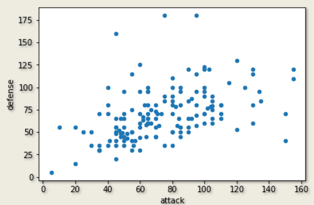
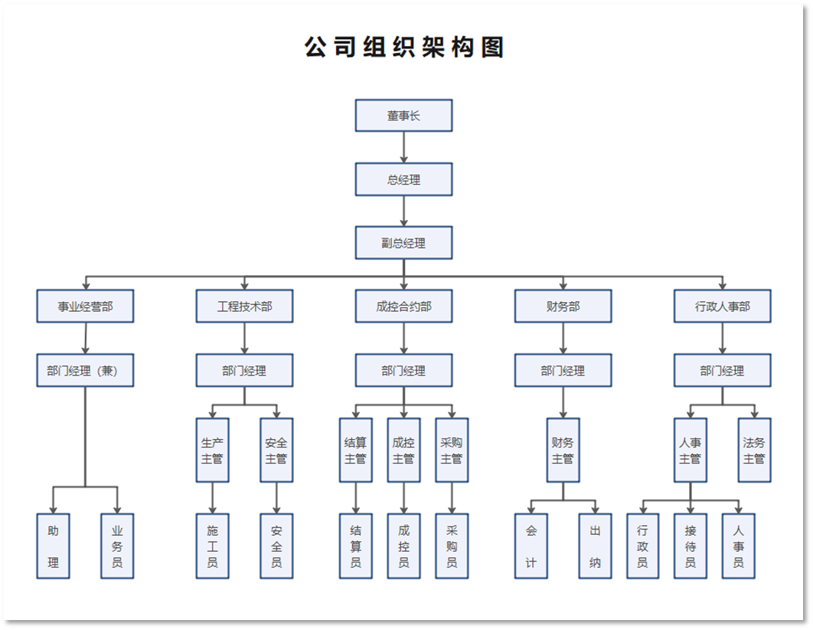
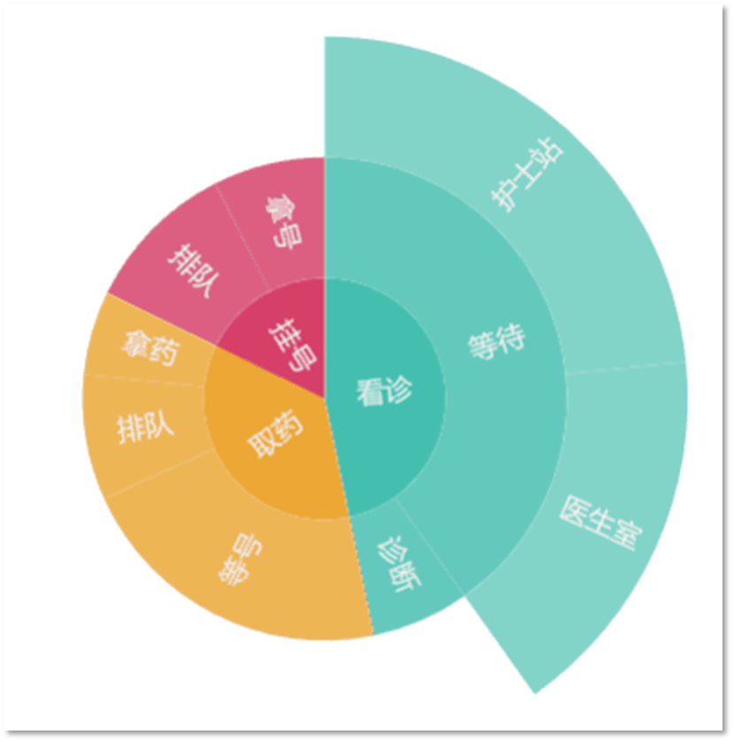
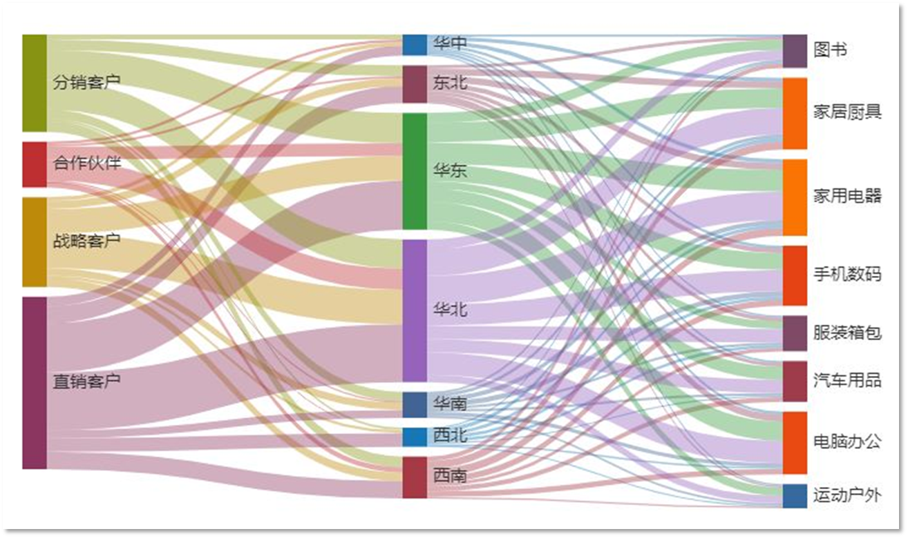
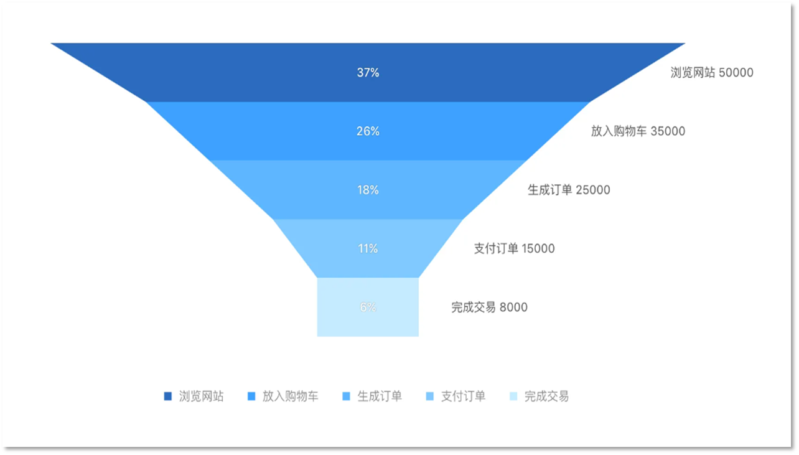
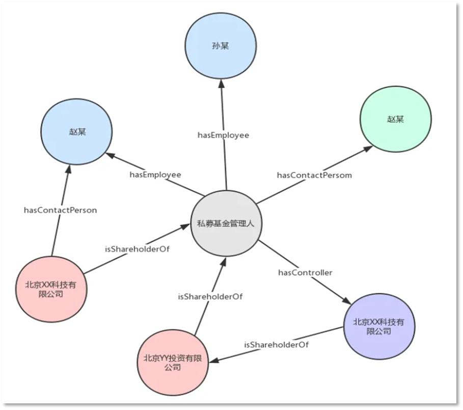

# 1 关系型数据的概念
（一）关系型数据（relational data）是*表现实体之间联系和关联的数据*。

（二）关系型数据的可视化能够发现实体间错综复杂的关系，有助于分析其结构、规律和特征，获得更有商业价值的洞见和价值。

***==常见的关系类别有相关关系、包含关系、层级关系、分流关系、联结关系。==***

# 2 相关关系
[[第5章： 结构化数据的可视化#3.4 相关性图|相关关系]]（correlation）指出了实体的什么特性在什么时间、以何种方式相关，从而帮助理解什么条件与目标结果相关，进而为行动策略提供了基础。

相关关系有三种可能的结果：正相关、负相关和零相关。
- 正相关：两个变量在同一方向上移动
- 负相关：两个变量其中一个变量的增加与另一个变量减少有关
- 零相关：两个变量之间没有关系

## 2.1 可视化方法
### 2.1.1 [[第5章： 结构化数据的可视化#^4c862c|散点图]]
#### 2.1.1.1 定义 
主要绘制数值类型变量数据，它将所有的数据以点的形式展现在直角坐标系上，如果变量相互关联，则点将沿直线或曲线分布。
相关性越强，点与直线的距离就越近
#### 2.1.1.2 [[第4章：可视化编程语言#2.1.4.2 关系类（Relational Plots）|代码]]
```python
import numpy as np
import pandas as pd
import matplotlib.pyplot as plt
import seaborn as sns
data = pd.read_csv("../input/pokemon.csv")
 
#绘图，使用dataframe.plot.scatter()方法
g1 = data.loc[data.generation==1,:]
g1.plot.scatter('attack', 'defense')
```

### 2.1.2 [[第5章： 结构化数据的可视化#^67da4d|气泡图]]
#### 2.1.2.1 定义
一种多变量图表，是散点图的变体，气泡图通常用于比较和展示不同类别圆点（这里我们称为气泡）之间的关系，通过气泡的位置以及面积大小来表示。
气泡图使用三个值来确定每个数据序列，可用于分析数据之间的相关性。
#### 2.1.2.2 [[第4章：可视化编程语言#2.1.4.2 关系类（Relational Plots）|代码]]
```python
import matplotlib.pyplot as plt
import numpy as np
 
# 输入产量与温度数据
production = [1125, 1725, 2250, 2875, 2900, 3750, 4125]
tem = [6, 8, 10, 13, 14, 16, 21]
rain = [25, 40, 58, 68, 110, 98, 120]
 
colors = np.random.rand(len(tem))  # 颜色数值
size = production
plt.scatter(tem, rain, s=size, c=colors, alpha=0.6)  # 画散点图, alpha=0.6 表示不透明度为 0.6
plt.ylim([0, 150])  # 纵坐标轴范围
plt.xlim([0, 30])   # 横坐标轴范围
plt.xlabel('温度')  # 横坐标轴标题
plt.ylabel('降雨量')  # 纵坐标轴标题
plt.show()
```


# 3 包含关系
包含是集合与集合之间的从属关系，也叫子集关系。
包含关系是关系型数据中最基本也是最简单的一种关系类别。
## 3.1 可视化方法
### 3.1.1 韦恩图
#### 3.1.1.1 定义
表示数据集之间包含关系的可视化图形。
通过面积的大小来映射集合元素的个数，重叠部分的面积，则代表多个数据集重合元素的个数。

# 4 层级关系
层级是一种用树形结构描述实体及其之间联系的关系类型。层级关系的逻辑结构可以用一棵倒置的树表示。
分层数据中最基本的数据关系是层级关系，它代表两条记录之间一对多（包括一对一）的联系。
## 4.1 可视化方法
### 4.1.1 树状图
一种流行的利用包含关系表达层次化数据的可视化方法，它是以数据树的图形表示形式，以父子层次结构来组织对象。
树状图可以分为有权重的树形图和无权重的树形图。


### 4.1.2 旭日图
一种现代饼图，能表达清晰的层级和归属关系，以父子层次结构来显示数据构成情况。旭日图中，离原点越近表示级别越高，相邻两层中，是内层包含外层的关系。
可以更细分溯源分析数据，真正了解数据的具体构成。


# 5 分流关系
分流是描述数据的流向或能量平衡的分流关系。
当目标是生成清晰可理解的流时，必须使用其他的图技术。

## 5.1 可视化方法
### 5.1.1 桑基图
一种描述数据分流关系的可视化图表方案，它主要由边、流量和支点组成，其中边代表了流动的数据，流量代表了流动数据的具体数值，节点代表了不同分类。
桑基图的优势是可以直观地展现数据流动

### 5.1.2 和弦图
用于表示数据间的关系和流量。外围不同颜色圆环表示数据节点，弧长表示数据量大小。
和弦图用于探索实体组之间的关系，实体之间的连接用于显示它们共享某些共同点，这使和弦图非常适合比较数据集内或不同数据组之间的相似性。

### 5.1.3 漏斗图
适合作为具有层级关系的数据的可视化方式，特别是流程类或具有先后关系步骤的数据，且一般是用来描述单变量在不同环节的变化情况。


# 6 联结关系
指对象与对象之间由于某种因素的作用，使二者之间具有某种关系。
>如小明和小明的妈妈之间存在母子关系。

一个对象并不是只和另一个对象存在联结关系，其可以与多个对象之间存在联结关系。
>如小明和爸爸、小明和同学都存在联结关系

## 6.1 可视化方法
### 6.1.1 节点关系图
表示两个或多个对象之间的关系，由节点、联系、方向组成。
节点表示一个对象，常用圆形、方形等形状来表示。
两个节点之间有联系，则使用线段连接，线段上会有关系说明。
节点之间联系的方向性，使用线段的箭头来表示联系的单向或双向。

