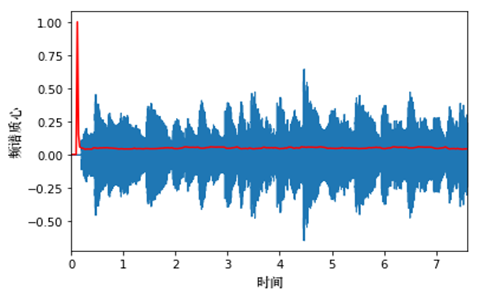
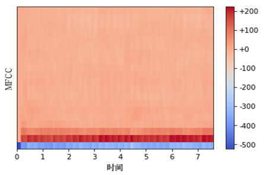

# 1 多媒体数据可视化概述
## 1.1 多媒体数据定义
在计算机系统中，组合两种或两种以上媒体的一种人机交互式信息交流和传播媒体，称为多媒体
多媒体涵盖的媒体种类包括文字、图像、视频、语音等，即多种信息载体的表现形式和传递方式。
## 1.2 多媒体数据可视化
- 多媒体数据可视化主要是指对多媒体数据的特征抽取；
- 在对多媒体数据进行可视化时，要满足其多样性特征；
- 多媒体数据特征抽取可以分为：
	- ==文本特征抽取==
	- ==图形特征抽取==
	- ==声音特征抽取==
	- ==视频特征抽取==

# 2 多媒体数据类型
## 2.1 音频数据
音频特征主要分为帧层次上的音频特征和片段层次上的音频特征；
帧层次上的音频特征主要包括：频域能量^[评判某一帧是否是静音帧，若该帧的频域能量达不到阈值，就认为该帧是“静音帧”]；子带能量比^[将频域划分为4个子带，各子带能量与频域能量的比值]；频率中心^[度量音频亮度的指标]；带宽等指标^[音频频域范围]；
片段层次上的音频特征包括：静音比例^[一段音频片段中静音帧的数目占片段中总帧数的比例]；子带能量比均值^[基于“子带能量比”，计算片段中各子带能量比的均值]；频谱流量^[一个片段中相邻两帧之间频谱变化量的均值]；

### 2.1.1 音频特征可视化
频谱质心是指声音的“质心”。频谱质心的值越小，表明越多的频谱能量集中在低频范围内。

过零率是指一个信号符号变化的比率，即在每帧中，语音信号通过零点（从正变为负或从负变为正）的次数。

梅尔倒谱系数通常由10～20个特征构成的集合，可以用来简明地描述频谱包络的总体形状，对语音特征进行建模。

### 2.1.2 音乐节奏可视化
弧图法采用首尾端点位于一维轴上的弧来表示重复的音乐结构，其宽度与重复序列的长度成正比，半径与匹配对之间的距离成正比

## 2.2 图像数据
图像数据的特征可以分为底层视觉表达特征和高层语义特征。
图像的底层视觉表达特征又可以分为全局特征和局部特征：
- 全局特征：颜色、纹理、边缘、形状；
- 局部特征：==视觉词袋==通过对图像进行特征提取和描述，将一幅图像分割为一系列局部区域或者基本元素的集合，然后将这些区域或者基本元素构建成“单词袋”，统计它们出现的频率，最后用==直方图==的形式来表示。
### 2.2.1 基于相似性的图像集可视化
基于相似性的图像可视化可以构造出带有层次的信息，从而支持对大规模图像集的浏览。

### 2.2.2 基于故事线的社交照片可视化
u故事线是可视化大规模社交网络图片或一系列新闻报道图片的一种有效方法，其可以提炼出多类别图片在时间线上的先后顺序。

## 2.3 视频数据
视频数据的分析涉及视频结构和关键帧的抽取、视频语义的理解，以及视频特征和语义的可视化与分析。视频可视化主要考虑采用何种视觉编码来表达视频中的信息，以及如何帮助用户快速精确地分析视频特征和语义。

### 2.3.1 可视化
#### 2.3.1.1 视频概要
#### 2.3.1.2 视频抽象
视频抽象注重将视频信息映射为可视化元素，其中视频信息主要指代视频中重要的信息，而不是原始的视频图像。
视频抽象方法可以分为视频嵌入^[==将视频流转化成一个向量，并且以线性或非线性形式组织起来，以便帮助观察者快速有效地理解视频流中宏观的结构信息和变化趋势==]、视频图标^[==对视频的内容或特征采用某种变换形成的简化可视表述==]和视频语义^[==抽取出具有语义的属性或关键性事件==]

