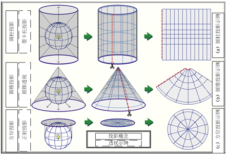

# 1 空间型数据可视化概念
## 1.1 空间数据定义
是指定义在三维空间中，具有地理位置的数据
## 1.2 地图和投影
地理投影是尤为重要的关键技术。地图信息可视化最基础的步骤就是地图投影，即将==不可展开的曲面上的地理坐标信息转换到二维平面==，等价于曲面参数化。

通过地球投影将三维曲面变成二维坐标系中的坐标（x，y）的过程中必然产生曲面的误差与变形。通常按照变形的方式来分析，这个转换过程要具备如下3个特性。
1. 等角度：投影面上任何点的2个微分段组成的角度，投影前后保持不变。角度和形状保持正确的投影，也被称为正形投影。
2. 等面积：地图上任何图形面积经主比例尺寸放大后，与实际相应图形的面积大小保持不变。
3. 等距离：在标准的经纬线上无长度变形，即投影后任何点到投影所选中原点的举例保持不变。

最常见的3种投影方法有：==墨卡托投影、阿伯斯投影、方位投影==。

### 1.2.1 墨卡托投影
又称为正轴等角圆柱投影。用一个与地轴方向一致的圆柱切割地球，并按等角度条件，将地球的经纬网投影到圆柱面上，将圆柱面展开平面后即获得墨卡托投影后的地图。
经线时均匀地映射成一组垂直的直线，纬线映射成一组平行的水平线。相邻纬线之间的距离由赤道向两级增大，在投影中每个点上任何方向的长度比均相等，即没有角度变形，但是==面积变形明显==。在基准纬线（赤道）上的对象保持原始面积，==随着离基准线越来越远而变大==。
### 1.2.2 阿伯斯投影
正轴等面积割圆锥投影。==面积不变==的正轴等积割圆锥投影。
首先使用圆锥投影与地球球面相割于2条纬线上，然后按照等面积条件将地球的经纬网投影到圆锥面上，将圆锥面展开就得到了阿伯斯投影。阿伯斯投影==具备等面积特性，但是不具备等角度特性==。
适合东西跨度较大的中低纬度地区，因为这些地区的变形相对较小，比如中国和美国。
### 1.2.3 正位投影
属于等距投影的一种。任何一点沿着经度线到投影中原点的距离保持不变。
==以选中的点作为原点生成的方位投影能非常准确地表示任何位置到该点的距离==
# 2 空间型数据可视化种类和图表
## 2.1 基于点的地理数据可视化
### 2.1.1 点描法地图
点描法地图又称为==点分布地图、点密度地图==，是一种通过在地理背景上绘制相同==大小的点来表示数据在地理空间上分布的方法==。

### 2.1.2 带气泡的地图
需要地图上的点反映出属性的数据大小，而不仅仅是点分布地图表达出的分布情况。

## 2.2 线型数据可视化
- 网络地图：==以地图为定义域的网络结构，网络的线段表达数据中的连接关系和特征==。
- 流量地图：流量地图是一种==表达多个对象之间流量变化的地图==。流出对象和流入对象之间通过类似于河流的曲线链接，==曲线的宽度代表流量的大小==。
## 2.3 基于区域的地理数据可视化
区域数据也称为面数据，面数据包含了比点数据和线数据更多的信息，面即区域块。区域数据设计地图上不同区域自然或社会经济的基本状况和统计信息。
### 2.3.1 等值线图
等位地图，被称为等值线地图，可以说是地图和等高线图两个图层的叠加，常用于表示地面海拔高度的变化曲面、温度变化数据、降雨量数据。
### 2.3.2 等值区间地图
等值区间地图数据最原始的地图，直接利用地图形状来展示数据，假设数据的属性在一个区域内部平均分布，将区域内相应数据的统计值直接映射为该区域的颜色，各区域的边界为封闭的曲线，因此一个地区采用同一颜色编码。
### 2.3.3 变形统计地图
为了解决等值区间地图这种对可视化空间布局使用不合理的问题，变形统计地图可视化根据地理区域的数值大小调整相应区域的形状和面积，对不同区域按照一定的规则进行变形，其核心思想是采用变形算法，按照地理区域的属性值对各区域进行适当的变形，以克服空间使用的不合理性。
### 2.3.4 简化示意图
不规则图形的面积有时难以估算，因此多采用简化示意图。
