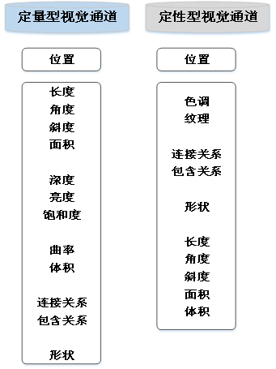

# 1 可视化理论概述
## 1.1 要求
- 图形选择的契合性：根据不同类型的需求，使用不同的可视化图形。
- 图形优化的合理性：对图形元素展示的数据进行合理的“加减法”，是得信息表达更加有效。
- 图片风格的统一性：可视化过程中要尽可能的保持绘图风格的统一，避免绘图风格差异造成认知偏差。
 
# 2 可视化基本理论
## 2.1 格式塔原则
- 接近性原则
- 相似性原则^[形状、大小、颜色相似的物体会被视为一个群体]
- 闭合性原则^[将不完整的局部感知成一个整体]，如将一个缺口圆，看成一个圆
- 连续性原则^[引导视觉遵循一致的路径，通过共性将物体感知练成一个整体]，如环形图
- 包含性原则，将信息分组、内容分离，提升页面的层次和机构性
- 简单性原则，人会采取最简化的方式识别世界
- 共势性原则，一组问题具有沿着相似光滑路径运动趋势或相似的排列模式，人会把它识别成同一类物体
- 对称性原则
- 经验性原则，相近的物体放在一类会识别成一类

## 2.2 颜色刺激理论
- 视觉系统与可见光
- 色彩空间

## 2.3 视觉编码理论
- 相对判断^[人类的感知系统工作原理是决定与对所观察事物的相对判断]和视觉假象^[通过视觉系统获得的视觉感知，与客观世界中事物不一致的现象]
- [[第1章：可视化概述#^da25f3|标记和视觉通道]] ^ef7a75
	- 对视觉通道的编码主要根据视觉通道的表现力和有效性。并形成了如下三种最基本的模式 ^69a18a
		- 
	- 视觉通道表现力排行： ^1da38e
		- 

# 3 可视化图形要素
## 3.1 坐标系统图形
- 条形图
- 折线图
- [[第6章：关系型数据的可视化#2.1.1 第5章： 结构化数据的可视化 4c862c 散点图|散点图]]
- 箱型图
- 极坐标图
- 雷达图
- 热力图
- 空间坐标系图形
## 3.2 非坐标系统图形
- [[第6章：关系型数据的可视化#5.1.1 桑基图|桑基图]] 
- 扇形图
- 网络图
- [[第6章：关系型数据的可视化#5.1.3 漏斗图|漏斗图]]
- 仪表盘图
- [[第6章：关系型数据的可视化#4.1.1 树状图|树状图]]
- [[第7章：文本数据可视化#3.1 词云图|词云图]]
- 地理图
## 3.3 ==图形要素的应用场景

- 比较类：可以选择能够反映数据项不同特征（柱状图、雷达图、词云图、仪表盘图等）和变化规律（如折线图、柱状图、桑基图、漏斗图等）的图形要素。
- 关系类：
	- 对于量化数据
		- 数据项较少：散点图、热力图等
		- 数据项较多：着色散点图、空间散点图、曲面图
	- 对于非量化数据：可以采用网络图
- 构成类：
	- 对于数据项较少：扇形图、堆积柱状图、占比柱形图、堆积面积图
	- 对于数据项较多：矩阵柱状图、极坐标图
- 分布类：以统计分析类图表为主，如箱型图、散点图、柱形图、热力图