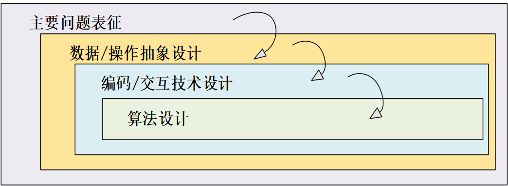
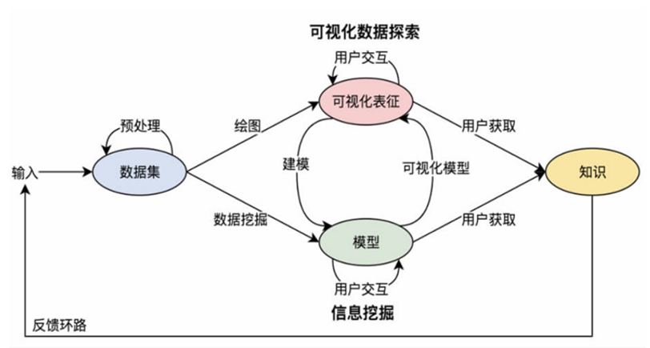
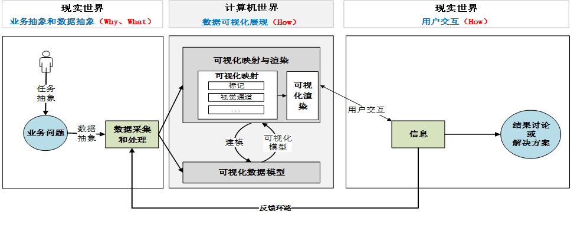

# 1 数据可视化过程理论模型
- 意义构建理论
- 信息觅食理论
- 分布式认知理论：
	- 实用型：明确的、有意思的、目标导向
	- 认识型：信息外部表征与人的内部心理模型的协调与适应
- 用户认知理论模型
# 2 主要流程模型
## 2.1 流水线模型
该模型把数据分成五种数据，要经历四个过程

具体过程：
1. 对原始数据进行数据分析
2. 对预处理过的数据进行数据筛选
3. 将目标数据映射为几何数据
4. 绘制图形图标数据
## 2.2 card模型
基于建构理论和信息觅食理论。 描述了人在数据分析时的主要认知行为、过程及关系,在此之后的大部分信息可视化系统和工具包都支持这个模型,只是在实现上存在细微的差异。
card模型的关键步骤间的转移路径与依赖关系，描述人在数据分析时的主要认知行为、过程及关系如下图：

具体过程如下：
1. 数据变换将原始数据转换为数据表形式
2. 可视化映射将数据表映射为可视化结构，由空间基、标记以及标记的图形属性等可视化表征组成
3. 通过可视元素^[根据位置、尺寸、大小、颜色等参数定义元素特征]将可视化结构转化成视图模式

## 2.3 嵌套模型
顶层是描述特定领域的问题和数据,第二层是将其映射为抽象操作和数据类型,第三层是设计视觉编码和交互以支持这些操作,最内层的第四层是创建算法以自动且高效地执行该设计。事实上, 三个内部层次都是设计问题的实例,尽管在每个等级上都是不同的问题。

具体过程：
1. 确定可视化的任务目标
2. 收集、处理数据，对数据、操作的抽象化设计
3. 实现数据可视化所需的可视编码和交互设计
4. 对可视化编码及交互设计进行算法设计
## 2.4 ==人机交互模型
可视化分析是非线性的迭代性发展过程。

# 3 业务驱动的数据可视化过程
分为现实世界的业务问题提出、计算机世界的数据可视化展示以及现实世界的用户交互三个部分

## 3.1 业务抽象和数据抽象
  1. 任务抽象:业务问题需求分析        
       1. 数据抽象:数据采集与数据处理
       1)数据采集
       2)数据处理:数据清洗、数据集成、数据转换
## 3.2 数据可视化展现
1. 可视化映射与渲染        
	1. 可视化映射:
			>条件：表示并保持数据原貌，并只有数据表中的数据才能映射可视化结构；可视化映射形成的可视化表征或隐喻是具有丰富表达力的
	
		1)可视化空间
		2)[[第1章：可视化概述#^da25f3|可视化编码]]:标记、[[第2章：可视化理论#^69a18a|视觉通道]]
	1. 可视化渲染 
	
1. 可视化建模
## 3.3 数据可视化的用户交互