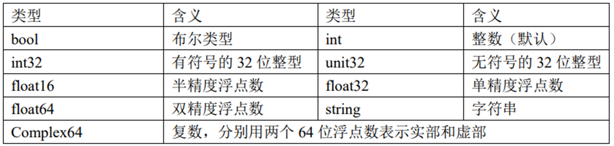
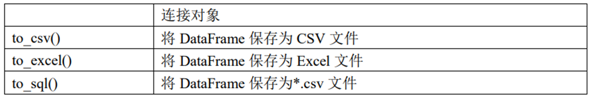
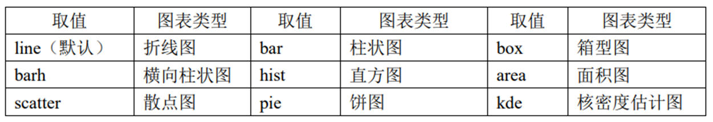

# 1 可视化软件工具

Excel、Tableau、Sugar BI

# 2 可视化编程语言
## 2.1 Python
### 2.1.1 numpy库
数组常见常用属性：

数组常见数据类型：

random模块常用方法：

### 2.1.2 pandas库
读取和外部存储的方法


plot()方法的 kind 属性取值及其对应图表类型
> df.ploy(kind =  ' ')


### 2.1.3 matplotlib库
pyplot 中常用绘图方法一览


### 2.1.4 Seaborn库
seaborn 库中常用方法及其含义.

#### 2.1.4.1 分布类（Distribution Plots）
1. 直方图 histplot
```
sns.histplot(data=df, x="变量名", bins=20, kde=True, hue=None)
```
1. 核密度图 kdeplot
sns.kdeplot(data=df, x="变量名", hue=None, fill=True)
2. 分布图（网格） displot
sns.displot(data=df, x="变量名", col=None, row=None, kind="hist")


#### 2.1.4.2 关系类（Relational Plots）

4. 散点图 scatterplot
sns.scatterplot(data=df, x="变量X", y="变量Y", hue=None, size=None, style=None)

5. 折线图 lineplot
sns.lineplot(data=df, x="时间变量", y="数值变量", hue=None)

6. 关系图（网格） relplot
sns.relplot(data=df, x="变量X", y="变量Y", col=None, row=None, kind="scatter")


#### 2.1.4.3 分类类（Categorical Plots）

7. 条形图 barplot（显示均值）
sns.barplot(data=df, x="分类变量", y="数值变量", hue=None, ci=95)

8. 计数图 countplot
sns.countplot(data=df, x="分类变量", hue=None)

9. 箱线图 boxplot
sns.boxplot(data=df, x="分类变量", y="数值变量", hue=None)

10. 小提琴图 violinplot
sns.violinplot(data=df, x="分类变量", y="数值变量", hue=None, split=False)

11. stripplot（抖动散点图）
sns.stripplot(data=df, x="分类变量", y="数值变量", jitter=True)

12. swarmplot（不重叠点图）
sns.swarmplot(data=df, x="分类变量", y="数值变量")


#### 2.1.4.4 回归类（Regression Plots）

13. regplot（回归散点图）
sns.regplot(data=df, x="变量X", y="变量Y", ci=95)

14. lmplot（回归 + 分面）
sns.lmplot(data=df, x="变量X", y="变量Y", hue=None, col=None, row=None)


#### 2.1.4.5 矩阵图（Matrix Plots）

15. 热力图 heatmap
sns.heatmap(df, annot=True, cmap="coolwarm")

16. 聚类热力图 clustermap
sns.clustermap(df, cmap="viridis", col_cluster=True, row_cluster=True)


#### 2.1.4.6 分面 FacetGrid

17. FacetGrid（自定义分面网格）
g = sns.FacetGrid(df, col="变量1", row="变量2")
g.map(sns.scatterplot, "变量X", "变量Y")


#### 2.1.4.7 风格设置

18. 风格设置
sns.set(style="whitegrid")

19. 调色板
sns.color_palette("Set2")
