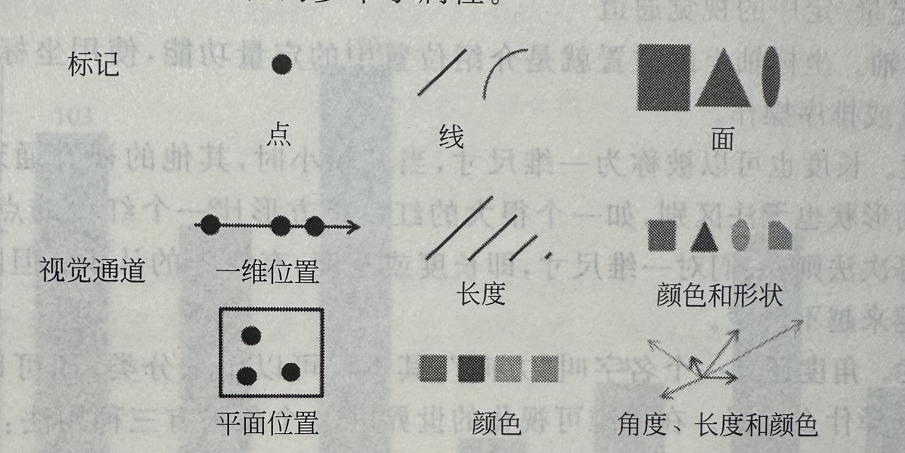

# 1 可视化基本概念

- 原则
	- 1.逻辑清晰
	- 2.表达清晰
	- 3.设计简洁
- 作用
	- 1.快速理解信息
	- 2.识别关系和信息
	- 3.证实假设或者猜想
- 分类
	- 1.结构化数据可视化
	- 2.关系型数据可视化
	- 3.文本数据可视化
	- 4.多媒体数据可视化
	- 5.时变数据可视化
	- 6.空间数据可视化
# 2 可视化一般过程

## 2.1 步骤
1. 数据获得
	挑战在于数据格式变换和在异构异质数据的获取
2. 数据处理
	1. 数据清洗
		1. 噪声和离群值。噪声是对真实数据的修改，离群值是与大多数据偏离较大的数据
		2. 数据缺失。包括消息未记；某些属性不适用于所有实例
		3. 数值重复
			1. 大多来自异构数据源的合并，可采用数据清洗方法清除
	2. 数据精简
		1. 使用质量指标优化非视觉因素，如时间和空间
		2. 使用质量指标优化数据可视化，称为可视数据的精简
	3. ==其他数据预处理过程==
		1. 合并。将两个以上的属性或者对象合并为一个属性或者对象，可以做到：简化数据；改变数据尺度；减小数据方差
		2. 采样。如果采样大致具备原始数据的特征，那么就是具有代表性的
		3. 降维。有助于解决维度灾难，减少数据处理的时间和内存消耗；可以有效地可视化数据；降低噪声或消除无关特征。方法有主成分分析、奇异值降维
		4. 特征子集选择。从数据集中选择部分数据属性值可以消除冗余、与任务无关的特征
		5. 特征生成。
		6. 离散化^[将数据集根据其分布划分成若干个子集,形成对数据集的离散表达。]和二维化^[将数据区间映射到[0,1]区间的方法]。
		7. 属性变换^[将某个属性的所有可能性一一映射到另一个空间]。标准化^[将数据区间变换到某一统一的区间范围]和归一化^[变换到[0,1]区间]的两类特殊的属性变化。
1. 可视化映射（流程的核心） ^da25f3
	1. 可视化空间
	2. 标记，是数据属性到可视化元素的映射，用于直观的代表数据的性质分类。
	3. 视觉通道，是数据的值到标记的视觉表现属性的映射，用于展现数据属性的定量信息。
	4. 
	5. > [[第二章：可视化理论#^ef7a75|标记和视觉通道]]是可视化编码元素的两个方面，两者结合可以完成可视化映射这一过程。

# 3 挑战
1.  视觉噪声
2. 信息丢失严重
3. 大型图像感知
4. 高速图像变换
5. 高性能要求
6. 可视化过程表现方式
7. 查看大量数据
8. 集成数据挖掘
9. 集成分析推理
10. 他人协作
11. 普遍可靠性

## 3.1 发展方向
1. 与数据挖掘联系更加紧密
2. 与人机交互更加紧密
3. 与大规模、高纬度、非结构化数据更加紧密