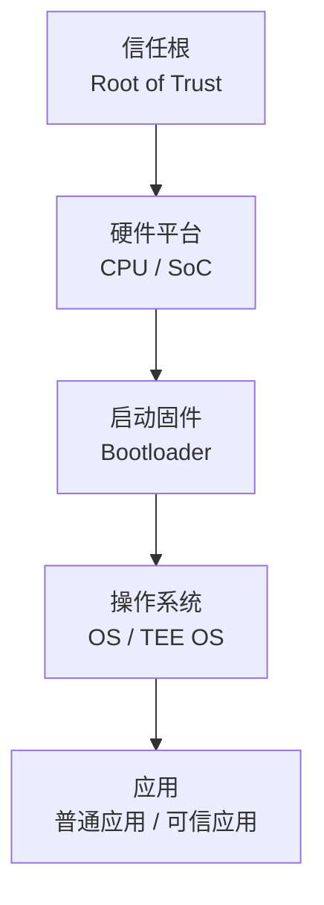
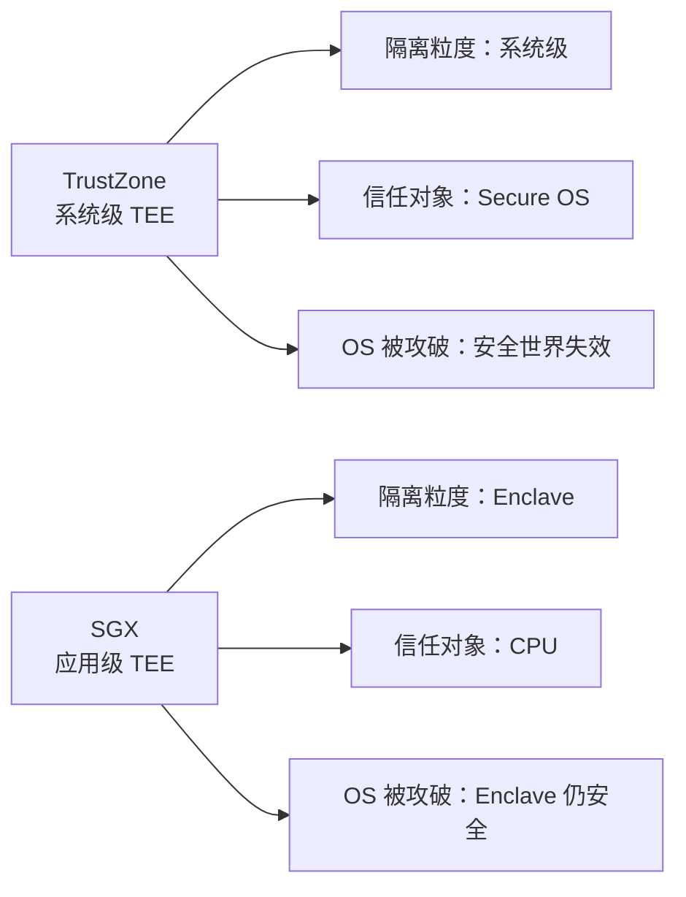

# 1 重点
## 1.1 T0
1. **隐私保护模型 (第六章)**
    ◦ *[[总复习#7.3 数据匿名化与反匿名化基本模型|K-匿名 (K-Anonymity)]]*：必须掌握定义（K-1 条相同）、**如何实现**（泛化、抑制）以及**两大缺陷**（==无法防范同质性攻击、背景知识攻击==）。
    ◦ *[[总复习#7.4 差分隐私 (Differential Privacy) 基本原理、用法|差分隐私 (Differential Privacy)]]*：这是针对 K-匿名缺陷提出的更强模型。重点理解其**定义**（添加噪声，使查询结果对个体的存在不敏感）和**拉普拉斯机制**（针对数值型结果）,。
2. **虚拟化与容器安全 (第五章)**
    ◦ *[[总复习#6.6 容器|VM vs 容器]]*：这是当前技术的重点。必须能说出二者的区别（VM 有独立 OS，容器共享内核）以及**容器的安全风险**（隔离性差、内核漏洞逃逸）,。
3. **可信计算环境 (第四章)**
    ◦ *[[总复习#5.6 TrustZone与SGX的区别|TrustZone vs SGX]]*：这是硬件安全的两个流派。重点记忆**TrustZone**是基于 CPU 状态切换（安全世界/非安全世界），而**SGX**是基于内存隔离（Enclave 飞地）。
    ◦ *[[总复习#5.3.1 信任链|信任链]]*：启动过程（ROM -> Bootloader -> Trusted OS -> Rich OS）是填空或简答题的高频点。
## 1.2 T1
1. **大数据算法 (第七章)**
    ◦ *[[总复习#8.1.2 **PageRank 算法 (网页质量排名)**：|PageRank]]*：理解其**核心思想**（投票机制、数量假设、质量假设）。
    ◦ *[[总复习#8.1.1 TF/IDF 模型 (相关性计算)|TF/IDF]]*：理解其**公式含义**（词频越高越重要，但在所有文档中越常见越不重要）。
    ◦ **推荐攻击**：了解**托攻击 (Shilling Attack)** 的基本原理（伪造用户画像影响推荐结果）。
2. *访问控制模型 ([[总复习#3.8.2 访问控制|第二章]] & [[总复习#9.4 访问控制的分类、基本方法|第八章]])*
    ◦ *[[总复习#^6f9e8f|RBAC (基于角色)]]*：企业最常用，理解 用户-角色-权限 的映射关系。
    ◦ *[[总复习#3.9 等级分级基础知识|BLP vs Biba]]*：BLP 侧重**保密性**（无上读，无下写），Biba 侧重**完整性**（无下读，无上写），口诀要记牢,。
>[!tip] 
BLP:保密性,防泄密
Biba:完整性,防污染
3. **大数据架构 (第三章)**
    ◦ *[[总复习#4.1 SOA 系统的架构|SOA]] vs [[总复习#4.6 微服务及其安全|微服务]]*：理解从 ESB 总线（SOA）到去中心化、轻量级通信（微服务）的演变。
    ◦ *[[总复习#4.5.4 两种发布订阅系统架构|发布/订阅]]*：理解其**解耦**特性（时间、空间、同步）。
## 1.3 T2
1. *大数据 5V 特征*：Volume, Velocity, Variety, Veracity, Value (第一章)。
2. *[[总复习#3 密码学基础知识|密码学基础]]*：
    ◦ Kerckhoffs 假设（安全依赖于密钥而非算法）。
    ◦ 混合加密（公钥加密会话密钥，对称密钥加密数据）。
3. *[[总复习#3.8.1 身份认证|身份认证]]*：单点登录（SSO/Kerberos）的概念，以及“所知、所有、所是”三要素,。
# 2 大数据安全的概念
## 2.1 如何理解大数据
**5V 特征**：大数据通常具有五个主要特征：
1.  **Volume** (数据量大)：超出常规工具处理能力的数据集。
2. **Velocity** (处理速度快)：产生速度快，对实时处理能力要求高（如流数据）。
3. **Variety** (类型复杂)：包含结构化、半结构化和非结构化数据（如视频、图片）。
4. **Veracity** (真实性/质量)：数据质量参差不齐，需识别错误或恶意数据。
5. **Value** (价值)：价值密度低，需通过技术挖掘其潜在价值。
---
**安全含义**：大数据安全包含两重含义：一是大数据服务本身的安全问题（如系统架构、隐私泄露）；二是利用大数据技术解决安全问题（如利用流量特征识别攻击）。
## 2.2 基本条例与标准
• *欧盟 GDPR*：《通用数据保护条例》。强调用户权利，如数据转移权（迁移数据）、被遗忘权（要求删除数据）、算法公平性（要求解释自动决策）。
• *中国《个人信息安全规范》*：国家标准，虽非强制但具重要参考意义。强调最小化收集、用户明示同意、限制使用范围、去标识化处理等原则。
# 3 密码学基础知识
## 3.1 密码学基本加解密过程与体制
• **五元组**：现代密码体制由 (P,C,K,E,D) 组成，分别代表明文、密文、密钥、加密算法、解密算法。
• **条件**：对于任意密钥 k 和明文 x，必须满足 $d_k​(e_k​(x))=x$。
• **Kerckhoffs 假设**：系统的安全性不应依赖于算法的保密，而应依赖于**密钥**的保密。
传统密码设计的技巧是：代换和置换。代换是系统地将一组字母换成其他字母或符号；置换是将字母重新排序
## 3.2 **香农的密码设计思想**
• 利用乘积密码实现 **混淆 (Confusion)** 和 **扩散 (Diffusion)**。
混淆使所得密文与明文以及密钥的关系变得十分复杂，无法从数学上直观描述，或从统计上难以分析;
扩散的目的是让明文中的任一位及密钥中的任一位能影响尽可能多的密文位，以便隐藏明文的统计特性，加强密码安全。
• **完善保密**：证明了“一次一密” (One-Time Pad) 可以达到完善保密水平，但要求密钥长度至少等于明文长度。
## 3.3 流密码设计思想
- **原理**：利用密钥产生一个伪随机比特流（密钥流），然后将该比特流与明文进行异或运算。
- **特点**：加密效率高，适合资源受限环境，但如果密钥流重复使用极其危险,。

## 3.4 分组密码的设计思想
• **原理**：将明文分成固定长度的数据块^[分拆为一些固定长度的分组，不够时还要进行数据填充]（分组），对每个块进行加密。
• **结构**：常用代换-置换网络 (SP网络)，利用 S 盒（非线性，提供混淆）和 P 置换（提供扩散）。
## 3.5  AES 与 DES
• **DES (数据加密标准)**：
    ◦ 64位分组，56位密钥。
    ◦ 使用 Feistel 结构。
    ◦ 现状：因密钥过短已被认为不再安全，被 3DES 或 AES 取代。
    不安全是因为：密钥太短（56 bit）、S 盒虽精巧，但整体抗性已不足
• **AES (高级加密标准)**：
    ◦ 128位分组，密钥长度可选 128/192/256 位。
    ◦ 不使用 Feistel 结构，而是 SP 网络。
    ◦ 现状：目前最常用的对称加密算法，速度快且安全。
DES 与 AES 都是对称分组密码，但 DES 采用 Feistel 结构、64 位分组和 56 位密钥，安全性已不足；AES 采用 SPN 结构、128 位分组和更长密钥，具有更强的混淆与扩散能力，是当前主流加密标准。
## 3.6 公钥加密体制基本思想
• **双钥机制**：使用一对密钥，一个公钥（公开）用于加密，一个私钥（保密）用于解密。
• **解决问题**：解决了传统密码学中最困难的**密钥分配**^[很多密钥分配协议引人了密钥分配中心。]和**数字签名**^[能否设计出一种方案，就像手写签名一样，确保数字签名出自某一特定的人，并且各方对此没有异议。]问题。
• **安全性**：基于数学难题（如 RSA 基于大整数分解，ECC 基于椭圆曲线离散对数）。
利用公钥算法实现保密通讯步骤如下：
1. 每一个用户产生一对密钥，用来加密、解密消息。
2. 每一个用户将其中一个密钥公开，该密钥称为公钥，另一个密钥称为私钥。每一个用户可以获得其他用户的公钥，称之为该用户的公钥环。
3. 若 Bob 打算发消息给 Alice收到消息后，使用其私钥对消息解密。由于只有 Alice 知道自己的私钥，因此其他接收者均不能对该消息解密。
## 3.7  网络协议 (IPSec, TLS/SSL)
### 3.7.1 IPSec (网络层)：
-  协议安全)是一个工业标准网络安全协议，为 IP网络通信提供透明的安全服务，可使 **TCP/IP 通信免遭窃听和篡改，可以有效抵御网络攻击，同时保持易用性。**
- 目标：保护 IP 数据包安全，防窃听和篡改；为抵御网络攻击提供保护措施。
- 组件：AH (认证头，提供防篡改，防止重放攻击)、ESP (封装安全载荷，提供加密+认证)、IKE (密钥交换)。
### 3.7.2 TLS/SSL (传输层)：
- SSL是 Web 浏览器和 Web 服务器之间安全交换信息的网络协议。SSL 提供了两个基本安全服务：认证与保密。SSL 提供了 Web 浏览器与Web 服务器之间的逻辑安全管道。
- 目标：保护 Web 通信安全 (HTTPS)。
	- 基本流程：
		1. ==握手协议==：协商加密算法、交换随机数、服务器发送证书、客户端验证证书并生成预主密钥。
			1. 第一阶段——密钥等信息交换阶段。通信双方通过相互发送 Hello 消息进行初始化。通过 Hello 消息，双方就能确定是否需要为本次会话产生一个新密钥。如果本次会话是一个新会话，则需要产生新的密钥，双方需要进入密钥交换过程；如果本次会话建立在一个已有的连接上，则不需要产生新的密钥，双方立即进入握手协议的第二阶段。
			2. 第二阶段——用户身份认证阶段。对用户身份进行认证，通常服务器方要求客户方提供经过签名的客户证书，并将证书结果返回给用户。
		2. ==记录协议==：使用协商好的密钥对数据进行加密传输。
- [i] TLS：  证书认证 → 协商算法 → 生成会话密钥 → 对称加密通信

SSL 协议通过握手过程和记录协议操作过程实现了如下的安全机制。
① **保密性**。SSL 协议利用对称密钥算法对传输的数据进行加密，以防止数据在传输过程
中被窃取。
② **身份认证性**。SSL 协议基于证书对服务器和客户端进行身份认证，确保数据发送到正
确的客户端和服务器，其中客户端的身份认证是可选的。
③ **完整性**。SSL 协议的数据传输过程中使用 MAC 算法来检验数据的完整性，确保数据
## 3.8 身份认证与访问控制的区别
### 3.8.1 身份认证
• 定义：身份识别与鉴定，确认实体为其声明的实体，用来鉴定用户身份的真伪。
*解决“你是谁”的问题，鉴定用户身份的真伪 (Authentication)。*
#### 3.8.1.1 单点登录（SSO）
定义：用户只需登录一次，即可访问系统中其他相互信任的子系统，无需再次登录。典型实现协议是 Kerberos。
单点登录（SSO）是一种集中式身份认证机制，用户在一次登录后即可访问多个相互信任的应用系统，无需重复认证。它通过统一认证中心和共享身份凭证，实现认证与业务系统的解耦，提高了系统的可用性和用户体验。
### 3.8.2 访问控制
• 定义：主体(Subject)依据某些控制策略或权限对客体(Object)本身或是其资源进行授权访问。
*解决“你能做什么”的问题，依据策略限制主体对客体的访问权限 (Authorization)。*
___
身份认证用于确认用户或实体的真实身份，解决“是谁”的问题；访问控制在身份认证的基础上，根据安全策略决定其对资源的访问权限，解决“能做什么”的问题。二者相互配合，共同构成系统安全防护的基础。
## 3.9 等级分级基础知识
### 3.9.1 BLP 模型 (Bell-LaPadula)：
安全等级:

    ◦ 目标：侧重于保密性，主要用于军事/政府分级保护。
    ◦ 规则：
        1. No Read Up (无上读)：低密级主体不能读取高密级客体。
        2. No Write Down (无下写)：高密级主体不能向低密级客体写入数据（防止泄密）。
### 3.9.2 Biba 模型
1. **核心目标**： 防止非法或未授权的**篡改**，确保高完整性的数据不被低完整性的数据污染。
2. **两大规则（口诀：无上写，无下读）**：
    ◦ **禁止向上写 (No Write Up)**：
        ▪ **规则**：主体不能向完整性级别比自己高的客体写入数据。
        ▪ **目的**：防止低完整性（不可信）的主体篡改或污染高完整性（可信）的数据。
    ◦ **禁止向下读 (No Read Down)**：
        ▪ **规则**：主体不能读取完整性级别比自己低的客体。
        ▪ **目的**：防止高完整性的主体（如关键进程）读取并依赖了低完整性（不可靠）的数据，从而导致自身降级或出错。
- [i] Biba 模型通过控制信息流向，确保数据只能从高完整性流向低完整性，从而实现**防污染**。
# 4 大数据服务架构
## 4.1 SOA 系统的架构
• 定义：面向服务的架构 (SOA) 是一种分布式计算模式，核心概念是“服务”。
• 特点：服务是自治的、松耦合的实体，通过定义良好的接口和契约联系起来。
• 架构目标：能够组织和利用分布在不同所有域的计算资源。
## 4.2 Web Services 消息的基本结构与主要规范
• 主要规范：
- ==传输规范==：提供基本的数据传输服务。使用HTTP服务作为应用层协议被广泛应用于Web service。其通过基本的HTTP操作发送XML消息。
- ==SOAP== (Simple Object Access Protocol)：==消息规范==，主要目的是支持Web services之间的松耦合、单向异步的消息交互。
	- Envelope (信封)：必需，顶级元素，包含整个消息。
	- Header (消息头)：可选，包含控制信息（如安全性、事务处理）。
	- Body (消息体)：必需，包含实际的数据负载。
	- Fault (故障)：可选，位于 Body 中，用于携带出错信息。
- ==WSDL== (Web Services Description Language)：服务==描述规范==（抽象接口和抽象接口的绑定）。
	- 接口描述了该服务提供的功能
	- 接口的绑定描述了如何访问该服务的功能。
- UDDI (Universal Description, Discovery and Integration)：==发布和发现规范==（注册中心）。
	- 白页信息
	- 黄页信息
	- 绿页信息
## 4.3 REST基本架构
### 4.3.1 定义
表述性状态转移，一种面向资源的架构风格。
### 4.3.2 特点
- 面向资源：将网络服务封装为资源，通过URI定位。
- 统一接口：对资源的操作包括（获取、创建、修改、删除），正好对应标准的HTTP方法（GET, POST, PUT, DELETE）
- 尤其使用于完全无状态^[服务器不保存客户端的会话状态]的创建、读取、更新、删除操作。
## 4.4 Web Services 与 REST 的区别
### 4.4.1 Web services（soap）
- 重量级，协议复制，基于XML
- 面向功能（操作）
- 安全性高（有WS-Security标准），适合企业级复杂交易。
### 4.4.2 REST
- 轻量级，基于HTTP，通常使用json（也可以是XML）
- 面向资源
- 性能更好（支持HTTP缓存），易于开发和使用。
## 4.5 事件驱动SOA
### 4.5.1 定义
其是将 **事件驱动架构 (EDA)** 与 **面向服务架构 (SOA)** 融合的一种新型架构，主要用于解决传统 SOA 在动态响应和大规模分布式环境下的不足。
### 4.5.2 核心理念
- 融合感知与服务：EDSOA 将感知服务系统（如物联网传感器）与 SOA 服务衔接起来，成为未来网络服务（特别是物联网）的主导架构。
- 关注通道：如果说传统 SOA 关注“组件”和“服务”，那么 EDSOA 则更多地关注“通道”（通信问题）。
### 4.5.3 架构特点
- ==通信与计算分离==：通过将通信与计算解耦，实现了真正的松耦合。它用事件驱动的交互模式代替了传统的请求驱动（Request-Driven）模式。
- ==实时动态响应==：允许系统在事件发生时实时、动态地做出响应，避免了传统轮询（Polling）方式的僵化和延迟。
- ==高伸缩性与弹性==：可以非常容易地增加事件的生产者和消费者，从而轻松提升系统吞吐量，非常适合业务量持续增长的系统。
- ==去中心化 (Decentralized)==：采用去中心化的智能服务组合模式，能够跨越不同的管理域（Administrative Domains）进行动态的业务匹配。
### 4.5.4 两种发布订阅系统架构
#### 4.5.4.1 集中式
这种架构依赖于一个中央实体来存储并转发消息。
##### 4.5.4.1.1 工作原理
发布者将消息发送给这个特定的中央服务器，该服务器负责匹配订阅并将消息转发给需要的订阅者。
##### 4.5.4.1.2 特点
- 机制类似于数据库中的触发器。
- **优点**：通常更注重系统的**可靠性**、数据一致性和事务支持（例如 IBM MQSeries, Oracle Advanced Queuing）。
- **缺点**：往往对高吞吐量和系统**可伸缩性**（Scalability）考虑不足。其性能瓶颈主要取决于匹配算法的效率。
#### 4.5.4.2 分布式
这种架构通过一组代理节点组成的覆盖网络来协作完成任务，适合大规模应用。
##### 4.5.4.2.1 工作原理
代理网络负责订阅信息的管理和事件的路由。节点通常分为两类角色：
- 接入节点：负责客户端的接入。
- 路由节点：复制消息在网络内部的路由转发。
##### 4.5.4.2.2 特点
- **优点**：具有很高的**可伸缩性**和**系统吞吐量**。能够根据负载动态调整规模，降低运营成本，适合地域分散且实时性要求高的场景。
- **挑战**：系统性能不仅取决于匹配算法，还严重依赖于**路由算法**、负载均衡以及网络通信时延。需要解决网络故障下的高可用性问题,。
>[!tip] 
>对于两种架构来说：**集中式**适合对一致性要求高但规模较小的场景；**分布式**适合海量数据、高并发的大规模互联网服务。
>
>简单来说，EDSOA让服务不在是被动等待调用，而是能够根据环境变化主动触发和响应。
## 4.6 微服务及其安全
### 4.6.1 定义
将单一应用程序划分为一组小的服务，每个服务运行在独立的进程中，服务间通过轻量级机制（通常是HTTP API）通信。
### 4.6.2 通信安全
实现：基于令牌的方案和基于TLS相互验证。
### 4.6.3 身份认证的实现
1. 通常通过 API 网关 统一入口进行验证。
2. OAuth 2.0：最常用的授权框架，客户端获取访问令牌 (Access Token) 访问资源。
3. JWT (JSON Web Token)：用于在服务间传递身份信息，支持无状态认证。
4. mTLS：基于 TLS 的双向认证，用于服务间通信安全。
>[!tip]
>*通信安全依靠 TLS（或 mTLS）保证链路与对端可信；
>身份认证与授权依靠令牌（OAuth/JWT）在应用层表达
在微服务中，mTLS 负责“谁在调用谁”，JWT 负责“代表谁、能做什么”。*
### 4.6.4 访问控制的区别
- **传统**：通常基于边界防护，内网默认可信，使用集中的 ACL 或 RBAC。
- **微服务**：需**细粒度**控制，遵循零信任原则。常用 **XACML** (可扩展访问控制标记语言) 标准，引入 **ABAC** (基于属性的访问控制)，通过策略执行点 (PEP) 和策略决策点 (PDP) 动态判定权限。
# 5 可信计算环境
## 5.1 可信计算的概念定义
在硬件平台引入安全芯片架构，通过其提供的安全特性提高终端系统安全性，从根本上防御不安全因素。
## 5.2 可信计算的框架
- *双系统架构*：TEE（可信计算环境）与Rich OS==并行存在运行==的环境。
- *隔离*：TEE 独立于 Rich OS，拥有独立的软硬件资源，Rich OS 无法直接访问 TEE 的资源。
- *交互*：通过特定的 API (如 GlobalPlatform TEE Client API) 进行通信。
## 5.3 可信计算的基本启动过程
### 5.3.1 信任链
从信任根开始逐级验证。

### 5.3.2 ==流程==
1. 系统复位，执行片内ROM代码（信任根，不可更改）
2. ROM验证并加载Bootloader。
3. Bootloader验证并加载Trusted OS（TEE）。
4. Trusted OS验证并加载Rich OS。
### 5.3.3 原则
先启动安全世界，再启动非安全世界，确保每一步的代码都经过签名验证。
## 5.4 **RichOS、TEE、SE 的区别比较**
- RichOS (富操作系统)：如 Android/iOS。功能最强，性能最高，但安全性最低（攻击面大）。
- TEE (可信执行环境)：如 TrustZone。安全性中等（硬件隔离），性能较好，灵活性高。实现了安全与性能的平衡。
- SE (安全单元)：如 SIM 卡、智能卡。安全性最高（防物理攻击），但性能低，存储小，功能受限。
## 5.5 TEE基本的实现
- 通常基于ARM TrustZone技术实现。
- 通过创建一个独立的小型操作系统（Trusted OS），运行在处理器的“安全世界”中。
- 硬件上隔离内存、外设和中断。
## 5.6 TrustZone与SGX的区别
### 5.6.1 TrustZone（ARM）：
   - **概念**：将处理器状态分为 **Secure World (安全世界)** 和 **Normal World (非安全世界)**。
   - **原理**：系统级隔离。利用总线上的 **NS 位** (Non-Secure) 区分安全/非安全访问。
   - **信任模型**：信任 Secure OS。如果 Secure OS 被攻破，整个安全世界都不安全。
### 5.6.2 SGX（Intel Software Guard Extensions)
 - **概念**：在内存中开辟受保护的区域，称为 Enclave (飞地/容器)。
 - **原理**：*仅信任 CPU 芯片本身*。将*代码和数据封装在 Enclave 中*，即使操作系统、BIOS、VMM 被攻破，也无法窥探 Enclave 内部。
 - **实现**：使用新的 CPU 指令集，内存加密引擎 (MEE) 对内存进行加密保护。

# 6 大数据处理与存储、安全隐私
## 6.1 云计算的定义、模式、部署方式
### 6.1.1 定义
一种能够通过网络以便利的、按需付费的方式获取计算资源（网络、服务器、存储、应用和服务）的模式。这些资源可快速部署，管理成本极低。
### 6.1.2 服务模式
 - **SaaS (软件即服务)**：用户通过网络使用软件，无须购买和维护（如 Web 邮箱）。
 - **PaaS (平台即服务)**：提供开发和部署平台，面向开发者（如 Google App Engine）。
 - **IaaS (基础设施即服务)**：提供底层的计算、存储、网络资源（如 AWS EC2）。
### 6.1.3 部署方式
- 公有云：服务商运营，面向公众，成本低但隐私风险相对较高。
- 私有云：企业自建自用，安全性最高，成本高。
- 行业云：由特定行业或组织建立，服务于特定群体。
- 混合云：基础设施由上述两种或两种以上的云组成，通过技术把它们组合起来，具有数据和应用程序的互通性和可移植性。能够***平衡安全和成本***。
## 6.2 **MapReduce、Hadoop 基本流程**
### 6.2.1 MapReduce
Google 提出的分布式计算框架。核心思想是 **分而治之**。
-  **Map (映射)**：将输入数据分解，处理成 $<Key, Value>$对。
- **Reduce (归约)**：将具有相同 Key 的数据聚合在一起进行处理。
### 6.2.2 Hadoop
MapReduce 的开源实现。
- **核心组件**：HDFS (分布式文件系统) 负责存储，MapReduce 负责计算。
- **流程**：输入分片 -> Map 任务处理 -> 中间结果写入本地磁盘 -> Shuffle (排序/传输) -> Reduce 任务处理 -> 输出结果。
## 6.3 同态加密的定义概念
- 定义：一种允许在加密数据上直接进行计算的加密技术。对密文进行特定运算后的结果，解密后与对明文进行同等运算的结果一致。
- 意义：解决了云环境中数据“可用不可见”的难题，保护数据隐私。
## 6.4 私有信息检索 (PIR) 的定义概念
- 定义：允许用户从数据库中检索信息，而服务器无法知道用户具体检索了哪一条信息。
- 应用：保护用户查询隐私，如股票查询、专利查询等。
## 6.5 虚拟化（VM）
### 6.5.1 定义概念
在计算机系统中加入一个虚拟化层，将物理资源（CPU、内存、存储等）抽象成逻辑资源，从而实现资源的隔离、复用和灵活调度。
### 6.5.2 分类
• 全虚拟化：完全模拟底层硬件，客户机操作系统无须修改（如 VMware Workstation）。
• 超虚拟化 (半虚拟化)：修改客户机操作系统以配合 Hypervisor，性能较好（如 Xen）。
• 硬件辅助虚拟化：利用 CPU 的硬件支持（如 Intel-VT）实现虚拟化，效率高。
• 操作系统级虚拟化：在内核层面隔离进程，如容器技术。
## 6.6 容器
### 6.6.1 定义
• **定义**：一种轻量级的虚拟化技术，基于*操作系统内核的隔离机制*（Namespaces）和*资源限制*（Cgroups）实现。
• **核心**：镜像（Image）、容器（Container）、仓库（Repository）。
• **特点**：启动快（秒级）、资源占用少、便携性强（一次构建，随处运行）。
### 6.6.2 安全主要问题
- **隔离性不足**：容器共享宿主机内核，隔离级别低于虚拟机，内核漏洞可能导致逃逸，并获取宿主机的控制权，波及其他容器。
- **镜像安全**：镜像可能包含漏洞或恶意软件。
- **API 安全**：Docker API 滥用：
	- **影子容器 (Shadow Container) 攻击**：攻击者利用 Docker API 创建一个隐蔽的容器，当主机重启时，该容器会自动运行恶意脚本，从而实现持久化攻击。
		- 攻击路径：利用暴露的 Docker API → 创建隐藏容器 → 设置自启动 → 实现持久化控制
	- **主机重绑定攻击 (Host Rebinding)**：利用 DNS 或 NetBIOS 欺骗，绕过浏览器的同源策略 (SOP)，从而非法访问 Docker API。
 **资源耗尽**：未限制资源可能导致 DoS 攻击。

- [i] 为什么不如 VM 安全:因为*容器共享宿主机内核*，一旦内核被攻破，所有容器都会受到影响。
### 6.6.3 安全防护机制
秘密管理 (Secret Management)：
- 问题：应用中的口令、密钥（Token）如果明文存储在容器中非常危险。
- 方案：Docker Swarm 等集群工具提供了加密的后端存储，并通过 TLS 安全传输秘密信息，确保秘密只在内存中对授权容器可用，不落地存储。
	- 沙箱容器 (Sandbox Containers)：
		- 代表技术：gVisor (Google 开源)。
		- 原理：它在应用程序和宿主机内核之间增加了一个“拦截层”（*运行在用户空间的内核*），拦截并处理系统调用。
		- 优势：提供了*类似虚拟机的强隔离性*，同时保持了容器的轻量级特性，即使应用*攻破了沙箱内核，也无法直接影响宿主机内核*。
	- AppC 标准 (Rocket/rkt)：
		- 针对 Docker 安全性薄弱提出的规范，强调*镜像签名的验证*（Image Signature）和去中心化的架构，确保镜像来源可靠且未被篡改。

## 6.7 安全多方计算 (SMC) 的基本定义、基本模型
• **定义**：在没有可信第三方的情况下，多个参与方利用各自的私密输入共同计算一个函数，除计算结果外，不泄露任何一方的输入信息。
• **百万富翁问题**：姚期智提出，两个富翁在不公布财产的情况下比较谁更富有。
• **模型**：
	**半诚实模型**：参与者遵守协议执行，但会试图从收到的信息中推断隐私。 
	**恶意模型**：参与者可能篡改输入、中止协议或不遵守规则。
## 6.8 BigTable 的数据模型与云存储安全
### 6.8.1 数据模型
一个稀疏的、分布式的、持久化存储的多维排序 Map。
 -  索引键：行键 (Row Key)、列键 (Column Key)、时间戳 (Timestamp)。
### 6.8.2 云存储安全问题
 - **数据泄露**：云服务商内部人员窃取或黑客攻击。
 - **数据完整性**：数据可能丢失或被篡改。解决方案包括 **POR** (数据可恢复性证明) 和 **PDP** (数据持有性证明)。
 - **隐私保护**：如利用 **PoW** (拥有权证明) 解决加密数据的去重问题。
# 7 大数据共享以及安全隐私
## 7.1 隐私的定义、分类、度量
- **定义**：个人或机构不愿被外部知晓的敏感信息。
- **分类**：个人隐私（如身份证号）、共同隐私（如公司薪资分布）。
- **度量**：通常用 **披露风险 (Disclosure Risk)** 来描述，即攻击者推断出敏感信息的概率。
## 7.2 数据匿名化定义、基本模型
- **定义**：通过对数据进行处理（如泛化、抑制），隐藏部分信息，使数据主体难以被识别。
- **发布-遗忘模型**：数据发布者在处理并发布数据后，不再追踪或控制数据的使用。
## 7.3 数据匿名化与反匿名化基本模型
- **K-匿名 (K-Anonymity)**：
	- **原理**：发布的数据中，任意一条记录的**准标识符**（如生日、邮编、性别）至少与 k-1 条其他记录相同，使攻击者无法从至少 k 个记录中区分出特定个体。
	- **缺陷**：无法防御**属性链接攻击**（如 k 个人虽然身份无法区分，但他们都患有同一种病，隐私仍泄露）。
    
- **l-多样性 (l-Diversity)**：
	- **原理**：在满足 K-匿名的基础上，要求每一个等价类（准标识符相同的组）中的**敏感属性**至少有 l 个不同的值。
	- **缺陷**：无法防御**偏斜性攻击**（如敏感值分布极不均匀）和**相似性攻击**。
- **t-相近 (t-Closeness)**：
	-  **原理**：要求每个等价类中敏感属性值的分布，与整个表中的总体分布之间的差异不超过阈值 t。
>[!tip] **准标识符 vs 敏感属性**
> 准标识符：生日、性别、邮编（_用于重识别_）
> 敏感属性：疾病、收入（_真正要保护的_）

## 7.4 差分隐私 (Differential Privacy) 基本原理、用法
### 7.4.1 基本原理
一种基于概率的隐私保护模型。要求对数据集的查询结果添加适量的**随机噪声**（如拉普拉斯噪声），使得查询结果对数据集中是否存在某条特定记录不敏感。
### 7.4.2 数学定义
对于只有一条记录不同的两个数据集 $D_1​$和 $D_2$​，算法 $A$ 在 $D_1$​ 和 $D_2$​ 上输出相同结果的概率比值应接近 1（受参数 ϵ 控制）。
### 7.4.3 用法
 - **拉普拉斯机制**：适用于*数值型*查询结果，通过添加服从拉普拉斯分布的噪声。（计数、求和、均值）
 - **指数机制**：适用于*非数值型*（离散型）查询结果。(非数值型 / 排序 / 选择)
### 7.4.4 优势
提供了可证明的隐私保护强度，不依赖于攻击者的背景知识。
### 7.4.5 差分隐私的 ε（epsilon）直觉解释
ε 越小 → 隐私越强 → 噪声越大 → 可用性下降
ε 越大 → 隐私越弱 → 噪声越小
常考判断题：“ε 越大隐私越强 ❌”
---
## 7.5 **差分隐私 vs 数据匿名化（对比一句话）**
> 数据匿名化是**发布前处理**，差分隐私是**查询阶段加噪**；  
> 前者依赖攻击模型，后者提供可证明的隐私保证。
# 8  大数据算法及其安全
## 8.1 搜索引擎算法：TF/IDF 模型与 PageRank 算法
### 8.1.1 TF/IDF 模型 (相关性计算)
 - TF (Term Frequency，词频)：关键词在网页中出现的频率。出现次数越多，认为相关性越高。通常需要*归一化*（除以总字数）以防止长网页占优。
 - IDF (Inverse Document Frequency，逆文本频率指数)：衡量关键词的稀有程度（权重）。如果一个词在所有网页中都很常见（如“的”），则其权重低；反之则权重高。
 - 原理：$查询的相关性 = ∑(TF×IDF)$。即==关键词的频率越高、且该词越稀有，相关性得分越高==。
### 8.1.2 **PageRank 算法 (网页质量排名)**：
- **核心思想**：基于“投票”机制。A 页面链接到 B 页面，视为 A 给 B 投了一票。
- **两个基本假设**：
        1. **数量假设**：一个页面接收到的入链数量越多，该页面越重要。
        2. **质量假设**：来自高质量页面（PageRank 值高）的链接，其投票权重更高。
## 8.2 电子商务的推荐算法
### 8.2.1 基于用户的协同过滤
寻找兴趣相似的用户（邻居），根据邻居的喜好进行推荐。缺点是数据稀疏时难以找到邻居，且计算量随用户增加而剧增,。
### 8.2.2 聚类模型
将用户聚类成群组，用群组的平均特征进行推荐。虽然降低了计算复杂度，但在粒度较大时准确率较低。
### 8.2.3 内容搜索法
根据用户购买商品的属性（如作者、品牌）构造查询条件进行搜索推荐。缺点是无法为购买记录少的用户提供有效推荐。
### 8.2.4 基于物品的协同过滤 
亚马逊提出。预先计算物品之间的相似度（如购买了A的人通常也购买B），在线推荐时查表即可。解决了扩展性问题，实时性好。
## 8.3 机器学习的常用方法和基本分类
- 监督学习 (Supervised Learning)：使用有标签的训练数据（如已知是猫的图片）来训练模型。包括***分类***（预测离散标签，如“是/否”）和***回归***（预测连续值，如温度）。
- 无监督学习 (Unsupervised Learning)：处理未标记的数据，从数据内部结构中推断规律。最典型的是聚类。（如:kmeans）
- 强化学习 (Reinforcement Learning)：通过最大化“奖励函数”来学习，如自动驾驶通过环境反馈学习。
- 安全威胁：包括***诱导分类器产生错误分类***（如修改恶意软件特征绕过检测） 和 ***诱骗视觉分类算法***（如在停车标志上贴贴纸欺骗自动驾驶汽车）。
# 9 认证和访问控制
## 9.1 身份认证的基本基础
### 9.1.1 认证的三种方式
1. **知道什么 (Something you know)**：如用户名、口令（密码）。
2. **拥有什么 (Something you have)**：如银行卡、USB Key、手机（接收短信验证码）、令牌。
3. **你是谁 (Who you are)**：基于生物特征，如指纹、人脸、虹膜。
### 9.1.2 口令存储安全
 - 哈希加盐：防止彩虹表攻击
 - **慢速哈希算法**：如 **PBKDF2**、**Bcrypt**、**Scrypt**。通过增加计算成本（时间/内存），使暴力破解变得不可行。
## 9.2 生物特征和多因子
### 9.2.1 区别
- **生物特征**：利用人体固有的生理特征（指纹、虹膜）或行为特征（步态、击键）进行认证。特点是**唯一性**和**便捷性**，但缺点是**不可更改**，一旦泄露终身有风险。
-  **多因子认证 (MFA)**：组合使用上述三类方式中的两种或以上（如“密码 + 短信验证码”）。目的是提高安全性，弥补单一认证方式（特别是静态口令）的缺陷。
### 9.2.2 例子
-  **生物特征例子**：指纹解锁手机、人脸识别支付、声纹识别。需要防范假体攻击（如照片骗过人脸识别），需引入**活体检测**技术。
-  **多因子例子**：
	- **双因子 (2FA)**：ATM取款（银行卡 + 密码）、网银登录（密码 + U盾/动态令牌）。
	- **一次性口令 (OTP)**：基于时间 (TOTP) 或基于计数器 (HOTP) 生成的动态验证码。
## 9.3 持续认证的定义概念、例子及区别
- **定义**：不仅仅在登录入口处检查，而是在用户允许进入后，持续监视用户的行为特征，根据这些信号动态验证身份。
- **例子**：监控用户的**击键节奏**、**鼠标移动轨迹**、**地理位置变化**等。如果检测到异常（如登录地突然从北京变到纽约），则要求重新验证。
- **区别**：传统认证是“一次性的门禁”，通过后即获得信任；持续认证是“全过程的监控”，信任度是动态变化的。
## 9.4 访问控制的分类、基本方法
- 自主访问控制 (DAC)：资源拥有者自主决定谁可以访问（如 Windows 文件权限）。灵活但安全性较低。
- 强制访问控制 (MAC)：系统强制执行策略（如军事系统的绝密/机密分级）。安全性高但灵活性差。
- 基于角色的访问控制 (RBAC)：用户 -> 角色 -> 权限。通过角色进行管理，简化了授权过程，适合企业环境。 ^6f9e8f
- 基于属性的访问控制 (ABAC)：基于用户属性、资源属性、环境属性（如时间、地点）动态计算权限。实现了细粒度的控制。
## 9.5 云环境下的访问控制
 - 挑战：云服务器不可完全信赖，需防止云服务商内部人员窃取数据。
 - 函数加密 (Functional Encryption)：支持对密文进行细粒度的访问控制。拥有特定私钥的用户只能计算出特定的函数结果，而无法解密原始数据。
 - CryptDB (开源系统)：
	 - 原理：在加密的数据库上直接执行 SQL 查询。通过中间代理拦截 SQL 语句，将操作（如等于、排序、加法）转换为对密文的操作,。
	 - 洋葱加密：使用多层加密，根据需要的操作（如求和、相等比较）动态剥离加密层，以平衡安全性和功能性。
# 10 总思维导图
