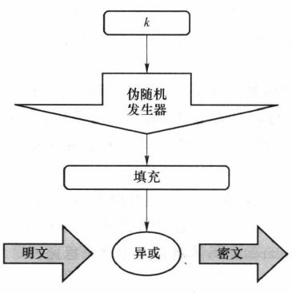
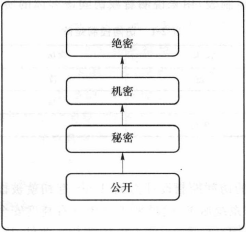

# 1 大数据安全的概念
## 1.1 如何理解大数据
**5V 特征**：大数据通常具有五个主要特征：
1.  **Volume** (数据量大)：超出常规工具处理能力的数据集。
2. **Velocity** (处理速度快)：产生速度快，对实时处理能力要求高（如流数据）。
3. **Variety** (类型复杂)：包含结构化、半结构化和非结构化数据（如视频、图片）。
4. **Veracity** (真实性/质量)：数据质量参差不齐，需识别错误或恶意数据。
5. **Value** (价值)：价值密度低，需通过技术挖掘其潜在价值。
---
**安全含义**：大数据安全包含两重含义：一是大数据服务本身的安全问题（如系统架构、隐私泄露）；二是利用大数据技术解决安全问题（如利用流量特征识别攻击）。
## 1.2 基本条例与标准
• *欧盟 GDPR*：《通用数据保护条例》。强调用户权利，如数据转移权（迁移数据）、被遗忘权（要求删除数据）、算法公平性（要求解释自动决策）。
• *中国《个人信息安全规范》*：国家标准，虽非强制但具重要参考意义。强调最小化收集、用户明示同意、限制使用范围、去标识化处理等原则。
# 2 密码学基础知识
## 2.1 密码学基本加解密过程与体制
• **五元组**：现代密码体制由 (P,C,K,E,D) 组成，分别代表明文、密文、密钥、加密算法、解密算法。
• **条件**：对于任意密钥 k 和明文 x，必须满足 $d_k​(e_k​(x))=x$。
• **Kerckhoffs 假设**：系统的安全性不应依赖于算法的保密，而应依赖于**密钥**的保密。
传统密码设计的技巧是：代换和置换。代换是系统地将一组字母换成其他字母或符号；置换是将字母重新排序
## 2.2 **香农的密码设计思想**
• 利用乘积密码实现 **混淆 (Confusion)** 和 **扩散 (Diffusion)**。
混淆使所得密文与明文以及密钥的关系变得十分复杂，无法从数学上直观描述，或从统计上难以分析;
扩散的目的是让明文中的任一位及密钥中的任一位能影响尽可能多的密文位，以便隐藏明文的统计特性，加强密码安全。
• **完善保密**：证明了“一次一密” (One-Time Pad) 可以达到完善保密水平，但要求密钥长度至少等于明文长度。
## 2.3 流密码设计思想
- **原理**：利用密钥产生一个伪随机比特流（密钥流），然后将该比特流与明文进行异或运算。
- **特点**：加密效率高，适合资源受限环境，但如果密钥流重复使用极其危险,。

## 2.4 分组密码的设计思想
• **原理**：将明文分成固定长度的数据块^[分拆为一些固定长度的分组，不够时还要进行数据填充]（分组），对每个块进行加密。
• **结构**：常用代换-置换网络 (SP网络)，利用 S 盒（非线性，提供混淆）和 P 置换（提供扩散）。
## 2.5  AES 与 DES
• **DES (数据加密标准)**：
    ◦ 64位分组，56位密钥。
    ◦ 使用 Feistel 结构。
    ◦ 现状：因密钥过短已被认为不再安全，被 3DES 或 AES 取代。
    不安全是因为：密钥太短（56 bit）、S 盒虽精巧，但整体抗性已不足
• **AES (高级加密标准)**：
    ◦ 128位分组，密钥长度可选 128/192/256 位。
    ◦ 不使用 Feistel 结构，而是 SP 网络。
    ◦ 现状：目前最常用的对称加密算法，速度快且安全。
DES 与 AES 都是对称分组密码，但 DES 采用 Feistel 结构、64 位分组和 56 位密钥，安全性已不足；AES 采用 SPN 结构、128 位分组和更长密钥，具有更强的混淆与扩散能力，是当前主流加密标准。
## 2.6 公钥加密体制基本思想
• **双钥机制**：使用一对密钥，一个公钥（公开）用于加密，一个私钥（保密）用于解密。
• **解决问题**：解决了传统密码学中最困难的**密钥分配**^[很多密钥分配协议引人了密钥分配中心。]和**数字签名**^[能否设计出一种方案，就像手写签名一样，确保数字签名出自某一特定的人，并且各方对此没有异议。]问题。
• **安全性**：基于数学难题（如 RSA 基于大整数分解，ECC 基于椭圆曲线离散对数）。
利用公钥算法实现保密通讯步骤如下：
1. 每一个用户产生一对密钥，用来加密、解密消息。
2. 每一个用户将其中一个密钥公开，该密钥称为公钥，另一个密钥称为私钥。每一个用户可以获得其他用户的公钥，称之为该用户的公钥环。
3. 若 Bob 打算发消息给 Alice收到消息后，使用其私钥对消息解密。由于只有 Alice 知道自己的私钥，因此其他接收者均不能对该消息解密。
## 2.7  网络协议 (IPSec, TLS/SSL)
### 2.7.1 IPSec (网络层)：
-  协议安全)是一个工业标准网络安全协议，为 IP网络通信提供透明的安全服务，可使 **TCP/IP 通信免遭窃听和篡改，可以有效抵御网络攻击，同时保持易用性。**
- 目标：保护 IP 数据包安全，防窃听和篡改；为抵御网络攻击提供保护措施。
- 组件：AH (认证头，提供防篡改，防止重放攻击)、ESP (封装安全载荷，提供加密+认证)、IKE (密钥交换)。
### 2.7.2 TLS/SSL (传输层)：
- SSL是 Web 浏览器和 Web 服务器之间安全交换信息的网络协议。SSL 提供了两个基本安全服务：认证与保密。SSL 提供了 Web 浏览器与Web 服务器之间的逻辑安全管道。
- 目标：保护 Web 通信安全 (HTTPS)。
    ◦ 基本流程：
        1. ==握手协议==：协商加密算法、交换随机数、服务器发送证书、客户端验证证书并生成预主密钥。
                1. 第一阶段——密钥等信息交换阶段。通信双方通过相互发送 Hello 消息进行初始化。通过 Hello 消息，双方就能确定是否需要为本次会话产生一个新密钥。如果本次会话是一个新会话，则需要产生新的密钥，双方需要进入密钥交换过程；如果本次会话建立在一个已有的连接上，则不需要产生新的密钥，双方立即进入握手协议的第二阶段。
                2. 第二阶段——用户身份认证阶段。对用户身份进行认证，通常服务器方要求客户方提供经过签名的客户证书，并将证书结果返回给用户。
        2. ==记录协议==：使用协商好的密钥对数据进行加密传输。
SSL 协议通过握手过程和记录协议操作过程实现了如下的安全机制。
① **保密性**。SSL 协议利用对称密钥算法对传输的数据进行加密，以防止数据在传输过程
中被窃取。
② **身份认证性**。SSL 协议基于证书对服务器和客户端进行身份认证，确保数据发送到正
确的客户端和服务器，其中客户端的身份认证是可选的。
③ **完整性**。SSL 协议的数据传输过程中使用 MAC 算法来检验数据的完整性，确保数据
## 2.8 身份认证与访问控制的区别
### 2.8.1 身份认证
• 定义：身份识别与鉴定，确认实体为其声明的实体，用来鉴定用户身份的真伪。
*解决“你是谁”的问题，鉴定用户身份的真伪 (Authentication)。*
#### 2.8.1.1 单点登录（SSO）
定义：用户只需登录一次，即可访问系统中其他相互信任的子系统，无需再次登录。典型实现协议是 Kerberos。
单点登录（SSO）是一种集中式身份认证机制，用户在一次登录后即可访问多个相互信任的应用系统，无需重复认证。它通过统一认证中心和共享身份凭证，实现认证与业务系统的解耦，提高了系统的可用性和用户体验。
### 2.8.2 访问控制
• 定义：主体(Subject)依据某些控制策略或权限对客体(Object)本身或是其资源进行授权访问。
*解决“你能做什么”的问题，依据策略限制主体对客体的访问权限 (Authorization)。*
___
身份认证用于确认用户或实体的真实身份，解决“是谁”的问题；访问控制在身份认证的基础上，根据安全策略决定其对资源的访问权限，解决“能做什么”的问题。二者相互配合，共同构成系统安全防护的基础。
## 2.9 等级分级基础知识
### 2.9.1 BLP 模型 (Bell-LaPadula)：
安全等级:

    ◦ 目标：侧重于保密性，主要用于军事/政府分级保护。
    ◦ 规则：
        1. No Read Up (无上读)：低密级主体不能读取高密级客体。
        2. No Write Down (无下写)：高密级主体不能向低密级客体写入数据（防止泄密）。

总思维导图
