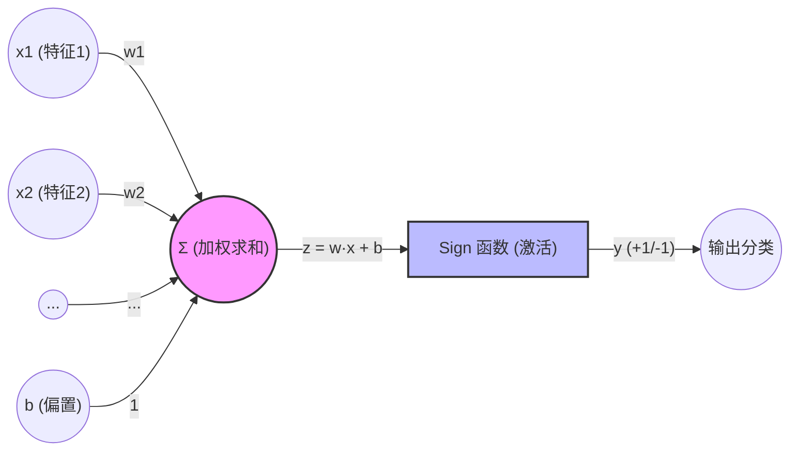
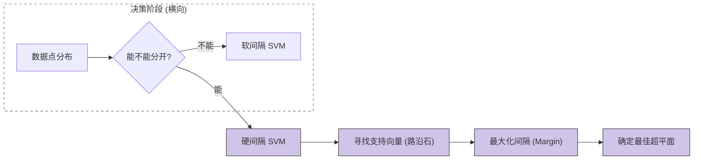
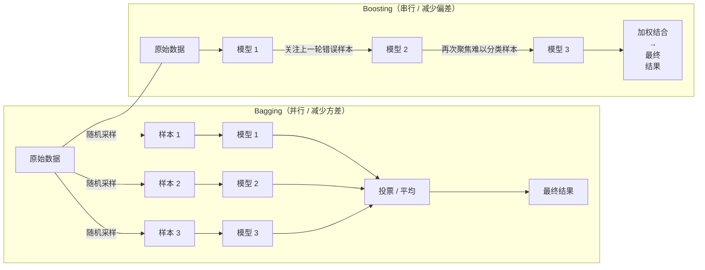
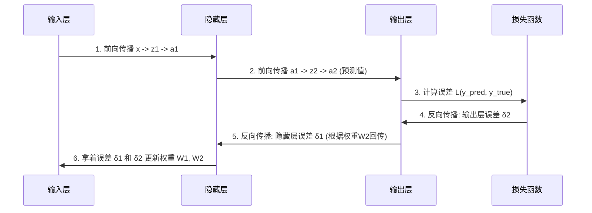
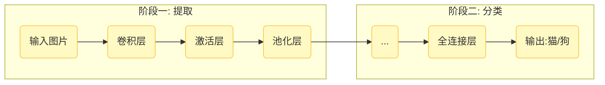
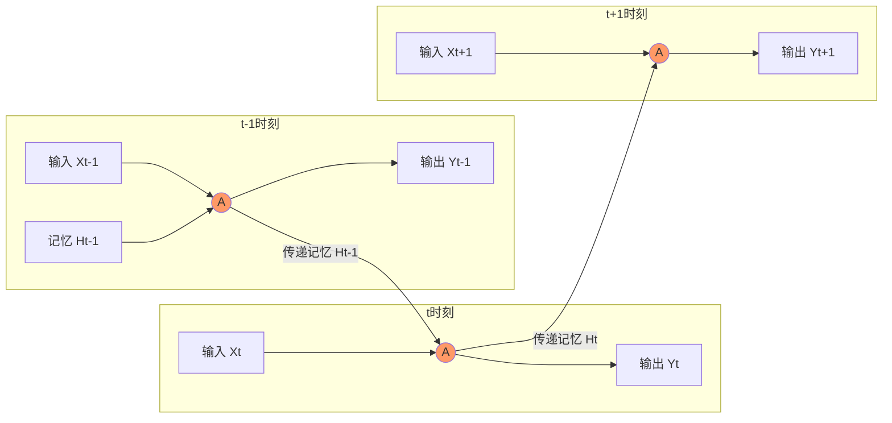

> **适用对象**：期末突击、零基础复习 **核心教材参考**：周志华《机器学习》、李航《统计学习方法》 **覆盖范围**：感知机、SVM、集成学习、神经网络(BP/CNN/RNN)、线性模型

# 1 第一板块：线性模型与感知机 (Linear Models & Perceptron)

## 1.1 感知机 (Perceptron) —— 神经网络的“祖先”

### 1.1.1 [小白解说]

想象你在教一个机器人把苹果和香蕉分开。

- **过程**：你拿一个水果给它看。如果是苹果，它说是香蕉（**分错了**），你就打它一下（**调整权重**），让它下次倾向于说是苹果。如果它分对了，你就不动它。
    
- **本质**：这就是“错误驱动学习”。只有犯错时才更新参数。
    

### 1.1.2 [结构图解]

输入信号通过权重加权求和，加上偏置，经过激活函数（符号函数）输出类别。

### 1.1.3 [硬核推导] (必考计算/推导)

**模型定义**：

$$f(x) = \text{sign}(w \cdot x + b)$$

其中 $\text{sign}$ 是符号函数，大于0输出+1（正类），小于0输出-1（负类）。

**损失函数 (Loss Function)**： 我们统计**所有“误分类点”到超平面的距离之和**。

$$L(w, b) = - \sum_{x_i \in M} y_i (w \cdot x_i + b)$$

_(注：_$M$ _是误分类点的集合)_

**梯度下降更新公式**： 随机梯度下降（SGD）每次只选一个误分类点 $(x_i, y_i)$ 更新：

$$w \leftarrow w + \eta y_i x_i$$$$b \leftarrow b + \eta y_i$$

# 2 第二板块：支持向量机 (SVM) —— 完美主义者的分类器

## 2.1 SVM 基础与硬间隔 (Hard Margin)

### 2.1.1 [小白解说]

感知机只要分开了就行，线可以在中间随便画。 SVM 说：**不行，这条线必须画在路中间，离两边的“路沿石”（支持向量）越远越好**。

### 2.1.2 [概念图解]

SVM 寻找的是那个让“间隔”最大的超平面。

### 2.1.3 [硬核推导] (高频考点)

**几何间隔**： 点 $x$ 到超平面 $w \cdot x + b = 0$ 的距离是 $\frac{1}{||w||} |w \cdot x + b|$。

**优化目标**：

$$\begin{aligned} \min_{w, b} \quad & \frac{1}{2} ||w||^2 \\ \text{s.t.} \quad & y_i(w \cdot x_i + b) \ge 1, \quad i=1,2,...,m \end{aligned}$$

**对偶问题 (Dual Problem)**： 把求 $w, b$ 转化为求 $\alpha$：

$$\max_\alpha \sum_{i=1}^{m} \alpha_i - \frac{1}{2} \sum_{i=1}^{m} \sum_{j=1}^{m} \alpha_i \alpha_j y_i y_j (x_i \cdot x_j)$$

# 3 第三板块：集成学习 (Ensemble Learning)

## 3.1 Bagging 与 Boosting

### 3.1.1 [小白解说]

- **Bagging (如随机森林)**：**搞题海战术**。并行训练，大家互不干扰，最后投票。
    
- **Boosting (如Adaboost)**：**搞错题集**。串行训练，后一个人专门做前一个人做错的题。
    

### 3.1.2 [原理对比图]

这张图清晰展示了两者训练方式的本质区别。

### 3.1.3 [硬核推导] Adaboost 权重更新

1. 计算当前分类器 $G_m$ 的错误率 $e_m$。
    
2. 计算分类器的“话语权”系数：$\alpha_m = \frac{1}{2} \ln \frac{1-e_m}{e_m}$。
    
3. **更新样本权重 (必考公式)**：
    
    w_{m+1, i} = \frac{w_{m,i}}{Z_m} \exp(-\alpha_m y_i G_m(x_i))
    
    _(做错的题，权重变大；做对的题，权重变小)_
    

# 4 第四板块：神经网络深度解析 (Neural Networks)

## 4.1 前馈神经网络与反向传播 (BP)

### 4.1.1 [小白解说]

神经网络就像一个层级管理公司。前向传播是汇报工作，反向传播是追责（分配误差梯度）。

### 4.1.2 [BP算法流程图]

理解误差是如何一步步传回去的。

### 4.1.3 [硬核推导] 链式法则 (Chain Rule)

$$\frac{\partial L}{\partial w^1} = \underbrace{\frac{\partial L}{\partial y_{pred}} \cdot \frac{\partial y_{pred}}{\partial z^2}}_{\delta^2 \text{(输出层误差)}} \cdot \underbrace{\frac{\partial z^2}{\partial a^1}}_{w^2} \cdot \underbrace{\frac{\partial a^1}{\partial z^1}}_{\sigma'(z^1)} \cdot \underbrace{\frac{\partial z^1}{\partial w^1}}_{Input}$$

**反向传递公式 (必背)**：

$$\delta^1 = (w^2)^T \delta^2 \odot \sigma'(z^1)$$

# 5 第五板块：深度学习进阶 (CNN & RNN)

## 5.1 卷积神经网络 (CNN) —— 图片识别专家

### 5.1.1 [小白解说]

CNN 用“小窗口”（卷积核）在图片上滑动，提取局部特征。

### 5.1.2 [结构图解]

典型的 LeNet/AlexNet 结构。

### 5.1.3 [知识点总结]

- **卷积 (Convolution)**：参数共享，局部连接。
    
- **池化 (Pooling)**：降维，防过拟合，平移不变性。
    

## 5.2 循环神经网络 (RNN) —— 序列文本专家

### 5.2.1 [小白解说]

RNN 自带“记忆条”（隐状态），处理当前词时会参考上一个词的记忆。

### 5.2.2 [时间展开图]

RNN 的精髓在于它按时间轴展开，同一个格子（参数 A）反复使用。

### 5.2.3 [硬核推导] RNN 结构公式

当前时刻记忆 $h_t$：

$$h_t = \tanh(W_{hh} h_{t-1} + W_{xh} x_t + b)$$

- **梯度问题**：由于 $W_{hh}$ 连乘，导致梯度消失（记不住开头）或爆炸。
    
- **解决**：LSTM / GRU。
    

# 6 附录：核心公式速查表 (考前默写)

1. **线性回归梯度更新**： $\theta_j := \theta_j - \alpha \frac{1}{m} \sum (h(x^{(i)}) - y^{(i)}) x_j^{(i)}$
    
2. **Sigmoid 导数**： $\sigma'(z) = \sigma(z)(1 - \sigma(z))$
    
3. **Softmax (多分类)**： $P(y=k) = \frac{e^{z_k}}{\sum e^{z_j}}$
    
4. **Adaboost 权重**： $\alpha = \frac{1}{2} \ln(\frac{1-e}{e})$
    
5. **CNN 特征图大小**： $Output = \frac{Input - Kernel + 2 \times Padding}{Stride} + 1$