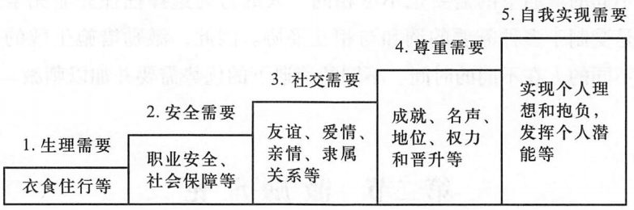

# 1 **第9章 领导的一般理论**

**【提纲重点 17】领导权力的来源 (必须要背)** 这是分析“领导为什么说话管用”的基础。教材将权力划分为五种来源：

1. **法定性权力 (Legitimate Power)**：组织正式职位赋予的权力（如“我是经理，听我的”）。
2. **奖赏性权力 (Reward Power)**：决定给予下属奖励的权力。
3. **强制性权力 (Coercive Power)**：强制或惩罚的权力（基于恐惧）。
    - _注_：以上三者属于**职位权力**。
4. **参照性权力 (Referent Power)**：由个人魅力、品德引起下属的崇拜和追随。
5. **专家性权力 (Expert Power)**：由个人拥有的专业知识或技能产生的权威。
    - _注_：以上两者属于**个人权力**。_背诵要点：领导者应更多依赖个人权力来提升影响力。_

**【提纲重点 18】领导理论 (核心考点，需深度理解)** 
**A. 领导者行为理论 (Behavioral Theories)** 不再看领导者“是什么人”（特质论），而是看领导者“做什么”（行为）。
- **独裁与民主**：
	- 爱荷华大学的库尔特分出3种领导方式
		- 独裁型领导**用命令的方式鞭策下属**、
		- 民主型领导**采取授权管理，鼓励下属参与决策
		- 放任型领导**以一种娱乐部式的领导方式，给下属充分的自由去做决策**
	- 罗伯特和沃伦进一步认为领导行为是一个连续统一体

- **密歇根大学研究**：分为**员工导向型**（关注人际关系）和**生产导向型**（关注任务技术）。
- **俄亥俄州立大学研究**：提出两个维度——**关怀维度**（体贴下属）和**定规维度**（构建任务结构）。

- **管理方格理论 (Blake & Mouton)**：用纵轴（关心人）和横轴（关心生产）画出81种风格。
    - **9.9型 (团队型)**：最理想，高关心人+高关心生产。
    - **1.1型 (贫乏型)**：最差。
    - **9.1型 (任务型)**：只管干活不管人。

**B. 权变（情境）领导理论 (Contingency Theories)** 核心观点：没有最好的领导风格，只有最**适合当下情境**的风格。

1. **费德勒权变模型 (Fiedler's Model)**：
    
    - _工具_：**LPC量表**（最难共事者问卷）。LPC得分高=关系导向；得分低=任务导向。
    - _情境三要素_：**上下级关系**（好/坏）、**任务结构**（明确/模糊）、**职位权力**（强/弱）。
    - _结论_：在**最有利**（环境特好）和**最不利**（环境特差）的情况下，**任务导向型**（低LPC）效果好；在**中等**环境下，**关系导向型**（高LPC）效果好。
2. **情境领导模型 (Hersey & Blanchard)**：
    
    - _依据_：**下属的成熟度**（能力+意愿）。
    - _四种风格_：
        - **告知型 (S1)**：高任务-低关系（针对：又笨又懒的下属）。
        - **推销型 (S2)**：高任务-高关系（针对：笨但勤快的下属）。
        - **参与型 (S3)**：低任务-高关系（针对：聪明但懒的下属）。
        - **授权型 (S4)**：低任务-低关系（针对：又聪明又懒的下属）。
3. **豪斯路径—目标理论 (Path-Goal Theory)**：
    
    - 领导者的任务是为下属“清理路障”，指明目标。
    - _四种风格_：**指导型**（具体安排指导，明确政策）、**支持型**（压力大时）、**参与型**（遇到问题会咨询下属意见）、**成就导向型**（设定目标，强调卓越的绩效）。

**C. 领导者角色理论 (了解)**

- 明茨伯格提出管理者扮演的三大类10种角色（人际、信息、决策）。

---
# 2 **第10章 激励**

这一章是案例分析中“员工士气低落怎么办”的标准答案库。
**【提纲重点 19】X理论与Y理论 (必须要背)** 
- **X理论**（人性本恶）：认为人天生自利、懒惰、逃避责任，管理需要强制和惩罚。
- **Y理论**（人性本善）：认为人愿意工作、能自我管理，管理需要授权和激励。
**【提纲重点 20】内容型激励理论 (必须要背)** 研究“什么东西”能激励人。

1. **马斯洛需要层次理论**：生理 $\rightarrow$ 安全 $\rightarrow$ 社交 $\rightarrow$ 尊重 $\rightarrow$ 自我实现。_（注：低级满足后才追求高级）_。
2. **赫茨伯格双因素理论 (Two-Factor Theory)**：
    - **保健因素 (Hygiene Factors)**：工资、工作条件、政策。**做不好会不满，做好了也只是“没有不满”（不会产生激励）。**
    - **激励因素 (Motivators)**：成就感、赏识、工作本身的挑战性。**有了由于满意，能产生巨大动力。**
    - _应用_：发奖金往往只是保健因素，要多给员工挑战和认可。
3. **麦克利兰成就需要理论**：人有三种高层次需要——**成就需要**（追求卓越）、**权力需要**（影响他人）、**亲和需要**（建立友谊）。

**【提纲重点 20】过程型激励理论 (逻辑要清)** 研究“人是如何被激励”的心理过程。

1. **公平理论 (亚当斯)**：
    - 员工会比较：**（自己的产出/投入）VS（他人的产出/投入）**。
    - 不公平（报酬过低或过高）都会导致紧张和行为改变（如减少努力、要求加薪）。
2. **期望理论 (弗鲁姆)**：
    - **激励力 (M) = 期望值 (E) $\times$ 效价 (V)**
    - _解释_：只有当员工认为“努力能达成绩效”（E高）且“绩效能带来有价值的奖励”（V高）时，才会努力。

**【提纲重点 20】行为改造型理论**

1. **强化理论 (斯金纳)**：
    - **正强化**（给奖励）、**负强化**（撤销惩罚，以鼓励行为）、**惩罚**、**自然消退**（不予理睬，使行为消失）。

---

### 2.1.1 **第五板块：控制（第12章）**

根据你的要求，控制篇只需掌握第12章的核心概念。

#### 2.1.1.1 **第12章 控制的类型与过程**

**【提纲重点 21】控制的过程 (三步走)**

1. **确定标准**：制定衡量绩效的尺子（如定量指标、定性标准）。
2. **衡量绩效**：通过观察、报表等方式获取实际数据。
3. **分析与纠偏**：比较实际与标准，找出偏差原因，采取纠正措施（改进工作或调整标准）。

**【提纲重点 22】控制的类型 (必须要背)** 根据**控制活动发生的时间点**划分：

1. **前馈控制 (Feedforward Control)**：
    - _别名_：预先控制、事前控制。
    - _核心_：在活动开始前，通过预测可能的问题，防患于未然（如原材料进厂检验、招聘时的笔试）。
    - _优点_：避免了后果产生，防患于未然。
2. **现场控制 (Concurrent Control)**：
    - _别名_：同步控制、过程控制。
    - _核心_：在活动进行中，主管亲临现场指导监督（如车间巡视）。
    - _优点_：及时纠偏；_缺点_：容易受到管理者时间精力的限制。
3. **反馈控制 (Feedback Control)**：
    - _别名_：事后控制。
    - _核心_：活动结束后，分析结果，总结经验教训（如年终考核、财务审计）。
    - _优点_：为下一次计划提供依据；_缺点_：亡羊补牢，损失已经发生。

---

**总结** 至此，我们已经依据你的提纲，完成了除“创新”（第15、16章）以外的所有核心内容复习。

- **第1-2章**：管理基础与历史。
- **第3-5章**：决策与计划（SWOT、目标管理）。
- **第6、8章**：组织结构与文化。
- **第9-10章**：领导权力、风格与激励理论。
- **第12章**：控制类型与过程。

**接下来的步骤？** 你的提纲只列到了“22. 前馈控制、现场控制与反馈控制”，没有涉及第15、16章（创新）。 **你需要我继续梳理书本最后两章“创新”的内容吗？还是我们现在停下来，针对某些特定的难点（比如计算题或案例分析）进行专门的训练？**