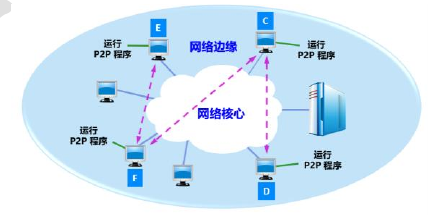
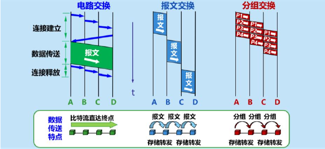
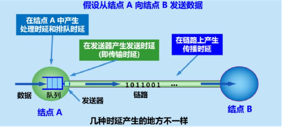
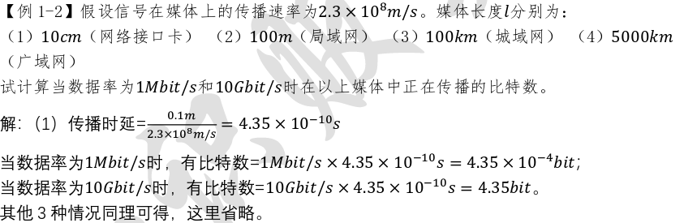
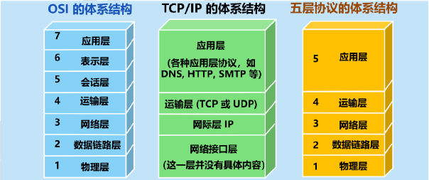
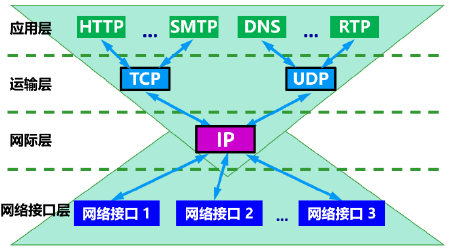

# 1 互联网的核心与边缘部分（互联网的组成）

1. 边缘部分：由所有连接在互联网上的主机组成。这部分是*用户直接使用*的,用来进行通信和资源共享。主机又称为==端系统==。
2. 核心部分:由大量网络和连接这些网络的路由器组成。这部分是为边缘部分**提供服务的**(提供连通性和交换)。
# 2 端系统的之间的两种通信方式 
## 2.1 客户-服务器方式

- 客户 (client) 和服务器 (server) 都是指通信中所涉及的两个应用进程。
- 客户服务器方式所描述的是***进程之间服务和被服务***的关系。
- 客户是服务的请求方,服务器是服务的提供方。 

> [!tip] 有明确的请求与被请求的关系
## 2.2 对等连接方式 

- 对等连接 (peer-to-peer,简写为 **P2P** ) 是指两个主机在通信时并不区分哪一个*是服务请求方还是服务提供方*。
- 只要两个主机都运行了对等连接软件 ( P2P 软件) ,它们就可以进行平等的、对等连接通信。
- 对等连接方式从本质上看仍然是使用客户服务器方式,*只是对等连接中的每一个主机既是客户又是服务器*。
# 3 互联网的核心部分
- 在网络核心部分起特殊作用的是路由器。 
- 路由器是实现==**分组交换**==的关键构件,其任务是***转发收到的分组***,这是网络核心部分最重要的功能。
- 路由器的任务:①转发分组 ②路由器之间不断交换路由信息 
# 4 典型交换技术

| 交换技术 |                      特点                       |
| ---- | :-------------------------------------------: |
| 电路交换 |        整个报文的比特流连续地从源点直达终点,好像在一个管道中传送。         |
| 报文交换 |      整个报文先传送到相邻结点,全部存储下来后查找转发表,转发到下一个结点。      |
| 分组交换 | 当个分组(这只是整个报文的一部分)传送到相邻结点,存储下来后查找转发表,转发到下一个结点。 |
1. 若要连续==传送大量的数据==,且其*传送时间远大于连接建立时间*,则==电路交换的传输速率较快==。
2. 报文交换和分组交换不需要预先分配传输带宽,在==传送突发数据==时可提高整个网络的==信道利用率==。
3. 由于一个分组的长度往往远小于整个报文的长度,因此==分组交换比报文交换的时延小==,同时也具有更好的==灵活性==。
# 5 计网的类别分类
## 5.1 按照网络作用**范围**分类
1. 广域网WAN：十几到几千公里
2. 城域网MAN：5~50公里
3. 局域网LAN：1公里左右
4. 个人区域网PAN：10米左右
## 5.2 使用者分类
- 公用网：指电信公司（国有或者私有）出资建造的大型网络
- 专用网：某个部门为满足本单位的特殊业务工作的需要而建造的网络
## 5.3 用来把用户接入到互联网的网络
为接入网AN，又称本地接入网络或者居民接入网。
其是由某个端系统连接到本地的ISP的第一个路由器之间的一些物理链路所组成的。
# 6 计算机网络的性能指标
## 6.1 速率（最重要的指标）
比特(bit)是一个二进制的数字，也是信息量的单位。
而网络技术中的**速率** 是*数据传送的速率*，也称为数据率或者比特率。其单位为$bit/s$ 。当数据率较高时有$k=10^3$,$M=10^6，G=10^9,T=10^{12},P=10^{15},E=10^{18},Z=10^{21}$
而提到速率一般指的是“额定速率或标称速率“
>[!note] 区分”数据量单位“和”速率单位“的换算
>$$
\begin{aligned}
10^{10}\,\text{bit/s} &= 1\,\text{Gbit/s} \\
1\,\text{GB} &= 2^{30}\,\text{B} \quad (\text{二进制})
\end{aligned}$$

## 6.2 ==时延==
1. 网络中的时延由以下几个不同的部分组成:发送时延、传播时延、处理时延、排队时延,下图为四种时延的产生地点说明。

2. ==发送时延(传输时延)==
	- 概念:主机或路由器发送数据帧所需要的时间。 
	- 计算公式：$\text{发送时延} = \frac{\text{数据帧长度 (bit)}}{\text{发送速率 (bit/s)}}$
3. ==传播时延== 
	- 概念:电磁波在信道中需要传播一定的距离而花费的时间。 
	- 计算公式：$\text{传播时延} = \frac{\text{信道长度(m)}}{\text{电磁波在信道上的传播速率 (m/s)}}$
### 6.2.1 例题
1. 收发两端之间的传输距离为1000𝑘𝑚,信号在媒体上的传播速率为$2×10^8𝑚/𝑠$。试计算一下两种情况的发送时延和传播时延:
	1. 数据长度为$10^7𝑏𝑖𝑡$,数据发送速率为100𝑘𝑏𝑖𝑡/𝑠。 
	2. 数据长度为$10^3𝑏𝑖𝑡$,数据发送速率为1𝐺𝑏𝑖𝑡/𝑠。

2. 假设信号在媒体上的传播速率为$2.3×10^8𝑚/𝑠$。媒体长度𝑙分别为:(1)10𝑐𝑚(网络接口卡) (2)100𝑚(局域网) (3)100𝑘𝑚(城域网) (4)5000𝑘𝑚(广域网)。试计算当数据率为1𝑀𝑏𝑖𝑡/𝑠和10𝐺𝑏𝑖𝑡/𝑠时在以上媒体中正在传播的比特数。 

## 6.3 ==利用率==
根据排队论的理论,当某信道的利用率增大时,该信道引起的时延也就迅速增加。 若令$𝐷_0$表示网络空闲时的时延,$𝐷$表示网络当前的时延,则在适当的假定条件下,可以用下面的简单公式表示𝐷和$𝐷_0$之间的关系:
$$
D = \frac{D_0}{1 - U}
$$

### 6.3.1 例题 
假定网络的利用率达到了90%。试估算现在的网络时延是它的最小值的多少倍? 

## 6.4 带宽
其有两种含义：
1. 指某个信号具有的频带宽度。单位是赫$kHZ$
2. 在计网中指网络中==某通道传送数据的能力==。单位就是数据率的单位$bit/s$。 
>[!tip] 带宽越大则传送数据能力越高，最高数据率越高
# 7 协议的基本概念
1. 定义:网络协议,简称为协议,是为进行网络中的数据交换而建立的规则、标准或约定。
2. 网络协议的三个组成要素 

# 8 分层带来的好处
- 各层之间是独立的 
- 灵活性好
- 结构上可分割开
- 易于实现和维护
- 能促进标准化工作
# 9 具有五层协议的体系结构及每层的作用

| 体系结构             | 作用                                       |
| ---------------- | ---------------------------------------- |
| 应用层              | 通过应用进程间的交互来完成特定网络应用。                     |
| 运输层              | 向两台主机中进程之间的通信提供通用的数据传输服务。                |
| 网络层              | 为分组交换网上的不同主机提供通信服务。                      |
| 数据链路层            | 解决三个基本问题:封装成帧、透明传输、差错检验。                 |
| [[第2章：物理层\|物理层]] | 确定与传输媒体的接口有关的一些特性,尽可能地屏蔽掉这些传输媒体和通信手段的差异。 |

# 10 计算机网络体系结构 

# 11 ISP的基本概念 
互联网服务提供者ISP(Internet Service Provider)。在许多情况下,ISP就是一个进行商业活动的公司,因此ISP又称互联网服务提供商。例如,中国电信、中国联通和中国移动等公司都是我国最著名的ISP。
# 12 协议与层次 
