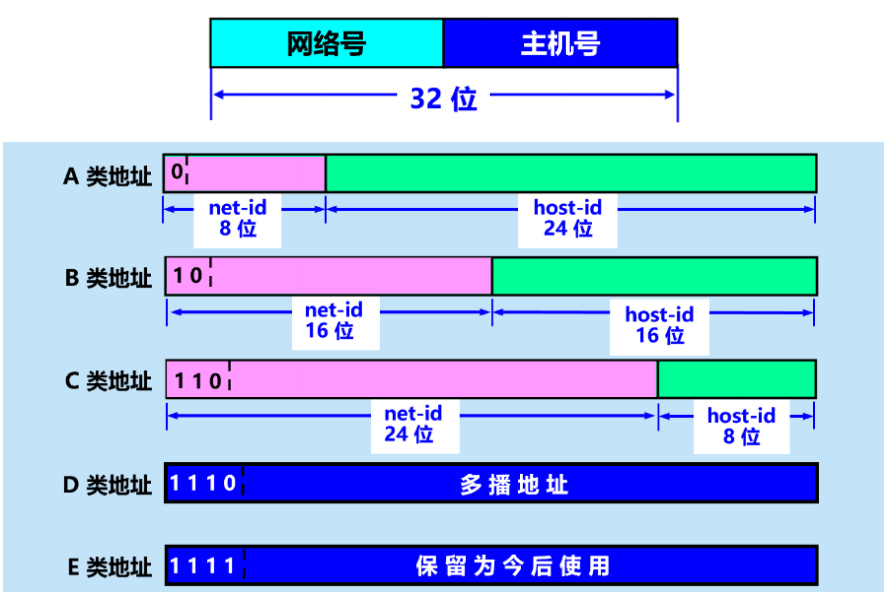
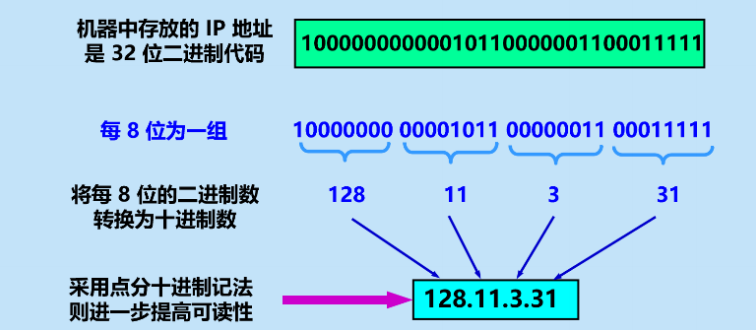
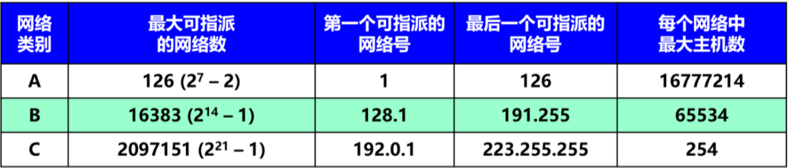
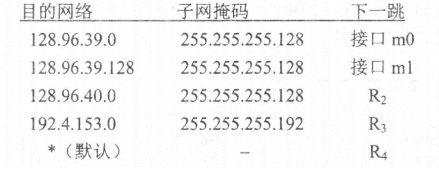

# 1 尽最大努力交付的基本概念
网络层向上只提供简单灵活的、无连接的、尽最大努力交付的数据报服务。网络层不提供服务质量的承诺。即所传送的分组可能出错、丢失、重复和失序（不按序到达终点），当然也不保证分组传送的时限。
尽最大努力交付并不表示路由器可以任意丢弃分组，实质上就是*不可靠交付*
# 2 虚拟互联网的意义
- 所谓虚拟互连网络也就是逻辑互连网络，它的意思就是互连起来的各种物理网络的异构性本来是客观存在的，但是我们利用 IP 协议就可以使这些性能各异的网络从用户看起来好像是一个统一的网络。（*忽略了异构性*）
- 使用 IP 协议的虚拟互联网络可简称为 IP 网。
- 使用虚拟互联网络的好处是：当互联网上的主机进行通信时，就好像在一个网络上通信一样，而看不见互连的各具体的网络异构细节。
- 如果在这种覆盖全球的 IP 网的上层使用 TCP 协议，那么就是现在的互联网 (Internet)
# 3 网际协议IP
网际协议 IP 是 TCP/IP 体系中*两个最主要的协议之一*。与 IP 协议配套使用的还有三个协议：
- 地址解析协议ARP（作用于链路层和网络层，但是他属于网络层）
- 网际控制报文协议ICMP（作用于运输层和网络层，但是他属于网络层）
- 网际组管理协议IGMP（作用于运输层和网络层，但是他属于网络层）
# 4 分类的IP地址
两级的IP地址结构如下：

*每一类地址都有一定的固化地址不能改变*，可以根据固化地址来判定是哪一类的地址。
## 4.1 优缺点
- 优点：管理简单、使用方便、转发分组迅速、划分子网灵活使用。
- 缺点：设计不合理导致大地址块浪费资源、无法解决IP地址枯竭问题。
## 4.2 点分十进制记法

### 4.2.1 判定IP地址类型的简易方法

|    头    | 类型  |
| :-----: | :-: |
|  0～127  |  A  |
| 128～191 |  B  |
| 192～223 |  C  |
| 224～239 |  D  |
| 240～255 |  E  |
## 4.3 IP的指派范围

- **最大可指派的网络数=$2^\text{网络号位数-固化地址位数}-\text{全0(只有A)和全1的个数}$
- **最大主机数=$2^{\text{主机号位数}}-2$,因为不安排IP地址全0和全1**
# 5 CIDR
# 6 IP地址和MAC地址

- 硬件地址^[固化于网卡]（或物理地址）是数据链路层和物理层使用的地址。
- IP 地址是网络层和以上各层使用的地址，是一种逻辑地址（称 IP 地址是逻辑地址是因为 IP 地址是用软件实现的）。
## 6.1 例子
1. 试说明 IP 地址与硬件地址的区别。为什么要使用这两种不同的地址？
解：1. 从层次的角度看，硬件地址（或物理地址）是数据链路层和物理层使用的地址；IP 地址是网络层和以上各层使用的地址，是一种逻辑地址（称 IP 地址是逻辑地址是因为 IP 地址是用软件实现的）。
2.由于全世界存在着各式各样的网络，它们使用不同的硬件地址。要使这些异构网络能够互相通信就必须进行非常复杂的硬件地址转换工作，而统一的 IP 地址可以解决这个复杂的问题，可以使这些性能各异的网络从用户看起来好像是一个统一的网络。
# 7 地址解析协议ARP
根据IP地址找出对应的MAC地址

1. ARP高速缓存
	- 存放IP地址到MAC地址的映射表、动态更新、超时删除
2. ARP查找记录MAC地址
	- 向本局域网内关播发送ARP请求（路由器不转发ARP请求）
	- 请求分组：发送行MAC+发送方IP+目标行MAC地址+目标IP
	- 响应分组：发送行MAC+发送方IP+目标行MAC地址+目标IP
- [i] ARP分组分装在**以太帧**中传输，**不能跨局域网使用ARP**
## 7.1 ARP高速缓存的作用
- 存放最近获得IP地址的对应MAC地址
- 减少ARP广播通信量
- 某主机在发送ARP请求分组时就把自己的IP，MAC一并导入ARP的请求分组，另一主机收到请求就顺便把对方的IP<->MAC写入自己的ARP高速缓存中，不在发送ARP请求。
# 8 IP数据报的格式
一个 IP 数据报由*首部和数据*两部分组成。首部的前一部分是固定长度，共 20 字节，是所有 IP 数据报必须具有的。在首部的固定部分的后面是一些可选字段，其长度是可变的。
## 8.1 首部
- 固定部分：20字节的固定长度（160bit)；**所有IP数据报必须具有**
- 可变部分：长度可变
- [i] 首部总长度$\leq 60$字节
## 8.2 例题
一数据报的总长度为 3820 字节，其数据部分的长度为 3800 字节（使用固定首部），需要分片为长度不超过 1420 字节的数据报片。
>[!tip] 分片后会有新的首部出现，所以必须是1420-20(首部长度)=1400

解：因固定首部长度为 20 字节，因此每个数据报片的数据部分长度不能超过 1400 字节。于是分为 3 个数据报片，其数据部分的长度分别为 1400、1400 和 1000 字节。原始数据报首部被复制为各数据报片的首部，但必须修改有关字段的值。

# 9 路由器转发分组的原理
## 9.1 工作原理

在路由表中，对每一条路由，最主要的是（目的网络地址，下一跳地址）
根据目的网络地址就能确定下一跳路由器(*以路由器为界限，来找下一跳地址*)，这样做的结果是：IP 数据报最终一定可以找到目的主机所在目的网络上的路由器（可能要通过多次的间接交付）。只有到达最后一个路由器时，才试图向目的主机进行直接交付。
### 9.1.1 例题
设某路由器建立了如下路由表：

现共收到 5 个分组，其目的地址分别为：
（1）128.96.39.10 （2）128.96.40.12 （3）128.96.40.151 （4）192.4.153.17 （5）192.4.153.90试分别计算其下一跳。
解：（1）(128.96.39.10)𝐴𝑁𝐷(255.255.255.128) = 128.96.39.0，结果与目的网络 128.96.39.0匹配，故通过接口 m0 直接交付。
（2）(128.96.40.12)𝐴𝑁𝐷(255.255.255.128) = 128.96.40.0，结果与目的网络 128.96.39.0 不匹配；
(128.96.40.12)𝐴𝑁𝐷(255.255.255.128) = 128.96.40.0，结果与目的网络 128.96.39.128 不匹配；
(128.96.40.12)𝐴𝑁𝐷(255.255.255.128) = 128.96.40.0，结果与目的网络 128.96.40.0 匹配，故其下一跳为𝑅2。
（3）(128.96.40.151)𝐴𝑁𝐷(255.255.255.128) = 128.96.40.128，结果与目的网络 128.96.39.0不匹配；(128.96.40.151)𝐴𝑁𝐷(255.255.255.128) = 128.96.40.128，结果与目的网络 128.96.39.128 不匹配；
(128.96.40.151)𝐴𝑁𝐷(255.255.255.128) = 128.96.40.128，结果与目的网络 128.96.40.0 不匹配；(128.96.40.151)𝐴𝑁𝐷(255.255.255.192) = 128.96.40.128，结果与目的网络 192.4.153.0 不匹配；故其下一跳为默认路由𝑅4。

## 9.2 最长前缀匹配原则
使用 *CIDR*时，路由表中的每个项目由“网络前缀”和“下一跳地址”组成。在查找路由表时可能会得到不止一个匹配结果。 应当从匹配结果中选择具有最长网络前缀的路由：最长前缀匹配 (longest-prefix matching)。网络前缀越长，其地址块就越小，因而路由就越具体(more specific) 。最长前缀匹配又称为最长匹配或最佳匹配。
