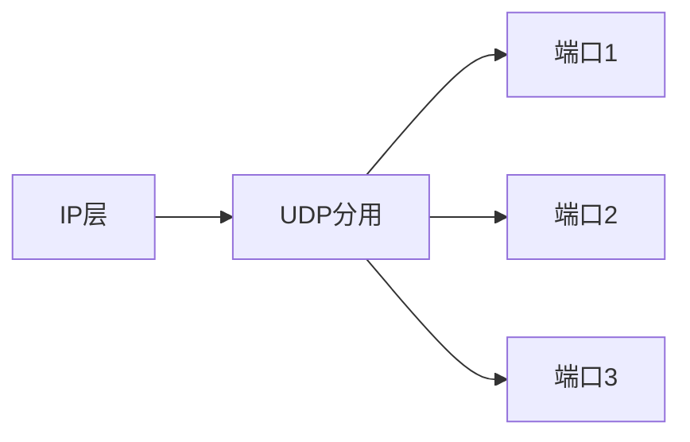

# 1 运输层协议概述
- 进程间*基于网络*的通信
- 运输层为运行在不同主机上的应用进程提供直接的逻辑通信服务
- 运输层协议又称*端到端*协议
- “逻辑通信”：从应用层来看，只要把应用层报文交给下面的运输层，运输层就可以把这报文传送到对方的运输层，好像是在两个运输层实体之间有一条*端到端*逻辑通信通道
	- “好像是这样的通信，但实际上*并非真的这样通信*。”
# 2 端口
运输层在网络层的基础上，为应用进程之间提供通信服务
要使用端口号来*区分不同的进程*，**实现分用与复用**
- 分用：运输层从网络层收到发给应用进程的数据后，分别交付给指明的各应用进程。
- 复用：应用进程都可以通过运输层在传送到IP层
端口是通信的==**抽象终点**==
## 2.1 特点
- 16位端口号，允许有65535($2^{16}-1$)个端口号
- 只具有本地意义：不同计算机的相同端口号没有联系
- *两个进程*的通信，必须要知道双方端口号及IP地址
# 3 运输层的两个主要协议

| 用户数据报协议UDP                   | 传输控制协议TCP                  |
| ---------------------------- | -------------------------- |
| 无连接的协议，提供无连接服务               | 面向连接的协议，提供面向连接服务           |
| 其传送的运输协议数据单元TPDU是UDP报文或用户数据报 | 其传送的运输协议单元TPDU是TCP报文段      |
| 支持单播、多播、广播                   | 支持点对点单播，不支持多播、广播           |
| 不提供可靠交付                      | 提供可靠服务                     |
| 简单。适用于很多应用，如：多媒体应用等          | 复杂。用于大多数应用，如：万维网、电子邮件、文件传输 |
## 3.1 UDP(==面向报文==)
1. 功能增加
	- 在IP数据报服务上增加了**复用和分用、差错检测**功能
### 3.1.1 主要特点
- 无连接。发送数据前不需要建立连接
- 使用[[第4章：网络层#1 尽最大努力交付的基本概念|尽最大努力支付]]。不保证可靠支付，因此不需要维持复杂的连接状态表。
- 面向报文。UDP一次传送和交付一个完整的报文
- 没有拥塞控制。网络中出现拥塞*不会降低主机的发送速率*，适合多媒体通信要求
- 支持一对一、一对多，多对多的交互通信
- 首部开销小，只有两个字节
### 3.1.2 基于端口的复用

接收方根据UDP中首部的端口号，把报文通过相应的端口上交给应用进程。如果发现端口号不正确(不存在该进程)，就丢弃报文，并由ICMP发送”端口不可达“差错报文给发送方。
## 3.2 TCP
### 3.2.1 主要特点：
- 面向连接
- 每一条TCP连接只能有两个端点，每一条TCP连接只能是点对点的。
- 提供可靠支付的服务。
- **全双工通信**
- 面向字节流
	”流“指的是流入和流出进程的字节得到
	虽然应用程序和TCP的交互是一次一个的数据块，但是TCP把应用程序交付下来的数据看成仅仅是**一串无结构的字节流**。
### 3.2.2 TCP链接
- TCP把连接作为一种最基本的对象
- TCP连接的端点是抽象的套接字：{IP地址：端口号}
- 同一个IP地址可以有多个不同的TCP连接
- 同一个端口号可以出现在多个不同的TCP连接中
- {$socket_{1},socket_{2}$}={($IP_{1}:port_{1}$),($IP_{2}:port_{2}$)}
# 4 可靠传输
可靠传输的主要目标是保证数据：**无差错、不丢失、不重复、按序到达**。
## 4.1 可靠传输的工作原理 (教材 5.4节)
重点掌握**停止等待**和**连续ARQ**的区别。
### 4.1.1 停止等待协议 (Stop-and-Wait)
这是最简单的可靠传输机制。
- **基本原理**：发送方每发送完一个分组，就停止发送，等待接收方的确认（ACK）。收到确认后，再发送下一个分组。
- **三种异常情况的处理**（考试常考点）：
    1. **分组丢失/出错**：发送方设置**超时计时器**。如果在规定时间内未收到确认，就**超时重传**。
        - _注意_：发送方必须暂时保留已发送分组的副本，直到收到确认为止。
    2. **确认丢失**：若B发送的ACK丢失，A超时重传。B收到重复分组后，**丢弃重复分组**，并**重传确认**。
    3. **确认迟到**：A收到迟到的ACK，什么也不做（丢弃）；B收到重复分组，丢弃并重传ACK。
- **缺点**：信道利用率太低。
### 4.1.2 连续ARQ协议 (Automatic Repeat reQuest)
为了提高效率，采用流水线传输。
- **滑动窗口**：发送方维持一个发送窗口，位于窗口内的多个分组可以连续发送出去，不需要等待对方确认。
- **累积确认**：接收方不需要对每个分组逐个发送确认，而是对**按序到达的最后一个分组**发送确认。
    - _含义_：如果收到“确认号 N”，表示序号 N-1 及之前的所有分组都已正确接收。
- **Go-back-N (回退N)**：如果中间某个分组丢失（如发送了1,2,3,4,5，但3丢了），接收方只能确认2。发送方超时后，必须重传 **3, 4, 5**（即使4和5已经到达）。这在通信线路质量不好时效率较低。
## 4.2 TCP可靠传输的实现 (教材 5.6节)
### 4.2.1 以字节为单位的滑动窗口

TCP的滑动窗口与通用的ARQ不同，它是**面向字节**的，不是面向分组的。

- **窗口结构**：
    - **发送窗口**：取决于接收方给出的窗口值（rwnd）和当前网络拥塞窗口（cwnd），同一时刻，两窗口不总是一样大。
    - **指针P1, P2, P3**：
        - $P_3 - P_1$ = 发送窗口（A的发送能力）。
        - $P_2 - P_1$ = 已发送但未收到确认的字节。
        - $P_3 - P_2$ = 允许发送但当前尚未发送的字节（可用窗口）。
- **发送缓存与接收缓存**：
    - **发送缓存**：存放应用程序准备发送的数据 + 已发送但未收到确认的数据。
    - **接收缓存**：存放按序到达但尚未被应用程序读取的数据 + **未按序到达的数据**。
    - _注意_：TCP通常对不按序到达的数据**先临时存放在接收窗口中**，而不是直接丢弃，等缺少的字节收到后，再按序交付。

#### 4.2.1.1 超时重传时间的选择 (RTT & RTO)

TCP如何确定“超时”的时间？这是计算题的潜在考点。

- **往返时间 (RTT)**：一个报文段发出的时间与收到确认的时间之差。
- **加权平均往返时间 ($RTT_S$)**：TCP不直接使用测量的RTT，而是计算平滑值。
    - 公式：$\text{新的} RTT_S = (1 - \alpha) \times (\text{旧的} RTT_S) + \alpha \times (\text{新的} RTT \text{样本})$。
    - $\alpha$ 推荐值为 0.125。
- **超时重传时间 (RTO)**：RTO 应略大于 $RTT_S$。
    - 公式：$RTO = RTT_S + 4 \times RTT_D$ （$RTT_D$是RTT的偏差的加权平均值）。
- **Karn 算法**：若报文段重传了，计算 $RTT_S$ 时**不采用**该报文段的RTT样本（因为无法区分确认是对原报文还是重传报文的确认）。修正方法是：每重传一次，将RTO增大一倍。

#### 4.2.1.2 选择确认 (SACK)

- **解决问题**：如果收到的报文段无差错，只是未按序号（中间缺了一些），如何只重传缺少的数据？
- **机制**：在TCP首部选项中，报告收到的不连续字节块的**边界**（左边界和右边界）。这样发送方就可以只重传丢失的数据。

---

### 4.2.2 三、 复习总结（记忆口诀）

为了应对考试，请重点记忆以下区别：

|特性|停止等待协议|连续ARQ (Go-Back-N)|TCP滑动窗口|
|:--|:--|:--|:--|
|**发送策略**|发一个，等一个|连续发窗口内的分组|连续发窗口内的**字节**|
|**确认机制**|逐个确认|累积确认|累积确认 + SACK(可选)|
|**丢包处理**|超时重传当前分组|重传丢失分组及之后所有分组|超时重传 + 快重传(冗余ACK)|
|**信道利用率**|低|高|高|

**⚠️ 考试提醒：**

1. **计算题**：可能会给出一系列RTT样本，让你利用公式计算新的 $RTT_S$ 或 RTO。
2. **简答题**：可能会问“接收方收到乱序报文段时，TCP如何处理？”（答案：通常暂存，不丢弃，发送冗余ACK）。
3. **填空/选择**：注意区分**确认号**的含义（期望收到的下一个字节的序号）。