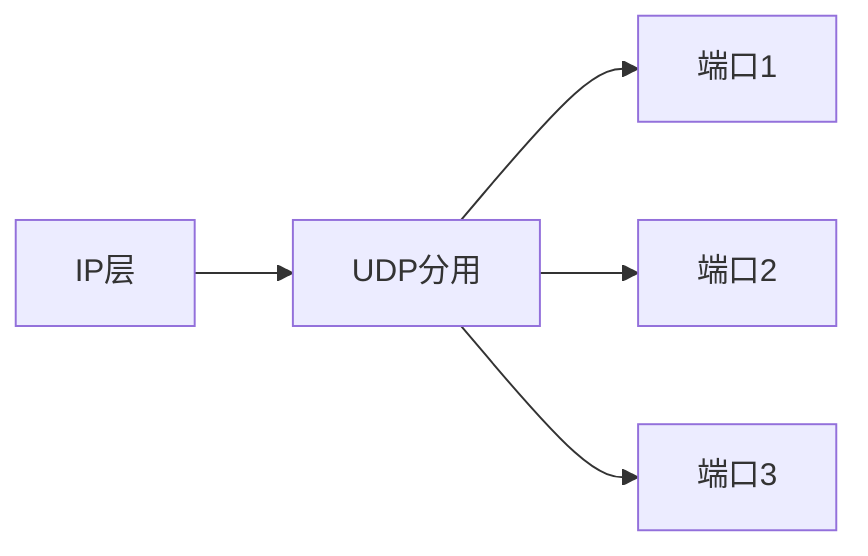

# 1 运输层协议概述
- 进程间*基于网络*的通信
- 运输层为运行在不同主机上的应用进程提供直接的逻辑通信服务
- 运输层协议又称*端到端*协议
- “逻辑通信”：从应用层来看，只要把应用层报文交给下面的运输层，运输层就可以把这报文传送到对方的运输层，好像是在两个运输层实体之间有一条*端到端*逻辑通信通道
	- “好像是这样的通信，但实际上*并非真的这样通信*。”
# 2 运输层的两个主要协议

| 用户数据报协议UDP                   | 传输控制协议TCP                  |
| ---------------------------- | -------------------------- |
| 无连接的协议，提供无连接服务               | 面向连接的协议，提供面向连接服务           |
| 其传送的运输协议数据单元TPDU是UDP报文或用户数据报 | 其传送的运输协议单元TPDU是TCP报文段      |
| 支持单播、多播、广播                   | 支持点对点单播，不支持多播、广播           |
| 不提供可靠交付                      | 提供可靠服务                     |
| 简单。适用于很多应用，如：多媒体应用等          | 复杂。用于大多数应用，如：万维网、电子邮件、文件传输 |
## 2.1 UDP(==面向报文==)
1. 功能增加
	- 在IP数据报服务上增加了**复用和分用、差错检测**功能
### 2.1.1 主要特点
- 无连接。发送数据前不需要建立连接
- 使用[[第4章：网络层#1 尽最大努力交付的基本概念|尽最大努力支付]]。不保证可靠支付，因此不需要维持复杂的连接状态表。
- 面向报文。UDP一次传送和交付一个完整的报文
- 没有拥塞控制。网络中出现拥塞*不会降低主机的发送速率*，适合多媒体通信要求
- 支持一对一、一对多，多对多的交互通信
- 首部开销小，只有两个字节
### 2.1.2 基于端口的复用

接收方根据UDP中首部的端口号，把报文通过相应的端口上交给应用进程。如果发现端口号不正确(不存在该进程)，就丢弃报文，并由ICMP发送”端口不可达“差错报文给发送方。
## 2.2 TCP
### 2.2.1 主要特点：
- 面向连接
- 每一条TCP连接只能有两个端点，每一条TCP连接只能是点对点的。
- 提供可靠支付的服务。
- **全双工通信**
- 面向字节流
	”流“指的是流入和流出进程的字节得到
	虽然应用程序和TCP的交互是一次一个的数据块，但是TCP把应用程序交付下来的数据看成仅仅是**一串无结构的字节流**。
### 2.2.2 TCP链接
- TCP把连接作为一种最基本的对象
- TCP连接的端点是抽象的套接字：{IP地址：端口号}
- 同一个IP地址可以有多个不同的TCP连接
- 同一个端口号可以出现在多个不同的TCP连接中
- {$socket_{1},socket_{2}$}={($IP_{1}:port_{1}$),($IP_{2}:port_{2}$)}
