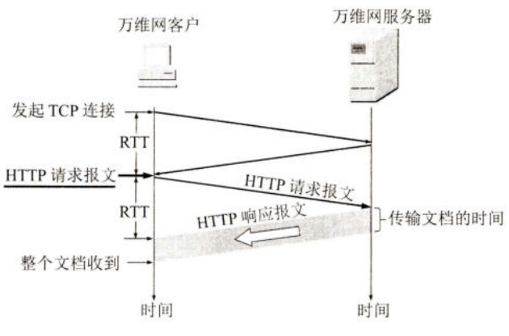
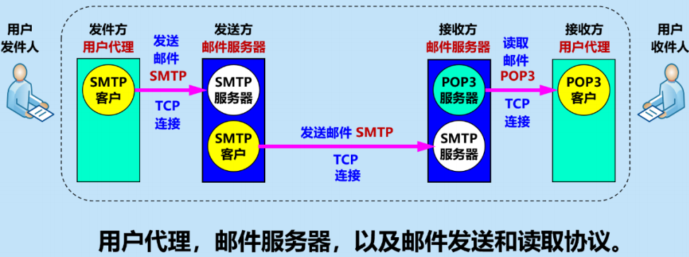

# 1 应用层协议
1. 定义：精确定义*不同主机*中的*多个应用进程*之间的通信规则
2. 许多都基于客户服务器(C/S)方式
	1. 客户：应用进程，服务请求方 
	2. 服务器：应用进程，服务提供方
# 2 DNS域名系统
## 2.1 定义
互联网使用的命名系统，用来吧人们使用的机器名字（域名）转化为IP地址。为互联网的各种网络应用提供核心服务
## 2.2 下层协议
UDP（为了减少网络开销）
## 2.3 过程
主机名要解释成IP地址时，这个应用进程就调用解析程序，并成为DNS的一个*客户*，把待解析域名放入*DNS请求报文*，用*UDP*用户数据报方式发送给*本地域名服务器*。
## 2.4 域名结构
www.cqupt.edu.cn
主机名.三级域名.二级域名.顶级域名
# 3 FTP的基本概念
1. 定义：文件传送协议 FTP (File Transfer Protocol)是互联网上使用得最广泛的文件传送协议。
2. 特点
	- FTP 提供交互式的访问，允许客户指明文件的类型与格式，并允许文件具有存取权限。
	- FTP 屏蔽了各计算机系统的细节，因而适合于在*异构网络中任意计算机之间传送文件*。
	- 文件传送协议 FTP 只提供文件传送的一些基本的服务，它使用 *TCP 可靠的运输服务*。
	- FTP 的主要功能是*减少或消除*在不同操作系统下处理文件的*不兼容性*。
	- FTP 使用客户服务器方式。一个 FTP 服务器进程可同时为*多个客户*进程提供服务。
# 4 万维网WWW
## 4.1 概述
1. 定义：一个大规模的，联机式的==信息储藏所==，并非某种特殊的计算机网络。
2. 访问方法：链接、提供分布式服务
3. 统一资源定义符URL
	1. 定义：对可以从互联网上得到的资源的位置和访问方法的一种简洁表示。
	2. 作用：URL 给资源的位置提供一种*抽象的识别方法*，并用这种方法给==资源定位==。只要能够对资源定位，系统就可以对资源进行各种操作，如存取、更新、替换和查找其属性。
	3. **<协议>://<主机名>:<端口>/<路径>**
		1. 协议有：FTP、HTTP、news
## 4.2 超文本传送协议HTTP
### 4.2.1 定义
- HTTP是*面向事务*的应用层协议
- 使用TCP连接进行了*可靠传输*
- 定义了浏览器与万维网服务器通信的*格式和规则*
- 是万维网上能够可靠交换文件的重要基础
### 4.2.2 特点
- 使用了*面向连接的 TCP*作为*运输层协议*，保证了数据的可靠传输
- HTTP 协议本身也是*无连接*的，虽然它使用了面向连接的 TCP 向上提供的服务。
- HTTP是*无状态*的，简化了服务器设计。使服务器更容易支持大并发HTTP请求。
### 4.2.3 操作过程

一个完整的 HTTP 事务通常包括以下步骤：
1. **建立连接**：浏览器分析 URL，请求 DNS 解析 IP 地址，然后与服务器建立 TCP 连接（三报文握手）。
2. **发送请求**：浏览器向服务器发送 **HTTP 请求报文**（如 `GET` 请求）。
3. **发送响应**：服务器收到请求后，查找资源，发送 **HTTP 响应报文**（包含所请求的文档）。
4. **释放连接**：TCP 连接释放。
### 4.2.4 ** HTTP 的连接方式（常考重点）**
- **HTTP/1.0：非持续连接 (Non-persistent connection)**
    - **特点**：每请求一个文档（如网页上的一个图片）就要建立一次 TCP 连接，传输完毕后立即释放。
    - **缺点**：开销大，延迟高。每次请求都要经历 TCP 建立连接的开销（需要 2 个 RTT：一个用于建立 TCP，一个用于请求文档）。
- **HTTP/1.1：持续连接 (Persistent connection)**
    - **特点**：服务器在发送响应后，**仍然保持 TCP 连接打开**。同一个客户后续的请求可以继续在这条连接上传送。
    - **两种工作方式**：
        1. **非流水线方式 (Without pipelining)**：客户收到前一个响应后才能发出下一个请求。节省了建立 TCP 的时间，但仍有空闲等待。
        2. **流水线方式 (With pipelining)**：客户不等待响应，直接连续发送多个请求。服务器按顺序连续返回响应。效率最高，只需一个 RTT 即可获得所有引用对象。
### 4.2.5 HTTP 报文结构
HTTP 报文是**面向文本**的，由 ASCII 码串组成。
- **请求报文**：
    - **请求行**（Request-Line）：包含 **方法** (Method)、**URL**、**版本**。
        - 常见方法：`GET` (获取资源)、`POST` (提交数据)、`HEAD` (只获取首部) 等。
    - **首部行** (Headers)：说明浏览器、服务器或报文主体的信息（如 `Host`, `User-Agent`）。
    - **实体主体**：通常在 GET 请求中为空，在 POST 请求中包含提交的数据。
- **响应报文**：
    - **状态行**（Status-Line）：包含 **版本**、**状态码** (Status-Code)、**短语**。
    - **常见状态码**（需记忆）：
        - **200 OK**：请求成功。
        - **301 Moved Permanently**：永久重定向。
        - **400 Bad Request**：请求报文有误。
        - **404 Not Found**：找不到请求的资源。
    - **首部行** & **实体主体**：包含服务器返回的数据（如 HTML 文件）。
# 5 电子邮件

## 5.1 协议
- 简单邮件发送协议 SMTP ->**基于TCP**连接
- 互联网文本报文格式 RFC 5322
- 通用互联网邮件扩充 MIME
- 邮件读取协议 POP3、IMAP
## 5.2 三个构件
用户代理、邮件服务器以及邮件发送和读取协议
## 5.3 POP3与IMAP
- POP3：邮局协议版本3
	- 使用客服服务器方式，基于[[第5章：运输层#3.2 TCP]]
	- 支持用户鉴别，服务器删除已经被用户读取了的邮件
- IMAP：网际报文存取协议
	- 使用C/S方式，基于TCP
	- 是一个联机协议
## 5.4 基于万维网的电邮
- 用户代理的缺点：必须在计算机中安装用户代理软件，收发邮件不方便
- 万维网电邮的优点：
	- 不需要用户代理软件
	- 计算机能联网，就能方便地收发电子邮件
	- 界面友好
- 协议
	- 发送、接受邮件使用HTTP协议
	- 两邮件服务器之间传送邮件使用SMTP
	- 使用HTTP POST 方法提交邮件
	- 使用HTTP GET 方法读取文件
# 6 DHCP动态主机配置协议
1. 作用
	1. 提供了即插即用连网的机制，允许一台加入网络的计算机自动获取IP地址
	2. 位置固定的计算机指派一个永久地址
	3. 运行客户端软件的计算机分配临时地址
2. 工作方式
	1. 客户端服务器
	2. 请求/应答
	3. 基于UDP
